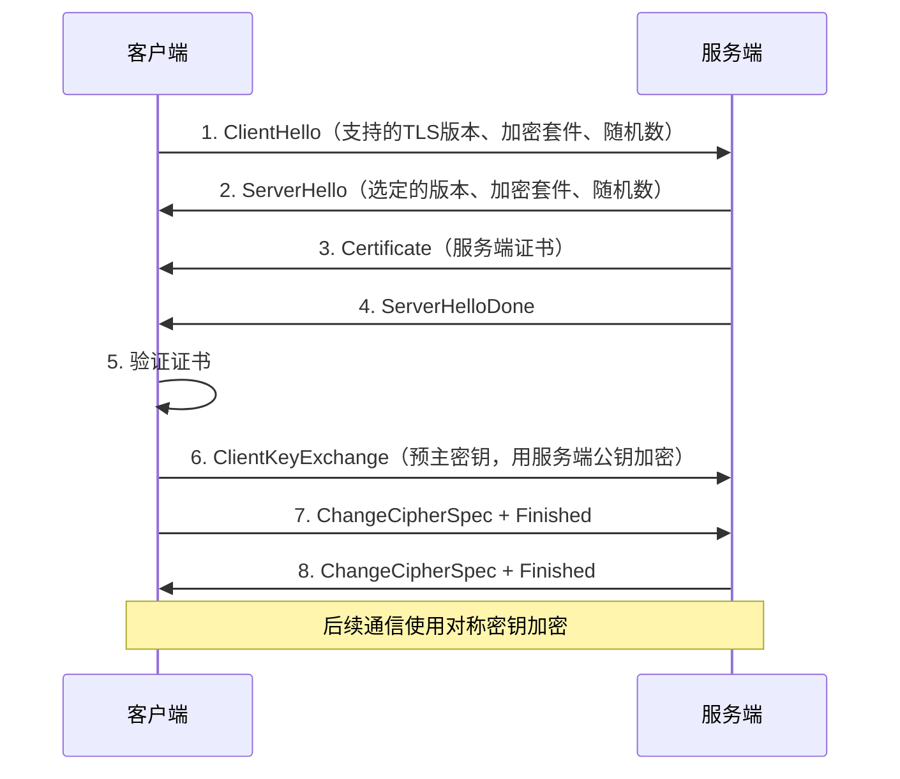
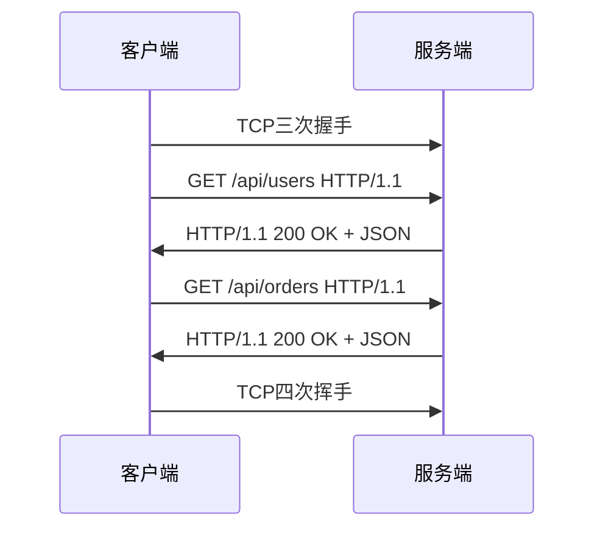
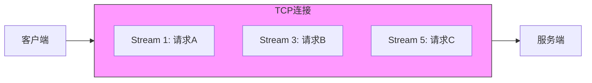

# HTTP 协议详解

## 一、核心概念

### 1.1 HTTP特点

| 特点 | 说明 |
|------|------|
| 基于TCP | 传输层使用TCP，可靠传输 |
| 请求-响应 | 客户端发请求，服务端返响应 |
| 无状态 | 每次请求独立，服务端不记住状态 |
| 文本协议 | 头部是人类可读的文本 |
| 灵活 | 支持各种数据类型（Content-Type） |

### 1.2 HTTP版本对比

| 版本 | 特点 |
|------|------|
| HTTP/1.0 | 短连接，每次请求新建TCP |
| HTTP/1.1 | 长连接（keep-alive），管道化 |
| HTTP/2 | 二进制分帧，多路复用，头部压缩 |
| HTTP/3 | 基于QUIC（UDP），更低延迟 |

---

## 二、报文结构

### 2.1 请求报文

```
GET /api/users?id=123 HTTP/1.1      ← 请求行（方法 路径 版本）
Host: api.example.com               ← 请求头
Content-Type: application/json
Authorization: Bearer xxx
                                    ← 空行
{"name": "test"}                    ← 请求体（POST/PUT时有）
```

### 2.2 响应报文

```
HTTP/1.1 200 OK                     ← 状态行（版本 状态码 原因短语）
Content-Type: application/json      ← 响应头
Content-Length: 27
                                    ← 空行
{"id": 123, "name": "test"}         ← 响应体
```

### 2.3 常用请求方法

| 方法 | 语义 | 幂等 | 有请求体 |
|------|------|------|----------|
| GET | 获取资源 | ✅ | ❌ |
| POST | 创建资源 | ❌ | ✅ |
| PUT | 替换资源 | ✅ | ✅ |
| PATCH | 部分更新 | ❌ | ✅ |
| DELETE | 删除资源 | ✅ | ❌ |
| HEAD | 获取头部 | ✅ | ❌ |
| OPTIONS | 获取支持的方法 | ✅ | ❌ |

### 2.4 常用状态码

| 状态码 | 含义 | 说明 |
|--------|------|------|
| **2xx** | **成功** | |
| 200 | OK | 请求成功 |
| 201 | Created | 创建成功（POST） |
| 204 | No Content | 成功但无响应体 |
| **3xx** | **重定向** | |
| 301 | Moved Permanently | 永久重定向 |
| 302 | Found | 临时重定向 |
| 304 | Not Modified | 缓存有效 |
| **4xx** | **客户端错误** | |
| 400 | Bad Request | 请求格式错误 |
| 401 | Unauthorized | 未认证 |
| 403 | Forbidden | 无权限 |
| 404 | Not Found | 资源不存在 |
| 405 | Method Not Allowed | 方法不允许 |
| **5xx** | **服务端错误** | |
| 500 | Internal Server Error | 服务器内部错误 |
| 502 | Bad Gateway | 网关错误 |
| 503 | Service Unavailable | 服务不可用 |

---

## 三、HTTP/1.1 核心特性

### 3.1 持久连接（Keep-Alive）

```
HTTP/1.0：
  请求1 → [建TCP] → [请求] → [响应] → [断TCP]
  请求2 → [建TCP] → [请求] → [响应] → [断TCP]

HTTP/1.1（默认Keep-Alive）：
  [建TCP] → 请求1 → 响应1 → 请求2 → 响应2 → ... → [断TCP]
```

```cpp
// 头部
Connection: keep-alive   // 保持连接
Connection: close        // 关闭连接
Keep-Alive: timeout=5, max=100  // 超时5秒，最多100个请求
```

### 3.2 分块传输（Chunked）

用于响应体长度未知的场景：

```
HTTP/1.1 200 OK
Transfer-Encoding: chunked

5\r\n          ← 第一块长度（16进制）
Hello\r\n      ← 第一块数据
6\r\n          ← 第二块长度
World!\r\n     ← 第二块数据
0\r\n          ← 结束标记
\r\n
```

### 3.3 缓存控制

```
// 响应头
Cache-Control: max-age=3600    // 缓存1小时
Cache-Control: no-cache        // 需要验证后才能使用缓存
Cache-Control: no-store        // 禁止缓存
ETag: "abc123"                 // 资源版本标识
Last-Modified: Wed, 01 Jan 2020 00:00:00 GMT

// 请求头（条件请求）
If-None-Match: "abc123"        // 配合ETag
If-Modified-Since: Wed, 01 Jan 2020 00:00:00 GMT
```

---

## 四、HTTP/2 核心特性

### 4.1 二进制分帧

```
HTTP/1.1：文本格式，逐行解析
HTTP/2：二进制帧，高效解析

帧结构：
+-----------------------------------------------+
|                 Length (3字节)                 |
+---------------+---------------+---------------+
|   Type (1)    |   Flags (1)   |
+-+-------------+---------------+---------------+
|R|                Stream Identifier (4字节)     |
+=+=============+===============================+
|                   Frame Payload               |
+-----------------------------------------------+
```

### 4.2 多路复用

```
HTTP/1.1（6个TCP连接）：
  连接1: 请求A → 响应A
  连接2: 请求B → 响应B
  ...

HTTP/2（1个TCP连接）：
  Stream 1: 请求A帧 → ... → 响应A帧
  Stream 3: 请求B帧 → ... → 响应B帧
  Stream 5: 请求C帧 → ... → 响应C帧
  （帧可以交错传输）
```

优势：
- 减少TCP连接数
- 消除HTTP层队头阻塞
- 优先级控制

### 4.3 头部压缩（HPACK）

```
HTTP/1.1每次请求都发送完整头部（Cookie可能很大）

HTTP/2使用HPACK：
1. 静态表：61个常用头部（:method GET等）
2. 动态表：记录已发送的头部
3. 哈夫曼编码

压缩效果：头部减少85-90%
```

### 4.4 服务器推送

```
客户端请求 index.html
服务器返回 index.html
服务器主动推送 style.css、app.js（预测客户端需要）
```

---

## 五、HTTPS

### 5.1 HTTPS = HTTP + TLS

```
HTTP：明文传输
  客户端 ←→ 服务端（数据可被窃听/篡改）

HTTPS：加密传输
  客户端 ←TLS加密→ 服务端（数据安全）
```

### 5.2 TLS握手过程



### 5.3 证书验证

```
证书包含：
- 域名
- 公钥
- 有效期
- 颁发者（CA）
- 签名

验证流程：
1. 检查域名是否匹配
2. 检查有效期
3. 用CA公钥验证签名（证书链向上追溯到根CA）
4. 检查是否在吊销列表中
```

---

## 六、代码实现

### 6.1 Qt HTTP客户端

```cpp
class HttpClient : public QObject {
    Q_OBJECT
    QNetworkAccessManager manager_;
    
public:
    void get(const QString& url) {
        QNetworkRequest request(url);
        request.setHeader(QNetworkRequest::ContentTypeHeader, "application/json");
        
        QNetworkReply* reply = manager_.get(request);
        connect(reply, &QNetworkReply::finished, this, [=]() {
            if (reply->error() == QNetworkReply::NoError) {
                QByteArray data = reply->readAll();
                emit requestFinished(true, data);
            } else {
                emit requestFinished(false, reply->errorString().toUtf8());
            }
            reply->deleteLater();
        });
    }
    
    void post(const QString& url, const QByteArray& body) {
        QNetworkRequest request(url);
        request.setHeader(QNetworkRequest::ContentTypeHeader, "application/json");
        
        QNetworkReply* reply = manager_.post(request, body);
        connect(reply, &QNetworkReply::finished, this, [=]() {
            // 处理响应...
            reply->deleteLater();
        });
    }
    
signals:
    void requestFinished(bool success, const QByteArray& data);
};
```

### 6.2 简易HTTP服务器

```cpp
class SimpleHttpServer : public QObject {
    Q_OBJECT
    QTcpServer server_;
    
public:
    bool start(quint16 port) {
        connect(&server_, &QTcpServer::newConnection,
                this, &SimpleHttpServer::onNewConnection);
        return server_.listen(QHostAddress::Any, port);
    }
    
private slots:
    void onNewConnection() {
        QTcpSocket* socket = server_.nextPendingConnection();
        connect(socket, &QTcpSocket::readyRead, this, [=]() {
            QByteArray request = socket->readAll();
            
            // 解析请求行
            QString firstLine = QString(request).section("\r\n", 0, 0);
            QStringList parts = firstLine.split(" ");
            QString method = parts[0];
            QString path = parts[1];
            
            // 路由处理
            QByteArray body;
            int statusCode = 200;
            
            if (path == "/api/status") {
                body = R"({"status": "ok"})";
            } else {
                statusCode = 404;
                body = R"({"error": "Not Found"})";
            }
            
            // 构造响应
            QString response = QString(
                "HTTP/1.1 %1 %2\r\n"
                "Content-Type: application/json\r\n"
                "Content-Length: %3\r\n"
                "Connection: close\r\n"
                "\r\n")
                .arg(statusCode)
                .arg(statusCode == 200 ? "OK" : "Not Found")
                .arg(body.size());
            
            socket->write(response.toUtf8());
            socket->write(body);
            socket->disconnectFromHost();
        });
    }
};
```

---

## 七、面试回答模板

### Q1：GET和POST区别？

> 语义区别：
> - GET：获取资源，幂等
> - POST：提交数据，非幂等
> 
> 实现区别：
> - GET参数在URL，有长度限制（约2KB）
> - POST参数在body，无大小限制
> - GET可被缓存，POST不行
> - GET可被收藏为书签，POST不行
> 
> 安全性：都不安全（明文传输），要安全用HTTPS

### Q2：HTTP/1.1和HTTP/2区别？

> HTTP/1.1问题：
> 1. 队头阻塞：一个请求慢会阻塞后续请求
> 2. 头部冗余：每次发完整头部
> 3. 不支持推送
> 
> HTTP/2改进：
> 1. 二进制分帧：高效解析
> 2. 多路复用：一个TCP连接并发多个请求
> 3. 头部压缩：HPACK减少85%
> 4. 服务器推送：主动推送资源

### Q3：HTTPS如何保证安全？

> 三个保障：
> 1. **加密**：对称加密传输数据，防窃听
> 2. **认证**：证书验证服务端身份，防冒充
> 3. **完整性**：MAC校验，防篡改
> 
> TLS握手流程：
> 1. 协商加密算法
> 2. 服务端发证书
> 3. 客户端验证证书
> 4. 交换密钥（非对称加密）
> 5. 后续用对称密钥通信

### Q4：你项目里HTTP怎么用的？

> 在营业厅平台项目里，我实现了轻量级HTTP服务器：
> 
> 1. 基于TCP Socket，手动解析HTTP报文
> 2. 支持GET/POST，RESTful风格API
> 3. 路由映射：/api/devices → 设备列表
> 4. 数据格式：JSON
> 5. 用curl/Postman测试调试
> 
> 没用HTTP/2，因为是内网、请求量不大。

---

## 八、Mermaid图

### HTTP请求流程



### HTTP/2多路复用


