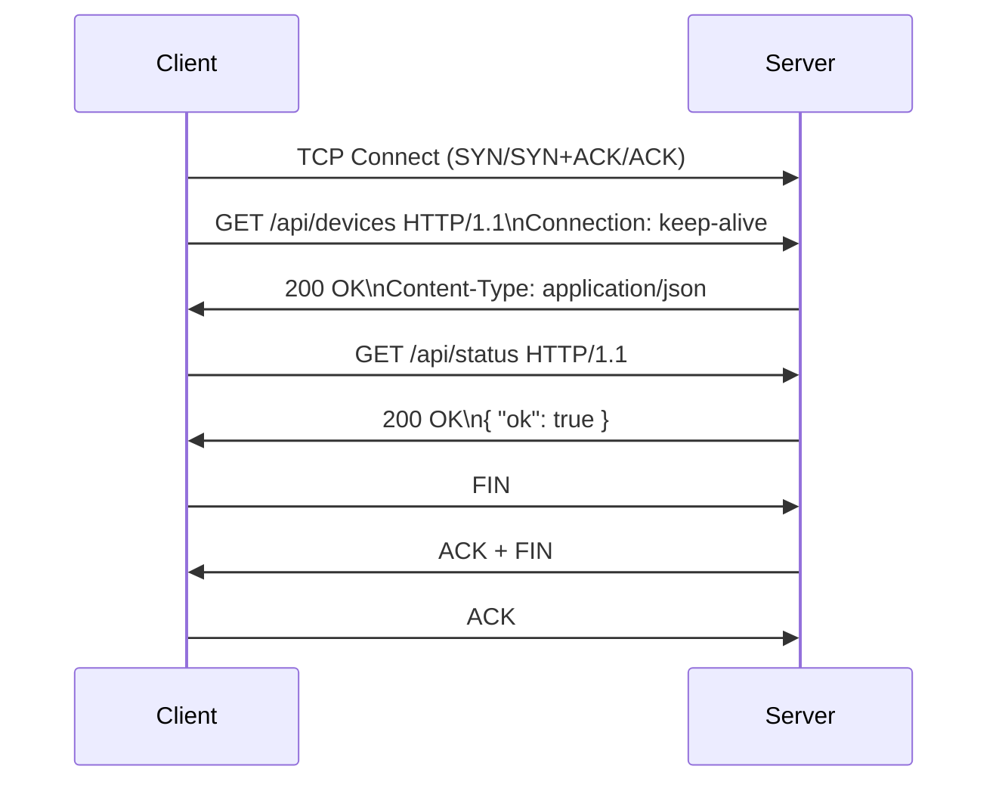

# HTTP 面试小抄

## 核心概念
HTTP = 基于 TCP 的应用层协议，典型请求-响应模型。

请求结构：请求行（GET /path HTTP/1.1）+ 请求头 + 空行 + 消息体（POST/PUT 常有）。
响应结构：状态行（HTTP/1.1 200 OK）+ 响应头 + 空行 + 消息体（HTML/JSON/文件）。
方法：GET/POST/PUT/DELETE；状态码：200/301/302/400/401/403/404/500。

## HTTP/1.1 keep-alive（面试够用）
- HTTP/1.0：默认短连接；HTTP/1.1：支持 Connection: keep-alive，一个 TCP 连接可复用多次请求。
- 项目形态：RESTful API + JSON。

## 面试常问 & 回答模板

Q1：GET 和 POST 区别？
> 语义：GET 查询、POST 提交/修改。实现：GET 参数在 URL、有长度限制；POST 参数在 body，适合较大结构化数据。GET 幂等，POST 通常非幂等。

Q2：你项目里 HTTP 用在什么地方？
> 在营业厅平台/柜外终端，用 HTTP 提供 REST 接口：底层 TCP+事件驱动解析报文；上层按 URL 路由（/api/devices /api/status）；数据用 JSON，联调用 curl/Postman。

## 三句话总结
- HTTP 本质是“基于 TCP 的文本协议 + 请求/响应 + 头 + body”。
- 会说清 GET/POST、状态码、keep-alive，足够应付多数面试。
- 再补一句你如何用 HTTP 做 REST 接口，更显实战。

## Mermaid 时序图：HTTP keep-alive 两次请求

