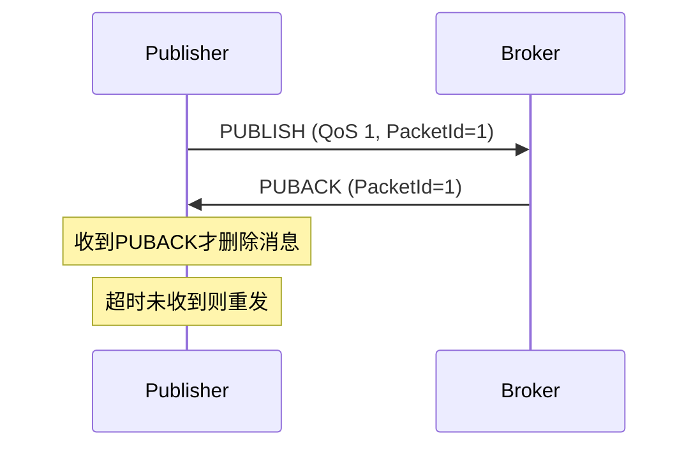
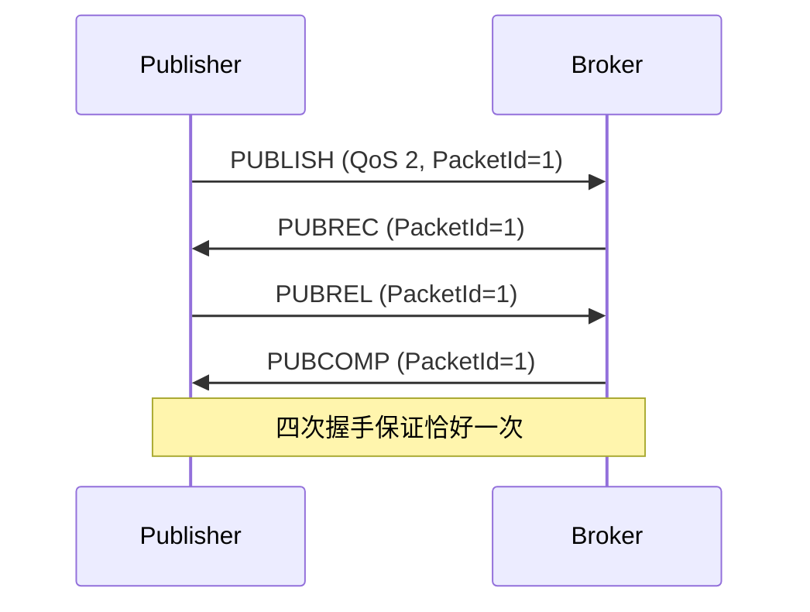
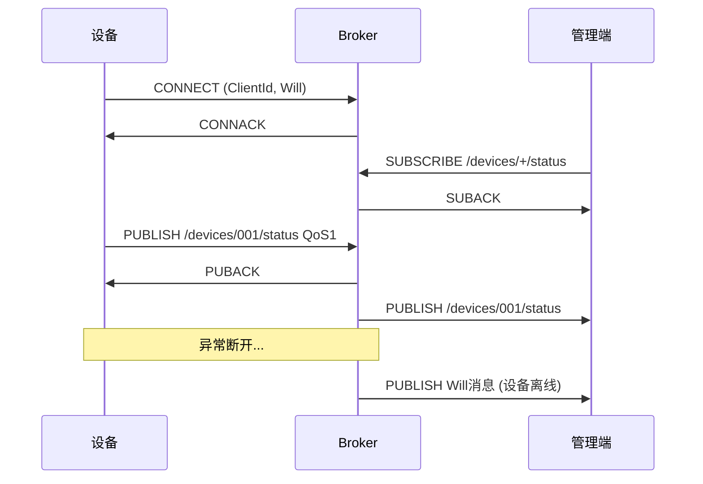
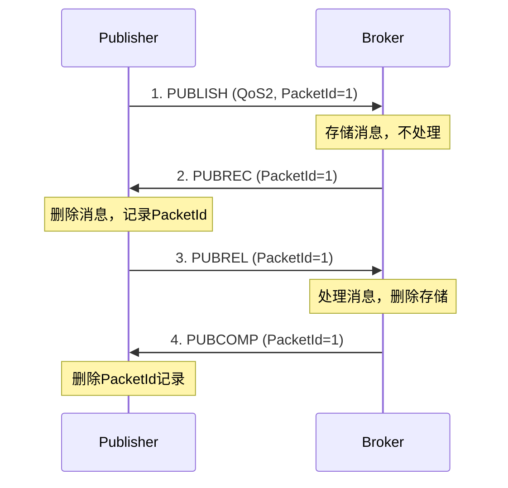

# MQTT 协议详解

## 一、核心概念

### 1.1 MQTT特点

| 特点 | 说明 |
|------|------|
| 轻量级 | 协议开销小，最小报文仅2字节 |
| 发布-订阅 | 解耦生产者和消费者 |
| 基于TCP | 可靠传输，支持TLS加密 |
| QoS机制 | 三级服务质量保证 |
| 长连接 | 保持连接，支持心跳 |
| 遗嘱消息 | 异常断开时自动发布 |

### 1.2 角色与模型

```
┌─────────┐                           ┌─────────┐
│ 发布者   │ ───publish──┐            │ 订阅者1  │
│(Publisher)│            │            │(Subscriber)│
└─────────┘            ▼            └─────────┘
                  ┌─────────┐              ▲
                  │ Broker  │ ────────────┘
                  │ (服务器) │ ────────────┐
                  └─────────┘              ▼
┌─────────┐            ▲            ┌─────────┐
│ 设备2   │ ───publish──┘            │ 订阅者2  │
└─────────┘                          └─────────┘
```

优势：
- 发布者和订阅者不需要知道对方存在
- Broker负责消息路由和分发
- 易于扩展，支持大量设备

### 1.3 Topic（主题）

```
Topic是消息的路由地址，层级结构：

设备状态：    /devices/device001/status
传感器数据：  /sensors/temperature/room1
控制命令：    /commands/device001/restart

通配符：
+ : 单层通配    /devices/+/status  匹配 /devices/xxx/status
# : 多层通配    /devices/#         匹配 /devices/下所有
```

---

## 二、QoS详解

### 2.1 三级QoS

| QoS | 名称 | 传输次数 | 特点 |
|-----|------|----------|------|
| 0 | 至多一次 | 0或1 | 最快，可能丢失 |
| 1 | 至少一次 | 1或多 | 可能重复，需幂等 |
| 2 | 恰好一次 | 1 | 最可靠，开销最大 |

### 2.2 QoS流程

**QoS 0：Fire and Forget**
```
Publisher → Broker：PUBLISH
（不确认，可能丢失）
```

**QoS 1：At Least Once**


**QoS 2：Exactly Once（四次握手）**


### 2.3 QoS选择建议

| 场景 | 建议QoS |
|------|---------|
| 传感器周期上报 | QoS 0（偶尔丢失可接受） |
| 设备状态上报 | QoS 1（需要送达） |
| 告警通知 | QoS 1（需要送达） |
| 控制命令 | QoS 1 + 应用层确认 |
| 计费/订单 | QoS 2（不能丢不能重） |

---

## 三、核心功能

### 3.1 保持连接（Keep Alive）

```
CONNECT报文指定Keep Alive时间（如60秒）

客户端：每60秒内必须发送至少一个报文
        否则发送PINGREQ
Broker：收到PINGREQ回复PINGRESP
        超过1.5倍Keep Alive未收到报文则断开

作用：检测半开连接（一方已断，另一方不知道）
```

### 3.2 遗嘱消息（Last Will）

```
CONNECT时指定遗嘱：
- Will Topic: /devices/device001/status
- Will Message: {"online": false}
- Will QoS: 1
- Will Retain: true

触发条件：
- 网络断开（非正常DISCONNECT）
- Keep Alive超时
- 协议错误

用途：通知其他设备"我掉线了"
```

### 3.3 保留消息（Retained Message）

```
PUBLISH时设置Retain=true

Broker保存该Topic最后一条Retain消息
新订阅者立即收到这条消息（不用等下次发布）

用途：新设备上线立即获取最新状态
```

### 3.4 清理会话（Clean Session）

```
CONNECT时指定Clean Session：

Clean Session = true：
- 不保存会话状态
- 断开后所有订阅丢失
- 重连后需重新订阅

Clean Session = false：
- Broker保存会话状态
- 断开期间的QoS 1/2消息会存储
- 重连后自动恢复订阅和接收离线消息
```

---

## 四、报文结构

### 4.1 固定头部

```
 7  6  5  4  3  2  1  0
+--+--+--+--+--+--+--+--+
|  Type   |DUP|QoS|Retain|  ← 第1字节：类型+标志
+--+--+--+--+--+--+--+--+
|    Remaining Length    |  ← 第2字节起：剩余长度（变长编码）
+--+--+--+--+--+--+--+--+
```

### 4.2 报文类型

| 类型 | 值 | 说明 |
|------|-----|------|
| CONNECT | 1 | 客户端请求连接 |
| CONNACK | 2 | 连接确认 |
| PUBLISH | 3 | 发布消息 |
| PUBACK | 4 | QoS 1确认 |
| PUBREC | 5 | QoS 2第一步确认 |
| PUBREL | 6 | QoS 2第二步 |
| PUBCOMP | 7 | QoS 2完成 |
| SUBSCRIBE | 8 | 订阅请求 |
| SUBACK | 9 | 订阅确认 |
| UNSUBSCRIBE | 10 | 取消订阅 |
| UNSUBACK | 11 | 取消订阅确认 |
| PINGREQ | 12 | 心跳请求 |
| PINGRESP | 13 | 心跳响应 |
| DISCONNECT | 14 | 断开连接 |

---

## 五、代码实现

### 5.1 Qt MQTT客户端

```cpp
#include <QtMqtt/QMqttClient>

class MqttDevice : public QObject {
    Q_OBJECT
    
    QMqttClient client_;
    QTimer reconnectTimer_;
    
public:
    MqttDevice(QObject* parent = nullptr) : QObject(parent) {
        // 配置
        client_.setHostname("broker.example.com");
        client_.setPort(1883);
        client_.setClientId("device_001");
        client_.setKeepAlive(60);
        
        // 设置遗嘱
        client_.setWillTopic("/devices/device_001/status");
        client_.setWillMessage(R"({"online": false})");
        client_.setWillQoS(1);
        client_.setWillRetain(true);
        
        // 连接信号
        connect(&client_, &QMqttClient::connected,
                this, &MqttDevice::onConnected);
        connect(&client_, &QMqttClient::disconnected,
                this, &MqttDevice::onDisconnected);
        connect(&client_, &QMqttClient::messageReceived,
                this, &MqttDevice::onMessageReceived);
        
        // 重连定时器
        reconnectTimer_.setInterval(5000);
        connect(&reconnectTimer_, &QTimer::timeout, this, [this]() {
            if (client_.state() == QMqttClient::Disconnected) {
                client_.connectToHost();
            }
        });
    }
    
    void start() {
        client_.connectToHost();
    }
    
    void publish(const QString& topic, const QByteArray& message, 
                 quint8 qos = 1, bool retain = false) {
        client_.publish(QMqttTopicName(topic), message, qos, retain);
    }
    
private slots:
    void onConnected() {
        qDebug() << "MQTT Connected";
        reconnectTimer_.stop();
        
        // 发布上线状态
        publish("/devices/device_001/status", 
                R"({"online": true})", 1, true);
        
        // 订阅命令主题
        auto subscription = client_.subscribe(
            QMqttTopicFilter("/commands/device_001/#"), 1);
        
        connect(subscription, &QMqttSubscription::messageReceived,
                this, &MqttDevice::onCommandReceived);
    }
    
    void onDisconnected() {
        qDebug() << "MQTT Disconnected, will reconnect...";
        reconnectTimer_.start();
    }
    
    void onMessageReceived(const QByteArray& message,
                           const QMqttTopicName& topic) {
        qDebug() << "Received:" << topic.name() << message;
    }
    
    void onCommandReceived(const QMqttMessage& msg) {
        QString cmd = msg.topic().name().section('/', -1);
        QByteArray payload = msg.payload();
        
        if (cmd == "restart") {
            // 处理重启命令
            emit restartRequested();
        } else if (cmd == "config") {
            // 处理配置更新
            emit configReceived(payload);
        }
    }
    
signals:
    void restartRequested();
    void configReceived(const QByteArray& config);
};
```

### 5.2 消息处理模式

```cpp
class MessageHandler : public QObject {
    // QoS 1接收去重
    QSet<quint16> receivedPacketIds_;
    
    // QoS 2状态机
    QMap<quint16, Qos2State> qos2States_;
    
public:
    void handlePublish(const MqttMessage& msg) {
        if (msg.qos == 1) {
            // 检查是否重复
            if (receivedPacketIds_.contains(msg.packetId)) {
                qDebug() << "Duplicate QoS1 message, skipping";
                sendPuback(msg.packetId);  // 仍需确认
                return;
            }
            receivedPacketIds_.insert(msg.packetId);
            
            // 处理消息
            processMessage(msg);
            
            // 发送确认
            sendPuback(msg.packetId);
            
            // 清理旧的packetId（滑动窗口）
            cleanupOldPacketIds();
        }
        else if (msg.qos == 2) {
            // QoS 2需要四次握手
            if (!qos2States_.contains(msg.packetId)) {
                qos2States_[msg.packetId] = {msg, StateReceived};
                sendPubrec(msg.packetId);
            }
        }
    }
    
    void handlePubrel(quint16 packetId) {
        if (qos2States_.contains(packetId)) {
            auto& state = qos2States_[packetId];
            processMessage(state.message);  // 此时才处理
            sendPubcomp(packetId);
            qos2States_.remove(packetId);
        }
    }
};
```

---

## 六、面试回答模板

### Q1：MQTT是什么？为什么用它？

> MQTT是轻量级的发布-订阅协议，基于TCP。
> 
> 为什么用：
> 1. **轻量**：最小报文2字节，适合带宽受限设备
> 2. **解耦**：发布者和订阅者不需要互知IP
> 3. **可靠**：QoS机制保证消息送达
> 4. **特性丰富**：心跳、遗嘱、保留消息
> 
> 典型场景：物联网设备监控、消息推送

### Q2：QoS三个等级分别什么意思？

> - **QoS 0**：至多一次，发了不管，最快但可能丢
> - **QoS 1**：至少一次，有确认重传，可能重复
> - **QoS 2**：恰好一次，四次握手，最可靠但最慢
> 
> 选择建议：
> - 传感器数据：QoS 0
> - 告警/状态：QoS 1 + 幂等处理
> - 计费/订单：QoS 2

### Q3：你项目里MQTT怎么用的？

> 在营业厅平台项目里，我用MQTT做设备状态监控：
> 
> 架构：
> - Broker部署在服务器
> - 终端设备作为Client连接
> 
> 具体用法：
> 1. 设备上线发布状态到 `/devices/{id}/status`（Retain）
> 2. 周期发心跳，Keep Alive 60秒
> 3. 设置遗嘱消息，掉线自动通知
> 4. 管理端订阅 `/devices/+/status` 监控所有设备
> 5. 告警用QoS 1保证送达，普通状态QoS 0

### Q4：遗嘱消息怎么用？

> 遗嘱是CONNECT时预设的消息，异常断开时Broker自动发布。
> 
> 配置：
> - Will Topic: `/devices/device001/status`
> - Will Message: `{"online": false}`
> - Will QoS: 1
> - Will Retain: true
> 
> 触发条件：
> - 网络断开（非DISCONNECT）
> - Keep Alive超时
> 
> 用途：让其他设备/服务知道"我掉线了"

---

## 七、Mermaid图

### MQTT通信流程



### QoS 2四次握手


