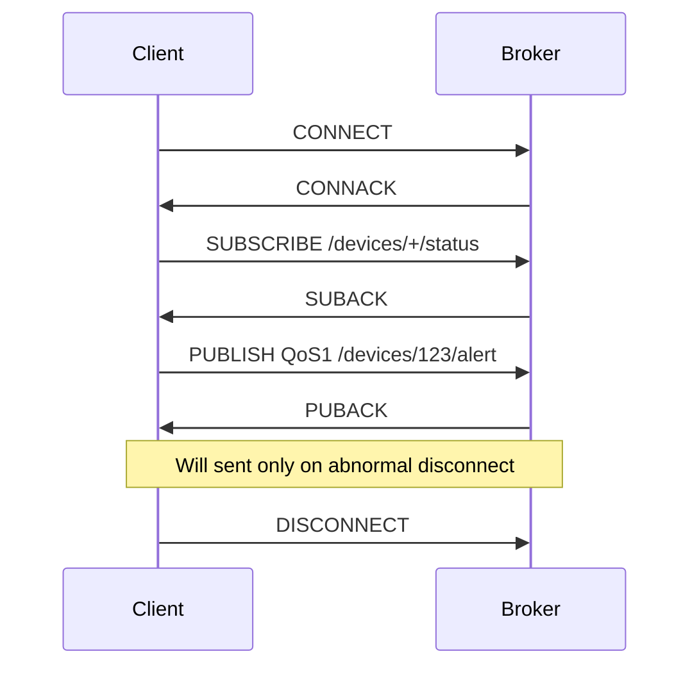

# MQTT 面试小抄

## 核心概念
MQTT = 轻量级发布-订阅协议，基于 TCP，适合大量设备与不稳定网络。

角色：Broker（服务器）/Client（设备/服务）。
核心：Topic（主题）、Publish/Subscribe、QoS（0/1/2）、Keep Alive、Retained、Will。

## QoS 三等级
- QoS 0：至多一次，可能丢，最低延迟。
- QoS 1：至少一次，可能重复，需要幂等。
- QoS 2：恰好一次，四次握手，开销最大。

## 面试常问 & 回答模板

Q1：MQTT 是什么？为什么用它？
> 基于 TCP 的发布-订阅协议，Broker 中转，设备只需订阅/发布，不必互知 IP。相比 HTTP 更轻量，长连接，支持 QoS、心跳与遗嘱，适合物联网。

Q2：你项目里 MQTT 怎么用的？
> 在营业厅平台做设备状态上报与指令下发：终端作为 Client 连 Broker；定期发布心跳与状态；管理端订阅实现监控；告警 QoS1 保证送达，普通状态 QoS0 降开销；开启遗嘱消息以感知异常掉线。

## 三句话总结
- MQTT = 轻量级长连接发布订阅，用 Broker 连接大量设备。
- 说清 QoS、心跳、遗嘱消息，体现对协议理解。
- 落到项目中的具体用法，更显实战。

## Mermaid 时序图：CONNECT / SUBSCRIBE / PUBLISH QoS1

