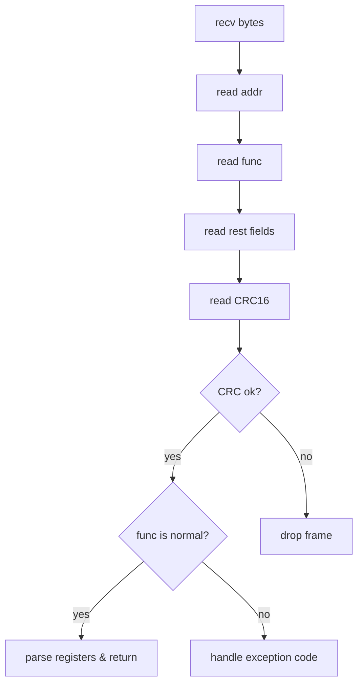
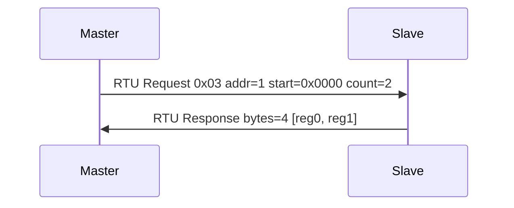

# Modbus 面试小抄（RTU/TCP）

## 核心概念
工业主从协议，统一寄存器读写。变种：Modbus RTU（串口/RS485）、Modbus TCP（TCP/IP）。

## RTU 帧结构（记住这个）
请求帧：从站地址（1B）+ 功能码（1B，如 0x03）+ 起始寄存器地址（2B）+ 寄存器数量（2B）+ CRC16（2B，低位在前）。
响应帧：从站地址 + 功能码 + 字节数 + 数据 + CRC16。错误：功能码 + 0x80，后跟异常码。
常见功能码：0x01 读线圈、0x03 读保持寄存器、0x05 写线圈、0x06 写寄存器、0x10 写多寄存器。

## 面试常问 & 回答模板

Q1：Modbus 是什么？RTU 和 TCP 区别？
> 工业主从协议，统一寄存器读写格式。RTU 跑串口/RS485，帧含地址/功能码/寄存器与 CRC；TCP 跑在 TCP 上，有 MBAP 头，不需要 CRC。

Q2：你项目里怎么实现 Modbus 的？
> 封装两层：底层串口/Socket 收发字节流；上层 Modbus 组帧/解析/CRC 校验。提供诸如 `readHoldingRegisters(addr, startReg, count)` 的接口，上层只关心工程量（电压/电流/温度），不关心功能码与 CRC。

## 三句话总结
- Modbus = 工业统一寄存器读写协议。
- RTU 跑串口，TCP 跑在 TCP 上，多 MBAP 头。
- 说清帧结构与封装方式，大多数面试足够。

## Mermaid 流程图：RTU 帧解析状态机

## Mermaid 时序图：主从请求/响应

