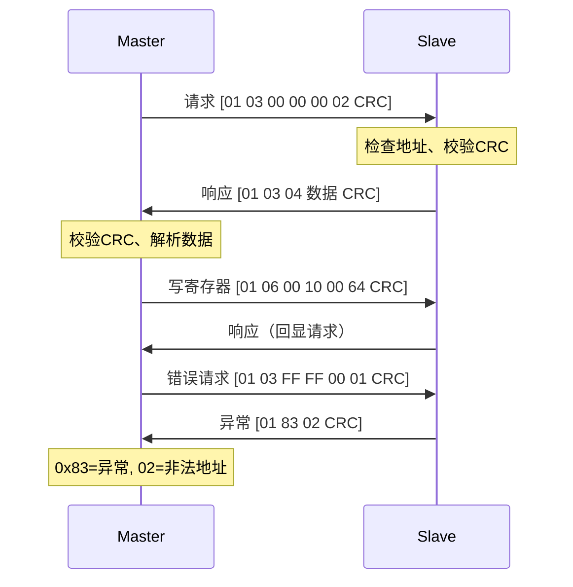
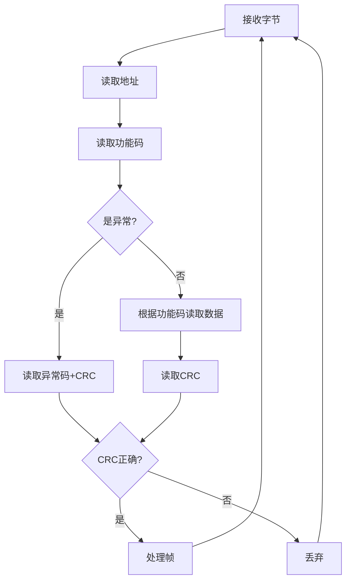

# Modbus 协议详解

## 一、核心概念

### 1.1 Modbus特点

| 特点 | 说明 |
|------|------|
| 工业标准 | 1979年诞生，广泛用于工业自动化 |
| 主从结构 | 一主多从，主站发起所有通信 |
| 寄存器模型 | 统一的数据访问方式 |
| 简单可靠 | 协议简单，易于实现 |
| 多种变体 | RTU、ASCII、TCP |

### 1.2 Modbus变体对比

| 变体 | 传输层 | 帧格式 | 校验 | 场景 |
|------|--------|--------|------|------|
| RTU | 串口/RS485 | 二进制 | CRC16 | 工业现场 |
| ASCII | 串口 | ASCII文本 | LRC | 调试/低速 |
| TCP | TCP/IP | 二进制 | 无需CRC | 以太网 |

### 1.3 数据模型

| 类型 | 地址范围 | 读写 | 大小 | 功能码 |
|------|----------|------|------|--------|
| 线圈(Coils) | 00001-09999 | 读写 | 1位 | 01/05/15 |
| 离散输入(Discrete Inputs) | 10001-19999 | 只读 | 1位 | 02 |
| 输入寄存器(Input Registers) | 30001-39999 | 只读 | 16位 | 04 |
| 保持寄存器(Holding Registers) | 40001-49999 | 读写 | 16位 | 03/06/16 |

---

## 二、Modbus RTU

### 2.1 帧结构

```
请求帧（读保持寄存器 0x03）：
┌────────┬────────┬──────────────┬──────────────┬────────┐
│ 地址   │ 功能码 │ 起始寄存器   │ 寄存器数量   │ CRC16  │
│ 1字节  │ 1字节  │ 2字节(高低)  │ 2字节(高低)  │ 2字节  │
└────────┴────────┴──────────────┴──────────────┴────────┘

示例：读从站1的寄存器0x0000开始的2个
01 03 00 00 00 02 C4 0B
│  │  └──┬──┘ └──┬──┘ └──┬──┘
│  │     │       │       └─ CRC16（低位在前）
│  │     │       └─ 数量=2
│  │     └─ 起始地址=0
│  └─ 功能码=读保持寄存器
└─ 从站地址=1

响应帧：
┌────────┬────────┬────────┬────────────┬────────┐
│ 地址   │ 功能码 │ 字节数 │ 数据       │ CRC16  │
│ 1字节  │ 1字节  │ 1字节  │ N字节      │ 2字节  │
└────────┴────────┴────────┴────────────┴────────┘

示例：返回2个寄存器的值
01 03 04 00 64 00 C8 FA 33
│  │  │  └───┬───┘ └──┬──┘
│  │  │      │        └─ CRC16
│  │  │      └─ 寄存器0=100, 寄存器1=200
│  │  └─ 字节数=4
│  └─ 功能码
└─ 从站地址
```

### 2.2 常用功能码

| 功能码 | 名称 | 说明 |
|--------|------|------|
| 0x01 | 读线圈 | 读取DO状态 |
| 0x02 | 读离散输入 | 读取DI状态 |
| 0x03 | 读保持寄存器 | 读取AO/配置 |
| 0x04 | 读输入寄存器 | 读取AI |
| 0x05 | 写单个线圈 | 控制单个DO |
| 0x06 | 写单个寄存器 | 设置单个配置 |
| 0x0F | 写多个线圈 | 批量控制DO |
| 0x10 | 写多个寄存器 | 批量设置配置 |

### 2.3 异常响应

```
正常响应：功能码不变
异常响应：功能码 + 0x80

示例：
请求：01 03 00 00 00 02 C4 0B  （读寄存器）
异常响应：01 83 02 C0 F1
            │  │  └─ 异常码02=非法数据地址
            │  └─ 0x83 = 0x03 + 0x80（表示异常）
            └─ 从站地址

常见异常码：
01 - 非法功能码
02 - 非法数据地址
03 - 非法数据值
04 - 从站设备故障
```

---

## 三、Modbus TCP

### 3.1 帧结构

```
Modbus TCP = MBAP头 + PDU（无CRC）

MBAP头（7字节）：
┌──────────────┬──────────────┬────────┬────────┐
│ 事务标识符   │ 协议标识符   │ 长度   │ 单元ID │
│ 2字节       │ 2字节(0x0000)│ 2字节  │ 1字节  │
└──────────────┴──────────────┴────────┴────────┘

完整帧：
00 01 00 00 00 06 01 03 00 00 00 02
└──┬──┘└──┬──┘└──┬──┘ │  │  └──┬──┘ └──┬──┘
   │     │     │     │  │     │       └─ 数量
   │     │     │     │  │     └─ 起始地址
   │     │     │     │  └─ 功能码
   │     │     │     └─ 单元ID（从站地址）
   │     │     └─ 长度=6（从单元ID开始）
   │     └─ 协议标识=0
   └─ 事务标识=1（用于匹配请求响应）
```

### 3.2 RTU vs TCP

| 对比项 | Modbus RTU | Modbus TCP |
|--------|------------|------------|
| 传输层 | 串口/RS485 | TCP/IP |
| 校验 | CRC16 | TCP自带校验 |
| 地址 | 1字节(1-247) | MBAP头+单元ID |
| 事务匹配 | 无 | 事务标识符 |
| 帧定界 | 时间间隔 | 长度字段 |

---

## 四、代码实现

### 4.1 Modbus RTU Master

```cpp
class ModbusRtuMaster : public QObject {
    Q_OBJECT
    
    QSerialPort serial_;
    QByteArray rxBuffer_;
    QTimer timeoutTimer_;
    
public:
    bool open(const QString& port, int baudRate = 9600) {
        serial_.setPortName(port);
        serial_.setBaudRate(baudRate);
        serial_.setDataBits(QSerialPort::Data8);
        serial_.setParity(QSerialPort::NoParity);
        serial_.setStopBits(QSerialPort::OneStop);
        
        if (!serial_.open(QIODevice::ReadWrite)) {
            return false;
        }
        
        connect(&serial_, &QSerialPort::readyRead,
                this, &ModbusRtuMaster::onDataReceived);
        connect(&timeoutTimer_, &QTimer::timeout,
                this, &ModbusRtuMaster::onTimeout);
        
        return true;
    }
    
    // 读保持寄存器 (功能码03)
    void readHoldingRegisters(uint8_t slaveAddr, 
                              uint16_t startReg, 
                              uint16_t count) {
        QByteArray frame;
        frame.append(slaveAddr);
        frame.append(0x03);  // 功能码
        frame.append((startReg >> 8) & 0xFF);
        frame.append(startReg & 0xFF);
        frame.append((count >> 8) & 0xFF);
        frame.append(count & 0xFF);
        
        appendCrc(frame);
        
        pendingRequest_ = {slaveAddr, 0x03, startReg, count};
        serial_.write(frame);
        timeoutTimer_.start(500);
    }
    
    // 写单个寄存器 (功能码06)
    void writeSingleRegister(uint8_t slaveAddr,
                             uint16_t reg,
                             uint16_t value) {
        QByteArray frame;
        frame.append(slaveAddr);
        frame.append(0x06);
        frame.append((reg >> 8) & 0xFF);
        frame.append(reg & 0xFF);
        frame.append((value >> 8) & 0xFF);
        frame.append(value & 0xFF);
        
        appendCrc(frame);
        
        serial_.write(frame);
        timeoutTimer_.start(500);
    }
    
    // 写多个寄存器 (功能码16/0x10)
    void writeMultipleRegisters(uint8_t slaveAddr,
                                uint16_t startReg,
                                const QVector<uint16_t>& values) {
        QByteArray frame;
        frame.append(slaveAddr);
        frame.append(0x10);
        frame.append((startReg >> 8) & 0xFF);
        frame.append(startReg & 0xFF);
        frame.append((values.size() >> 8) & 0xFF);
        frame.append(values.size() & 0xFF);
        frame.append(values.size() * 2);  // 字节数
        
        for (uint16_t v : values) {
            frame.append((v >> 8) & 0xFF);
            frame.append(v & 0xFF);
        }
        
        appendCrc(frame);
        
        serial_.write(frame);
        timeoutTimer_.start(500);
    }
    
private slots:
    void onDataReceived() {
        rxBuffer_.append(serial_.readAll());
        
        // 检查是否收到完整响应
        if (tryParseResponse()) {
            timeoutTimer_.stop();
        }
    }
    
    void onTimeout() {
        emit responseTimeout(pendingRequest_.slaveAddr);
        rxBuffer_.clear();
    }
    
private:
    bool tryParseResponse() {
        if (rxBuffer_.size() < 5) return false;  // 最小响应长度
        
        uint8_t addr = rxBuffer_[0];
        uint8_t func = rxBuffer_[1];
        
        // 检查是否异常响应
        if (func & 0x80) {
            uint8_t exceptionCode = rxBuffer_[2];
            emit exceptionReceived(addr, func & 0x7F, exceptionCode);
            rxBuffer_.clear();
            return true;
        }
        
        // 计算期望长度
        int expectedLen = 0;
        if (func == 0x03 || func == 0x04) {
            if (rxBuffer_.size() < 3) return false;
            int byteCount = rxBuffer_[2];
            expectedLen = 3 + byteCount + 2;  // addr+func+count+data+crc
        } else if (func == 0x06 || func == 0x10) {
            expectedLen = 8;  // 固定长度响应
        }
        
        if (rxBuffer_.size() < expectedLen) return false;
        
        // 校验CRC
        QByteArray frame = rxBuffer_.left(expectedLen);
        if (!checkCrc(frame)) {
            emit crcError();
            rxBuffer_.clear();
            return true;
        }
        
        // 解析数据
        if (func == 0x03 || func == 0x04) {
            int byteCount = frame[2];
            QVector<uint16_t> values;
            for (int i = 0; i < byteCount; i += 2) {
                uint16_t v = (static_cast<uint8_t>(frame[3+i]) << 8) |
                             static_cast<uint8_t>(frame[3+i+1]);
                values.append(v);
            }
            emit registersRead(addr, pendingRequest_.startReg, values);
        }
        
        rxBuffer_.remove(0, expectedLen);
        return true;
    }
    
    void appendCrc(QByteArray& frame) {
        uint16_t crc = calcCrc16(frame);
        frame.append(crc & 0xFF);         // 低位在前
        frame.append((crc >> 8) & 0xFF);  // 高位在后
    }
    
    bool checkCrc(const QByteArray& frame) {
        if (frame.size() < 2) return false;
        uint16_t received = static_cast<uint8_t>(frame[frame.size()-2]) |
                           (static_cast<uint8_t>(frame[frame.size()-1]) << 8);
        uint16_t calculated = calcCrc16(frame.left(frame.size()-2));
        return received == calculated;
    }
    
    uint16_t calcCrc16(const QByteArray& data) {
        uint16_t crc = 0xFFFF;
        for (int i = 0; i < data.size(); i++) {
            crc ^= static_cast<uint8_t>(data[i]);
            for (int j = 0; j < 8; j++) {
                if (crc & 0x0001) {
                    crc = (crc >> 1) ^ 0xA001;
                } else {
                    crc >>= 1;
                }
            }
        }
        return crc;
    }
    
signals:
    void registersRead(uint8_t addr, uint16_t startReg, 
                       const QVector<uint16_t>& values);
    void responseTimeout(uint8_t addr);
    void exceptionReceived(uint8_t addr, uint8_t func, uint8_t code);
    void crcError();
};
```

### 4.2 高层封装

```cpp
class TemperatureSensor {
    ModbusRtuMaster* modbus_;
    uint8_t slaveAddr_;
    
public:
    TemperatureSensor(ModbusRtuMaster* modbus, uint8_t addr)
        : modbus_(modbus), slaveAddr_(addr) {}
    
    // 读取温度（寄存器0x0000，单位0.1°C）
    void readTemperature() {
        modbus_->readHoldingRegisters(slaveAddr_, 0x0000, 1);
    }
    
    // 设置报警阈值（寄存器0x0010）
    void setAlarmThreshold(float temp) {
        uint16_t value = static_cast<uint16_t>(temp * 10);
        modbus_->writeSingleRegister(slaveAddr_, 0x0010, value);
    }
    
    // 解析温度
    float parseTemperature(uint16_t rawValue) {
        return rawValue / 10.0f;
    }
};
```

---

## 五、面试回答模板

### Q1：Modbus是什么？RTU和TCP区别？

> Modbus是工业领域的主从通信协议，用于读写设备寄存器。
> 
> RTU和TCP的区别：
> - **传输层**：RTU用串口/RS485，TCP用TCP/IP
> - **校验**：RTU用CRC16，TCP靠TCP本身校验
> - **帧定界**：RTU靠时间间隔，TCP用长度字段
> - **事务匹配**：TCP有事务标识符，RTU没有
> 
> 应用层逻辑（功能码、寄存器）完全相同。

### Q2：你项目里怎么实现Modbus的？

> 封装了两层：
> 
> **底层**：串口收发 + Modbus帧解析
> - 组帧：地址+功能码+数据+CRC
> - 解析：状态机，处理粘包/异常响应
> 
> **高层**：业务接口
> - `readTemperature(addr)` 封装功能码03
> - `setConfig(addr, value)` 封装功能码06
> - 上层只关心工程量，不管协议细节
> 
> 还实现了超时重试（500ms，3次）和异常码处理。

### Q3：CRC16怎么算的？

> Modbus RTU用CRC-16/MODBUS：
> - 多项式：0x8005（反转后0xA001）
> - 初始值：0xFFFF
> - 低位在前传输
> 
> 实现方式：查表法，预计算256字节的CRC表，运行时查表累加。

---

## 六、Mermaid图

### Modbus通信流程



### RTU帧解析状态机


