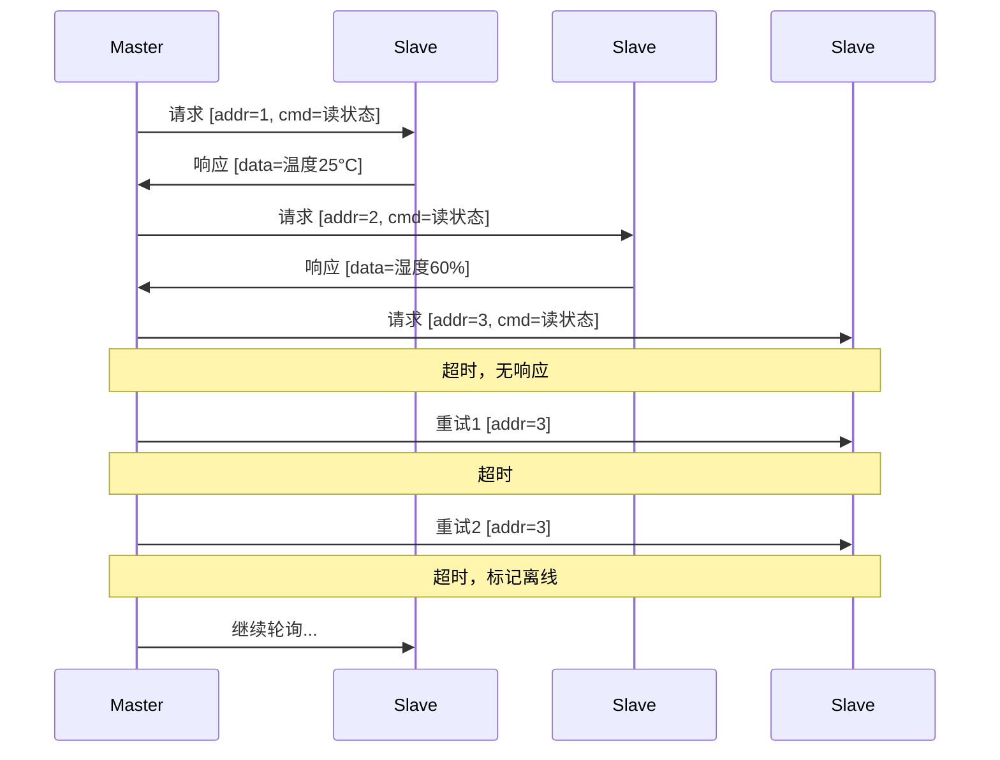
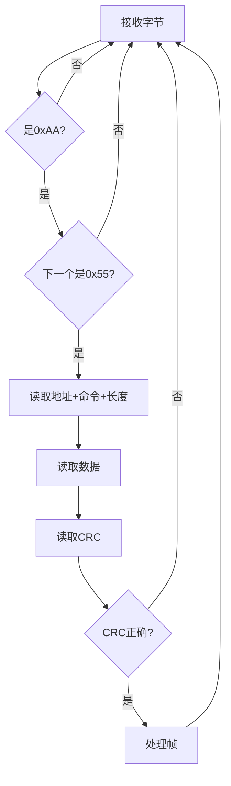

# RS485 协议详解

## 一、核心概念

### 1.1 RS485特点

| 特点 | 说明 |
|------|------|
| 差分信号 | A/B两线差分，抗干扰强 |
| 长距离 | 最远1200米（低波特率） |
| 多点通信 | 一主多从，最多32个节点（标准），256个（增强型） |
| 半双工 | 同一时刻只能收或发 |
| 总线结构 | 所有节点共享同一条总线 |

### 1.2 RS485 vs RS232 vs TTL

| 对比项 | RS485 | RS232 | TTL |
|--------|-------|-------|-----|
| 信号类型 | 差分 | 单端 | 单端 |
| 电压 | ±1.5V~±6V | ±3V~±15V | 0V/3.3V或5V |
| 传输距离 | 1200m | 15m | <1m |
| 节点数 | 32/256 | 1对1 | 1对1 |
| 抗干扰 | 强 | 中 | 弱 |
| 通信方式 | 半双工 | 全双工 | 全双工 |

### 1.3 硬件连接

```
┌─────────┐      ┌─────────┐      ┌─────────┐
│ Master  │      │ Slave 1 │      │ Slave 2 │
│   MCU   │      │   MCU   │      │   MCU   │
└────┬────┘      └────┬────┘      └────┬────┘
     │                │                │
┌────▼────┐      ┌────▼────┐      ┌────▼────┐
│  485芯片│      │  485芯片│      │  485芯片│
│ (MAX485)│      │ (MAX485)│      │ (MAX485)│
└────┬────┘      └────┬────┘      └────┬────┘
     │                │                │
═════╪════════════════╪════════════════╪═══════  A线
═════╪════════════════╪════════════════╪═══════  B线
     │                │                │
    ┌┴┐              GND              ┌┴┐
    │R│ 终端电阻                       │R│ 终端电阻
    │120Ω│                            │120Ω│
    └┬┘                               └┬┘
    GND                               GND
```

### 1.4 关键引脚

```
MAX485芯片引脚：
- RO：接收输出（接MCU RX）
- RE：接收使能（低有效）
- DE：发送使能（高有效）
- DI：发送输入（接MCU TX）
- A/B：差分总线

方向控制：DE和RE通常接在一起，用一个GPIO控制
- GPIO高：发送模式
- GPIO低：接收模式
```

---

## 二、通信协议

### 2.1 主从轮询

```
主站职责：
1. 按地址轮询各从站
2. 发送请求，等待响应
3. 超时重试或标记离线

从站职责：
1. 监听总线
2. 只响应发给自己的请求
3. 不主动发言
```

### 2.2 帧格式设计

```cpp
// 通用帧格式
struct RS485Frame {
    uint8_t header[2];    // 帧头 0xAA 0x55
    uint8_t address;      // 从站地址
    uint8_t command;      // 命令码
    uint8_t length;       // 数据长度
    uint8_t data[];       // 数据
    uint16_t crc;         // CRC16校验
};

// 示例：读取温度
// 请求：AA 55 01 03 00 [CRC]
// 响应：AA 55 01 03 02 [温度高][温度低] [CRC]
```

### 2.3 时序要求

```
发送前：切换到发送模式，等待稳定（1-5ms）
发送后：等待最后一个字节发完，再切换到接收模式
帧间隔：Modbus RTU要求3.5个字符时间的静默

计算示例（9600波特率）：
- 1个字符 = 10位（1起始+8数据+1停止）
- 1个字符时间 = 10/9600 ≈ 1.04ms
- 3.5个字符 ≈ 3.6ms
```

---

## 三、代码实现

### 3.1 Qt RS485通信类

```cpp
class RS485Master : public QObject {
    Q_OBJECT
    
    QSerialPort serial_;
    QTimer timeoutTimer_;
    QByteArray rxBuffer_;
    
    // 方向控制（如果需要软件控制）
    bool useDirectionControl_ = false;
    int directionPin_ = -1;
    
public:
    bool open(const QString& port, int baudRate = 9600) {
        serial_.setPortName(port);
        serial_.setBaudRate(baudRate);
        serial_.setDataBits(QSerialPort::Data8);
        serial_.setParity(QSerialPort::NoParity);
        serial_.setStopBits(QSerialPort::OneStop);
        
        if (!serial_.open(QIODevice::ReadWrite)) {
            return false;
        }
        
        connect(&serial_, &QSerialPort::readyRead,
                this, &RS485Master::onDataReceived);
        connect(&timeoutTimer_, &QTimer::timeout,
                this, &RS485Master::onTimeout);
        
        return true;
    }
    
    void sendCommand(uint8_t address, uint8_t cmd, 
                     const QByteArray& data) {
        QByteArray frame;
        frame.append(0xAA);  // 帧头
        frame.append(0x55);
        frame.append(address);
        frame.append(cmd);
        frame.append(static_cast<char>(data.size()));
        frame.append(data);
        
        // 计算CRC
        uint16_t crc = calcCRC16(frame);
        frame.append(crc & 0xFF);
        frame.append((crc >> 8) & 0xFF);
        
        // 切换到发送模式
        setDirection(true);
        
        // 发送
        serial_.write(frame);
        serial_.waitForBytesWritten(100);
        
        // 切换到接收模式
        setDirection(false);
        
        // 启动超时定时器
        currentAddress_ = address;
        timeoutTimer_.start(500);  // 500ms超时
    }
    
private slots:
    void onDataReceived() {
        rxBuffer_.append(serial_.readAll());
        
        // 尝试解析帧
        while (tryParseFrame()) {
            // 继续解析
        }
    }
    
    void onTimeout() {
        emit responseTimeout(currentAddress_);
    }
    
private:
    bool tryParseFrame() {
        // 找帧头
        int headerPos = rxBuffer_.indexOf(QByteArray("\xAA\x55", 2));
        if (headerPos < 0) {
            rxBuffer_.clear();
            return false;
        }
        if (headerPos > 0) {
            rxBuffer_.remove(0, headerPos);
        }
        
        // 检查长度
        if (rxBuffer_.size() < 5) return false;  // 至少有头+地址+命令+长度
        
        int dataLen = static_cast<uint8_t>(rxBuffer_[4]);
        int frameLen = 5 + dataLen + 2;  // 头+数据+CRC
        
        if (rxBuffer_.size() < frameLen) return false;
        
        // 校验CRC
        QByteArray frame = rxBuffer_.left(frameLen);
        uint16_t receivedCrc = (static_cast<uint8_t>(frame[frameLen-1]) << 8) |
                               static_cast<uint8_t>(frame[frameLen-2]);
        uint16_t calcedCrc = calcCRC16(frame.left(frameLen-2));
        
        if (receivedCrc != calcedCrc) {
            rxBuffer_.remove(0, 2);  // 丢弃错误帧头，继续找
            return true;
        }
        
        // 帧正确
        timeoutTimer_.stop();
        
        uint8_t address = frame[2];
        uint8_t cmd = frame[3];
        QByteArray data = frame.mid(5, dataLen);
        
        emit responseReceived(address, cmd, data);
        
        rxBuffer_.remove(0, frameLen);
        return true;
    }
    
    void setDirection(bool transmit) {
        if (useDirectionControl_) {
            // 控制GPIO（平台相关）
            // digitalWrite(directionPin_, transmit ? HIGH : LOW);
        }
        // 大多数USB转485芯片自动控制方向
    }
    
    uint16_t calcCRC16(const QByteArray& data) {
        uint16_t crc = 0xFFFF;
        for (int i = 0; i < data.size(); i++) {
            crc ^= static_cast<uint8_t>(data[i]);
            for (int j = 0; j < 8; j++) {
                if (crc & 0x0001) {
                    crc = (crc >> 1) ^ 0xA001;
                } else {
                    crc >>= 1;
                }
            }
        }
        return crc;
    }
    
signals:
    void responseReceived(uint8_t address, uint8_t cmd, const QByteArray& data);
    void responseTimeout(uint8_t address);
};
```

### 3.2 轮询管理器

```cpp
class PollingManager : public QObject {
    Q_OBJECT
    
    RS485Master* master_;
    QList<uint8_t> deviceAddresses_;
    QMap<uint8_t, DeviceStatus> deviceStatus_;
    int currentIndex_ = 0;
    QTimer pollTimer_;
    
public:
    void addDevice(uint8_t address) {
        deviceAddresses_.append(address);
        deviceStatus_[address] = {true, 0};  // 默认在线
    }
    
    void startPolling(int intervalMs = 100) {
        connect(&pollTimer_, &QTimer::timeout, this, &PollingManager::pollNext);
        pollTimer_.start(intervalMs);
    }
    
private slots:
    void pollNext() {
        if (deviceAddresses_.isEmpty()) return;
        
        uint8_t addr = deviceAddresses_[currentIndex_];
        master_->sendCommand(addr, CMD_READ_STATUS, QByteArray());
        
        currentIndex_ = (currentIndex_ + 1) % deviceAddresses_.size();
    }
    
    void onResponse(uint8_t address, uint8_t cmd, const QByteArray& data) {
        deviceStatus_[address].online = true;
        deviceStatus_[address].failCount = 0;
        emit deviceDataReceived(address, data);
    }
    
    void onTimeout(uint8_t address) {
        deviceStatus_[address].failCount++;
        if (deviceStatus_[address].failCount >= 3) {
            deviceStatus_[address].online = false;
            emit deviceOffline(address);
        }
    }
};
```

---

## 四、常见问题与解决

### 4.1 通信不稳定

| 问题 | 原因 | 解决方案 |
|------|------|----------|
| 乱码 | 波特率不匹配 | 确认两端波特率一致 |
| 无响应 | 地址错误/方向控制 | 检查地址，检查DE/RE控制 |
| 偶发错误 | 干扰/接地 | 加终端电阻，加共地线 |
| 距离远不通 | 信号衰减 | 降低波特率，加中继器 |

### 4.2 总线冲突

```
现象：多个从站同时发送，数据错乱
原因：
1. 从站地址冲突
2. 从站未正确响应（响应了非自己的请求）
3. 主站轮询间隔太短

解决：
1. 确保每个从站地址唯一
2. 从站严格检查地址匹配
3. 主站等待响应或超时后再发下一个请求
```

### 4.3 终端电阻

```
何时需要：
- 总线长度 > 几米
- 波特率 > 9600
- 有干扰环境

位置：总线两端各接120Ω
注意：只在物理两端，中间节点不加
```

---

## 五、面试回答模板

### Q1：RS485和普通串口有什么区别？

> RS232/TTL是点对点、单端信号、距离短。
> 
> RS485特点：
> 1. 差分信号（A/B线），抗干扰强
> 2. 支持一主多从（最多32/256个节点）
> 3. 长距离传输（最远1200米）
> 4. 半双工，需要方向控制
> 
> 应用层看还是串口收发，但多了地址、轮询和方向控制逻辑。

### Q2：你项目里怎么做RS485通信？

> 在营业厅平台项目里，我用RS485连接多个现场设备。
> 
> 实现方案：
> 1. 给每个设备分配唯一地址（1-247）
> 2. 主站周期轮询，发请求等响应
> 3. 帧格式：帧头+地址+命令+数据+CRC16
> 4. 超时500ms，重试3次标记离线
> 
> 遇到的坑：
> - USB转485方向控制问题 → 换自动方向控制的芯片
> - 长距离不稳定 → 加终端电阻120Ω

### Q3：怎么处理RS485总线冲突？

> 总线冲突通常是软件问题：
> 
> 1. 严格主从机制：只有主站发请求，从站只响应
> 2. 从站检查地址：非自己的请求不响应
> 3. 主站一问一答：等响应或超时才发下一个
> 4. 帧间隔：Modbus要求3.5个字符时间的静默

---

## 六、Mermaid图

### 主从轮询时序



### 帧解析状态机


