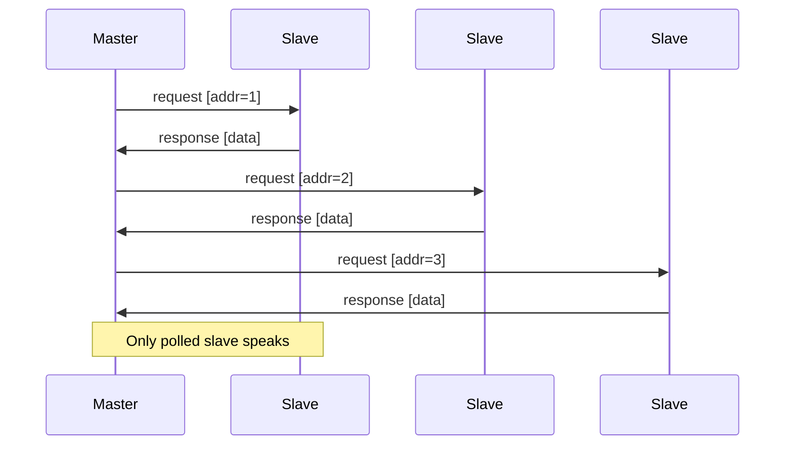

# RS485 面试小抄

## 核心概念
RS485 = 电气层标准：差分信号（A/B 线）、抗干扰强、长距离、支持一主多从，总线结构，半双工（同一时刻只能收或发）。
软件上常见：UART + 外挂 485 芯片 + DE/RE 控制方向。

## 总线冲突 & 主从轮询
- 一条线上多个从机，只有一个在说话；采用主从轮询：主站按地址发请求、从站收到后回应、其他从保持沉默。

## 面试常问 & 回答模板

Q1：RS485 和普通串口有什么区别？
> 串口（RS232/TTL）多为点对点，抗干扰有限，距离短；RS485 采用差分信号，一主多从、长距离，更适合工业现场。应用层看仍是串口，只是多了地址、轮询与方向控制。

Q2：你项目里怎么做 RS485 通信？
> 给每个从设备分配地址；主站固定周期轮询并等待响应，超时重试或标记离线；帧格式含地址、命令、数据与 CRC16，在干扰环境下更可靠；从站仅在收到针对自身的请求时响应，避免总线冲突。

## 三句话总结
- RS485 本质是“带地址的多点串口 + 半双工 + 差分信号”。
- 软件上：主从轮询 + 帧协议 + CRC + 超时重试。
- 用营业厅/现场设备例子说明你的实践。

## Mermaid 时序图：主站轮询多个从站

