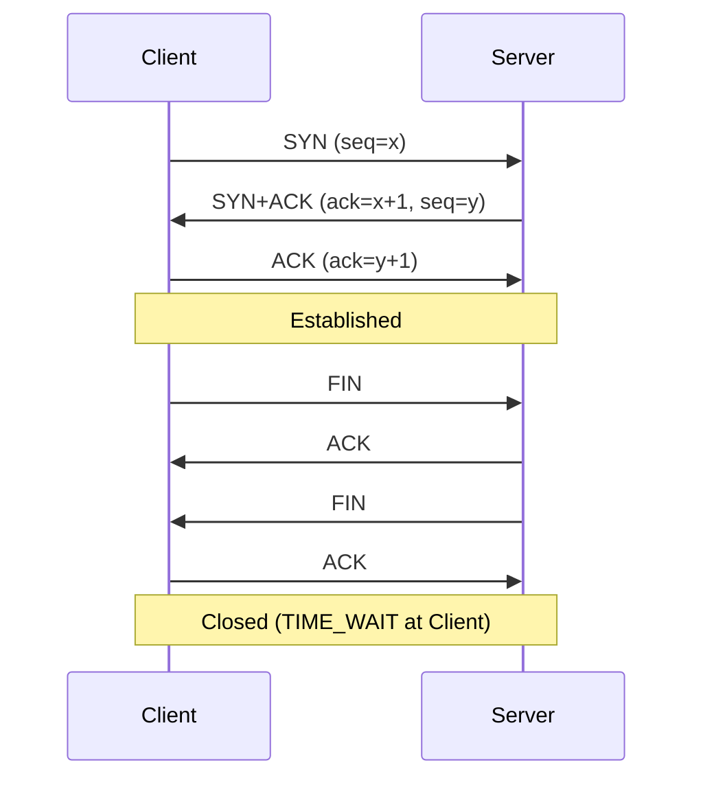
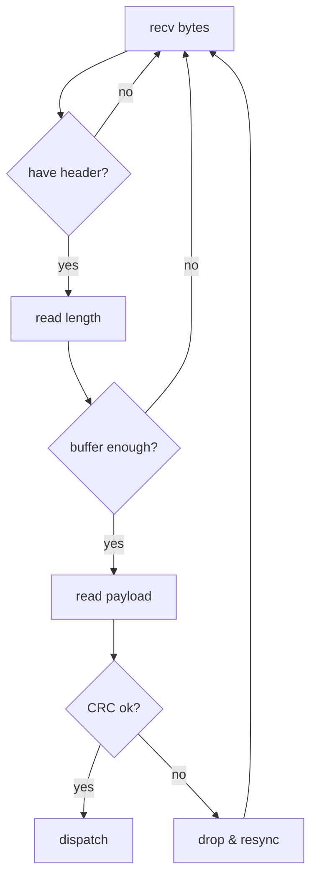

# TCP / UDP 面试小抄

## 核心概念

**TCP：**
- 面向连接（3 次握手建立，4 次挥手关闭）
- 可靠：有序、不丢、不重，不重复
- 字节流（没有消息边界）
- 流量控制、拥塞控制、超时重传
- 场景：文件传输、业务请求、配置下发、状态同步

**UDP：**
- 无连接：不建立连接，直接发
- 不保证可靠和顺序，不做重发
- 报文为单位，有消息边界；头部开销小、延迟低；可广播/多播
- 场景：实时音视频、局域网广播、简单心跳

## 3 次握手 / 4 次挥手（关键点）

**3 次握手：**
1) 客户端：SYN=1, seq=x；2) 服务端：SYN=1, ACK=1, ack=x+1, seq=y；3) 客户端：ACK=1, ack=y+1。

**4 次挥手：**
1) 主动方 FIN；2) 被动方 ACK；3) 被动方 FIN；4) 主动方 ACK，进入 TIME_WAIT。

面试常问：为什么需要 3 次、为什么 TIME_WAIT 在客户端？答：确认双方收发能力都 OK，避免旧连接的包干扰新连接。

## 粘包 / 拆包
- TCP 是字节流，一次 send 不等于一次 recv，必须在应用层定义协议：包头（魔数/版本）+ 长度字段 + 命令字 + 数据 + 校验（CRC）。
- 接收方维护缓冲区与状态机：等包头→读长度→读数据→校验通过交上层，失败丢弃/重新同步。

## 面试常见问题 & 回答模板

Q1：TCP 和 UDP 有什么区别？你项目里怎么选？
> TCP 面向连接、可靠、有序的字节流，适合数据完整性要求高的业务（配置指令、状态同步）。UDP 无连接、尽力而为的报文传输，延迟小、开销小。项目里绝大多数业务用 TCP，上层定义包头和长度字段解决粘包；少数广播或延迟敏感场景用 UDP，并在应用层做简单重试与校验。

Q2：讲一下 TCP 三次握手。
> 客户端发 SYN；服务端回 SYN+ACK；客户端回 ACK。目的是双方都确认“能发能收”，避免旧连接数据影响新连接。我更关注握手失败、重连与 TIME_WAIT 对端口复用的影响。

Q3：TCP 粘包是什么？你怎么处理？
> 流式协议会把多条消息合并为连续字节流，“一次 recv 一条消息”会出错。我设计“包头+长度+数据+校验”的格式，接收端用循环缓冲与状态机，读出完整包再交上层。

## 三句话总结
- TCP 可靠有序，UDP 简单高效，是否需要可靠性决定选型。
- “粘包 + 自定义协议 + 状态机解析”说清楚，已经比很多人强。
- 结合柜外/营业厅项目举例你的包格式与重连机制，更显实战。

## Mermaid 时序图：三次握手 / 四次挥手

## Mermaid 流程图：应用层粘包/拆包解析状态机

