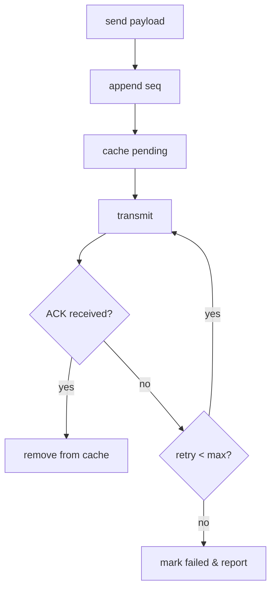

# UDP 面试小抄

## 核心概念
- 无连接：不建立连接，直接发送；不保证可靠与顺序；报文有消息边界；开销低、延迟小；支持广播/多播。
- 场景：实时音视频、局域网广播、简单心跳。

## 面试常问
- 为什么选 UDP 而非 TCP？（延迟、开销、无队头阻塞）
- 如何保证 UDP 的“业务可靠”？（上层重传与幂等）
- 如何避免 IP 分片导致丢包？（控制包大小、应用层分块）

## 回答模板

Q1：UDP 适用场景与优势？
> UDP 不建立连接，延迟小、开销低，适合实时/广播场景。需要可靠时在应用层做序列号、ACK 与重传，并保证幂等处理。

Q2：如何提升 UDP 的业务可靠性？
> 采用“序列号 + ACK/重传 + 去重缓存”的策略；必要时做窗口控制与限速；在高丢包环境下可考虑 FEC 前向纠错。

Q3：如何避免 IP 分片？
> 控制包长小于 MTU；超长数据应用层分块与重组；分块携带序号与校验，避免单片丢失导致整包失败。

## 三句话总结
- UDP 适合低延迟场景，可靠性通过应用层机制补齐。
- 序列/ACK/重传 + 幂等是常见做法，必要时配 FEC。
- 控制包长避免分片，广播/组播用于发现与心跳。

## Mermaid 流程图：UDP 可靠性封装

