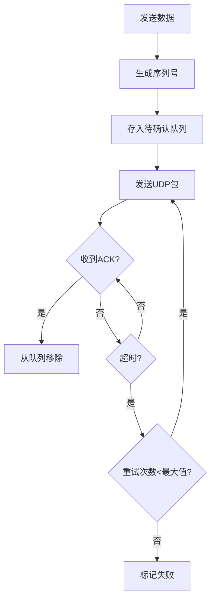
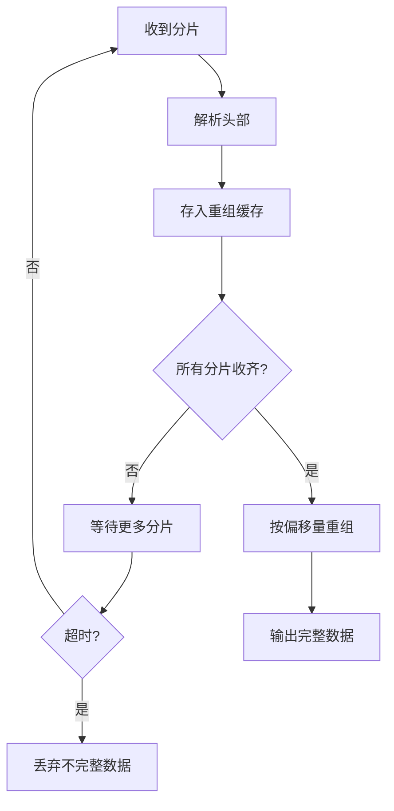

# UDP 协议详解

## 一、核心概念

### 1.1 UDP特点

| 特点 | 说明 |
|------|------|
| 无连接 | 不建立连接，直接发送 |
| 不可靠 | 不保证送达、不保证顺序、不保证不重复 |
| 面向报文 | 有消息边界，一次send对应一次recv |
| 开销低 | 头部只有8字节（TCP是20字节） |
| 支持广播/组播 | TCP不支持 |

### 1.2 UDP头部结构

```
 0      7 8     15 16    23 24    31
+--------+--------+--------+--------+
|   源端口号      |   目的端口号    |
+--------+--------+--------+--------+
|     长度        |     校验和      |
+--------+--------+--------+--------+
|              数据                 |
+--------+--------+--------+--------+
```

- 源端口：2字节
- 目的端口：2字节
- 长度：2字节（头部+数据的总长度）
- 校验和：2字节（可选，可设为0）

### 1.3 UDP vs TCP

| 对比项 | UDP | TCP |
|--------|-----|-----|
| 连接 | 无连接 | 面向连接 |
| 可靠性 | 不可靠 | 可靠（确认重传） |
| 顺序 | 不保证 | 保证 |
| 速度 | 快 | 较慢 |
| 头部开销 | 8字节 | 20字节 |
| 流量控制 | 无 | 有 |
| 拥塞控制 | 无 | 有 |
| 广播/组播 | 支持 | 不支持 |

---

## 二、适用场景

### 2.1 适合UDP的场景

1. **实时音视频**
   - 延迟敏感，丢几帧可接受
   - 如：视频会议、直播、VoIP

2. **游戏**
   - 位置同步、操作同步
   - 丢包可用预测/插值弥补

3. **DNS查询**
   - 简单请求-响应
   - 快速，不需要建连

4. **局域网广播/发现**
   - 设备发现、心跳
   - 如：SSDP、mDNS

5. **物联网传感器上报**
   - 大量设备、数据量小
   - 偶尔丢失可接受

### 2.2 不适合UDP的场景

- 文件传输（需要完整性）
- 金融交易（不能丢失）
- 数据库操作

---

## 三、UDP编程

### 3.1 Qt UDP示例

```cpp
// 发送端
class UdpSender : public QObject {
    QUdpSocket socket;
    
public:
    void send(const QByteArray& data, const QString& host, quint16 port) {
        socket.writeDatagram(data, QHostAddress(host), port);
    }
};

// 接收端
class UdpReceiver : public QObject {
    Q_OBJECT
    QUdpSocket socket;
    
public:
    bool start(quint16 port) {
        if (!socket.bind(QHostAddress::Any, port)) {
            return false;
        }
        connect(&socket, &QUdpSocket::readyRead, 
                this, &UdpReceiver::onReadyRead);
        return true;
    }
    
private slots:
    void onReadyRead() {
        while (socket.hasPendingDatagrams()) {
            QByteArray datagram;
            datagram.resize(socket.pendingDatagramSize());
            QHostAddress sender;
            quint16 senderPort;
            
            socket.readDatagram(datagram.data(), datagram.size(),
                               &sender, &senderPort);
            
            emit dataReceived(datagram, sender, senderPort);
        }
    }
    
signals:
    void dataReceived(const QByteArray& data, 
                      const QHostAddress& sender, quint16 port);
};
```

### 3.2 广播示例

```cpp
// 发送广播
void sendBroadcast(const QByteArray& data, quint16 port) {
    QUdpSocket socket;
    socket.writeDatagram(data, QHostAddress::Broadcast, port);
}

// 接收广播（需要绑定）
socket.bind(QHostAddress::Any, port, 
            QUdpSocket::ShareAddress | QUdpSocket::ReuseAddressHint);
```

---

## 四、可靠UDP设计

### 4.1 为什么需要

应用层需要可靠但又不想用TCP的场景：
- 需要广播/组播
- 需要低延迟
- 需要自定义重传策略

### 4.2 实现方案

```cpp
// 可靠UDP协议设计
struct ReliablePacket {
    uint32_t sequence;    // 序列号
    uint32_t ack;         // 确认号
    uint16_t flags;       // 标志位（ACK/SYN/FIN等）
    uint16_t checksum;    // 校验和
    uint8_t data[];       // 数据
};

class ReliableUdp {
    std::map<uint32_t, PendingPacket> pendingAcks_;  // 待确认
    std::set<uint32_t> receivedSeqs_;                 // 已接收（去重）
    uint32_t nextSeq_ = 0;
    
public:
    void send(const QByteArray& data) {
        ReliablePacket pkt;
        pkt.sequence = nextSeq_++;
        pkt.flags = 0;
        // 填充数据...
        
        // 保存待确认
        pendingAcks_[pkt.sequence] = {pkt, now(), 0};
        
        // 发送
        socket_.writeDatagram(...);
        
        // 启动重传定时器
        startRetryTimer();
    }
    
    void onPacketReceived(const ReliablePacket& pkt) {
        // 收到ACK
        if (pkt.flags & FLAG_ACK) {
            pendingAcks_.erase(pkt.ack);
            return;
        }
        
        // 去重
        if (receivedSeqs_.count(pkt.sequence)) {
            // 重复包，只回ACK
            sendAck(pkt.sequence);
            return;
        }
        
        // 新包
        receivedSeqs_.insert(pkt.sequence);
        sendAck(pkt.sequence);
        
        // 处理数据
        emit dataReceived(pkt.data);
    }
    
    void onRetryTimeout() {
        auto now = currentTime();
        for (auto& [seq, pending] : pendingAcks_) {
            if (now - pending.sendTime > TIMEOUT_MS) {
                if (pending.retryCount < MAX_RETRY) {
                    // 重传
                    socket_.writeDatagram(pending.packet);
                    pending.sendTime = now;
                    pending.retryCount++;
                } else {
                    // 超过重试次数，标记失败
                    emit sendFailed(seq);
                }
            }
        }
    }
};
```

### 4.3 关键参数

| 参数 | 建议值 | 说明 |
|------|--------|------|
| 重传超时 | 200-500ms | 根据网络RTT调整 |
| 最大重试 | 3-5次 | 超过则放弃 |
| 接收窗口 | 32-64 | 乱序缓存大小 |
| 去重缓存 | 1000+ | 记住最近收到的序列号 |

---

## 五、MTU与分片

### 5.1 问题

- 以太网MTU通常是1500字节
- UDP数据超过MTU会在IP层分片
- 任一分片丢失，整个数据报丢失

### 5.2 解决方案

```cpp
const int SAFE_UDP_SIZE = 1400;  // 留出IP/UDP头部空间

void sendLargeData(const QByteArray& data) {
    int offset = 0;
    int fragmentId = 0;
    
    while (offset < data.size()) {
        int chunkSize = qMin(SAFE_UDP_SIZE - sizeof(FragmentHeader), 
                             data.size() - offset);
        
        FragmentHeader header;
        header.totalSize = data.size();
        header.fragmentId = fragmentId++;
        header.offset = offset;
        header.isLast = (offset + chunkSize >= data.size());
        
        QByteArray packet;
        packet.append(reinterpret_cast<char*>(&header), sizeof(header));
        packet.append(data.mid(offset, chunkSize));
        
        socket_.writeDatagram(packet, ...);
        
        offset += chunkSize;
    }
}
```

---

## 六、面试回答模板

### Q1：UDP适用场景与优势？

> UDP不建立连接，延迟小、开销低，适合实时音视频、游戏、广播场景。
> 
> 优势：
> 1. 无连接开销，首包延迟低
> 2. 无队头阻塞（TCP丢包会阻塞后续数据）
> 3. 支持广播/组播
> 4. 应用可自定义可靠性策略

### Q2：如何提升UDP的业务可靠性？

> 核心机制：序列号 + ACK + 重传 + 去重
> 
> 实现要点：
> 1. 每个包带序列号
> 2. 接收方回ACK
> 3. 发送方超时重传（如500ms）
> 4. 接收方用缓存去重
> 5. 必要时加滑动窗口做流控
> 
> 我在项目里用类似方案做设备心跳，超时3次标记离线。

### Q3：如何避免IP分片？

> 控制包大小在MTU以内（通常1400字节安全）。
> 
> 大数据在应用层分块：
> 1. 每块带序号和偏移量
> 2. 接收方重组
> 3. 单块丢失只需重传该块

---

## 七、Mermaid图

### 可靠UDP流程



### 分片重组流程


