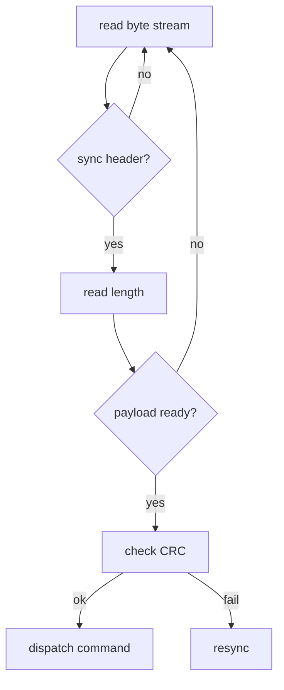

# 串口与 USB 虚拟串口 详解（面试/实战/速查）

## 基本参数
- 波特率、数据位、停止位、校验位（None/Even/Odd）、流控（硬件/软件/无）
- USB 转串口（CH340/FTDI 等）：应用层视为普通 COM 口

## 应用层协议设计
- 统一帧格式：帧头（魔数）、地址/设备 ID、命令字、长度、数据区、CRC16/CRC32
- 接收状态机：同步帧头→读长度→校验→分发；循环缓冲；异常包丢弃
- 超时与重试：命令超时重发、错误计数与告警阈值

## 流控与缓冲
- 硬件流控（RTS/CTS）、软件流控（XON/XOFF）；发送速率与接收缓冲匹配
- 大数据传输分块与确认，避免缓存溢出

## 常见问答
- 如何解决粘包/半包？（帧格式 + 状态机 + 缓冲）
- 为什么需要 CRC？（抗干扰场景的基本保障）
- 波特率与稳定性的关系（高波特率需更强的硬件与线路质量）

## 项目实践要点
- 喷码机/检测终端：串口命令集（开始/停止/设置参数/读状态）；
- 控制器返回状态与告警，统一解析模块隔离上层业务。

## 速答模板
- 串口通信关键在统一帧格式与状态机解析，配合 CRC、超时重试与流控，保证在干扰环境下的稳定传输。

## Mermaid 流程图：串口接收解析状态机

