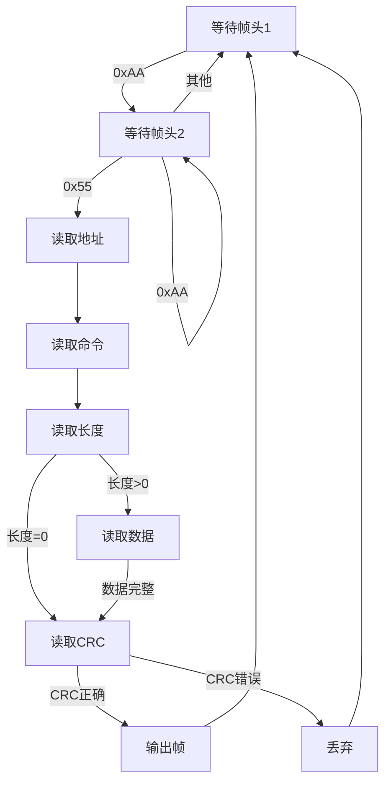
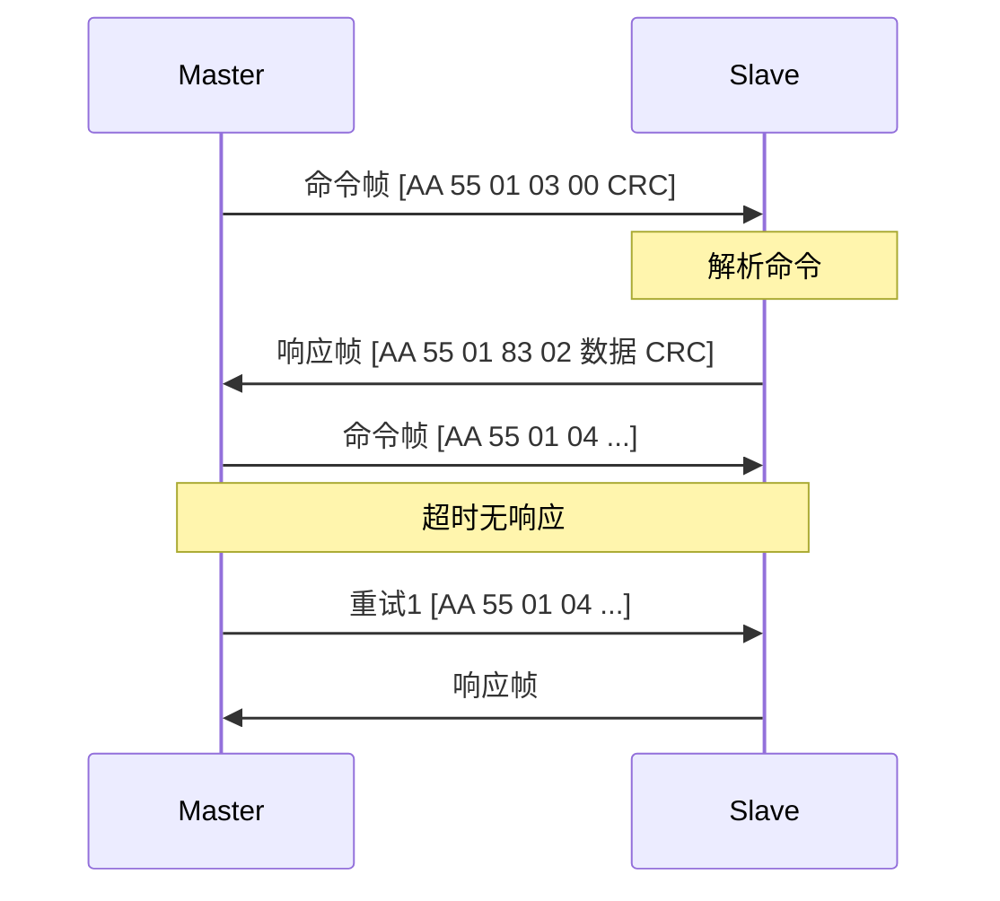

# 串口与USB通信详解

## 一、串口通信基础

### 1.1 串口参数

| 参数 | 说明 | 常用值 |
|------|------|--------|
| 波特率 | 每秒传输的bit数 | 9600, 115200 |
| 数据位 | 每帧数据位数 | 8 |
| 停止位 | 帧结束标志 | 1, 2 |
| 校验位 | 奇偶校验 | None, Even, Odd |
| 流控 | 流量控制 | None, Hardware, Software |

### 1.2 帧格式

```
一个字符的传输（8N1为例）：
┌────┬───────────────────────────┬────┐
│起始│    D0 D1 D2 D3 D4 D5 D6 D7│停止│
│ 0  │         数据位(8)         │ 1  │
└────┴───────────────────────────┴────┘
  1bit          8bit              1bit  = 10bit/字符

波特率9600：1秒传 9600/10 = 960 字符 ≈ 960 字节
波特率115200：1秒传 115200/10 = 11520 字节 ≈ 11KB
```

### 1.3 RS232 vs TTL vs RS485

| 对比项 | RS232 | TTL | RS485 |
|--------|-------|-----|-------|
| 电平 | ±3~±15V | 0/3.3V或5V | ±1.5~±6V差分 |
| 距离 | 15m | <1m | 1200m |
| 节点 | 点对点 | 点对点 | 一主多从(32) |
| 抗干扰 | 中 | 弱 | 强 |
| 接口 | DB9 | 杜邦线 | A/B线 |

---

## 二、应用层协议设计

### 2.1 帧格式设计

```cpp
// 通用帧格式
struct SerialFrame {
    uint8_t header[2];    // 帧头 0xAA 0x55
    uint8_t address;      // 设备地址（多设备时）
    uint8_t command;      // 命令码
    uint8_t length;       // 数据长度
    uint8_t data[];       // 数据区（变长）
    uint16_t checksum;    // 校验和（CRC16或累加和）
};

// 示例命令定义
enum Command {
    CMD_READ_STATUS  = 0x01,  // 读状态
    CMD_SET_PARAM    = 0x02,  // 设置参数
    CMD_START        = 0x03,  // 开始
    CMD_STOP         = 0x04,  // 停止
    CMD_ACK          = 0x80,  // 响应
    CMD_NAK          = 0x81,  // 否定响应
};
```

### 2.2 帧解析状态机

```cpp
class FrameParser {
public:
    enum State {
        WaitHeader1,
        WaitHeader2,
        WaitAddress,
        WaitCommand,
        WaitLength,
        WaitData,
        WaitChecksum1,
        WaitChecksum2
    };
    
private:
    State state_ = WaitHeader1;
    QByteArray buffer_;
    int expectedDataLen_ = 0;
    
public:
    void feed(const QByteArray& data) {
        for (char c : data) {
            processByte(static_cast<uint8_t>(c));
        }
    }
    
private:
    void processByte(uint8_t byte) {
        switch (state_) {
        case WaitHeader1:
            if (byte == 0xAA) {
                buffer_.clear();
                buffer_.append(byte);
                state_ = WaitHeader2;
            }
            break;
            
        case WaitHeader2:
            if (byte == 0x55) {
                buffer_.append(byte);
                state_ = WaitAddress;
            } else if (byte != 0xAA) {
                state_ = WaitHeader1;
            }
            // 如果是0xAA，保持WaitHeader2（可能是新帧头）
            break;
            
        case WaitAddress:
            buffer_.append(byte);
            state_ = WaitCommand;
            break;
            
        case WaitCommand:
            buffer_.append(byte);
            state_ = WaitLength;
            break;
            
        case WaitLength:
            buffer_.append(byte);
            expectedDataLen_ = byte;
            if (expectedDataLen_ > 0) {
                state_ = WaitData;
            } else {
                state_ = WaitChecksum1;
            }
            break;
            
        case WaitData:
            buffer_.append(byte);
            if (buffer_.size() - 5 >= expectedDataLen_) {
                state_ = WaitChecksum1;
            }
            break;
            
        case WaitChecksum1:
            buffer_.append(byte);
            state_ = WaitChecksum2;
            break;
            
        case WaitChecksum2:
            buffer_.append(byte);
            
            // 校验
            if (verifyChecksum(buffer_)) {
                emit frameReceived(parseFrame(buffer_));
            } else {
                emit checksumError();
            }
            
            state_ = WaitHeader1;
            break;
        }
    }
    
    bool verifyChecksum(const QByteArray& frame) {
        int len = frame.size();
        uint16_t received = (static_cast<uint8_t>(frame[len-1]) << 8) |
                            static_cast<uint8_t>(frame[len-2]);
        uint16_t calculated = calcCRC16(frame.left(len-2));
        return received == calculated;
    }
    
signals:
    void frameReceived(const Frame& frame);
    void checksumError();
};
```

### 2.3 超时与重试

```cpp
class ReliableSerial : public QObject {
    Q_OBJECT
    
    QSerialPort serial_;
    FrameParser parser_;
    QTimer timeoutTimer_;
    
    struct PendingCommand {
        QByteArray frame;
        int retryCount;
        qint64 sendTime;
    };
    std::queue<PendingCommand> pendingQueue_;
    
public:
    void sendCommand(const Frame& frame) {
        QByteArray data = encodeFrame(frame);
        
        pendingQueue_.push({data, 0, QDateTime::currentMSecsSinceEpoch()});
        
        if (pendingQueue_.size() == 1) {
            sendNext();
        }
    }
    
private:
    void sendNext() {
        if (pendingQueue_.empty()) return;
        
        auto& cmd = pendingQueue_.front();
        serial_.write(cmd.frame);
        cmd.sendTime = QDateTime::currentMSecsSinceEpoch();
        
        timeoutTimer_.start(500);  // 500ms超时
    }
    
    void onResponse(const Frame& response) {
        timeoutTimer_.stop();
        pendingQueue_.pop();
        
        emit responseReceived(response);
        
        sendNext();
    }
    
    void onTimeout() {
        auto& cmd = pendingQueue_.front();
        cmd.retryCount++;
        
        if (cmd.retryCount < 3) {
            // 重试
            qDebug() << "Retry" << cmd.retryCount;
            sendNext();
        } else {
            // 放弃
            emit commandFailed();
            pendingQueue_.pop();
            sendNext();
        }
    }
};
```

---

## 三、USB虚拟串口

### 3.1 概念

```
USB转串口芯片（如CH340、FT232、CP210x）：
- 物理层：USB
- 应用层：虚拟串口（COM口）
- 对软件透明：和普通串口一样用

工作原理：
USB数据 ←→ 芯片缓冲 ←→ UART信号

好处：
- 电脑不需要物理串口
- 热插拔
- 驱动自动识别
```

### 3.2 常见芯片对比

| 芯片 | 厂商 | 价格 | 稳定性 | 驱动支持 |
|------|------|------|--------|----------|
| CH340 | 南京沁恒 | 低 | 一般 | Win/Mac/Linux |
| FT232 | FTDI | 高 | 好 | 全平台 |
| CP2102 | Silicon Labs | 中 | 好 | 全平台 |
| PL2303 | Prolific | 低 | 一般 | Win有兼容问题 |

### 3.3 热插拔处理

```cpp
class SerialManager : public QObject {
    Q_OBJECT
    
    QSerialPort serial_;
    QString targetPortName_;
    QTimer checkTimer_;
    
public:
    void setTargetPort(const QString& portName) {
        targetPortName_ = portName;
        
        // 定期检查串口是否存在
        connect(&checkTimer_, &QTimer::timeout, this, &SerialManager::checkPort);
        checkTimer_.start(1000);
    }
    
private slots:
    void checkPort() {
        bool portExists = false;
        for (const auto& info : QSerialPortInfo::availablePorts()) {
            if (info.portName() == targetPortName_) {
                portExists = true;
                break;
            }
        }
        
        if (portExists && !serial_.isOpen()) {
            // 串口出现，尝试打开
            openPort();
        } else if (!portExists && serial_.isOpen()) {
            // 串口消失，关闭
            serial_.close();
            emit disconnected();
        }
    }
    
    void openPort() {
        serial_.setPortName(targetPortName_);
        serial_.setBaudRate(115200);
        
        if (serial_.open(QIODevice::ReadWrite)) {
            emit connected();
        }
    }
    
signals:
    void connected();
    void disconnected();
};
```

---

## 四、流量控制

### 4.1 硬件流控（RTS/CTS）

```
RTS (Request To Send)：请求发送
CTS (Clear To Send)：允许发送

工作原理：
1. 发送方拉高RTS："我要发送"
2. 接收方检查缓冲区
3. 缓冲区有空间，拉高CTS："可以发送"
4. 发送方看到CTS高，开始发送
5. 接收方缓冲区快满，拉低CTS："暂停"
6. 发送方看到CTS低，停止发送

适用：高速传输、接收方处理慢
```

### 4.2 软件流控（XON/XOFF）

```
XON (0x11)：继续发送
XOFF (0x13)：停止发送

工作原理：
1. 接收方缓冲区快满，发送XOFF
2. 发送方收到XOFF，暂停发送
3. 接收方处理完数据，发送XON
4. 发送方收到XON，继续发送

缺点：数据中不能包含0x11/0x13
```

### 4.3 Qt中设置流控

```cpp
serial_.setFlowControl(QSerialPort::NoFlowControl);      // 无流控
serial_.setFlowControl(QSerialPort::HardwareControl);    // 硬件流控
serial_.setFlowControl(QSerialPort::SoftwareControl);    // 软件流控
```

---

## 五、常见问题与解决

### 5.1 粘包/半包

```
问题：TCP/串口是流式的，没有消息边界
症状：
- 收到两条消息粘在一起
- 一条消息分两次收到

解决：
1. 固定长度：每条消息固定N字节
2. 分隔符：用特殊字符分隔（如\n）
3. 长度字段：头部包含长度
4. 状态机：按协议格式解析

推荐：长度字段 + 状态机解析
```

### 5.2 乱码

```
问题：收到的数据是乱码

原因1：波特率不匹配
解决：确认两端波特率一致

原因2：数据位/校验位不匹配
解决：确认8N1等参数一致

原因3：编码问题
解决：确认字符编码（ASCII/UTF-8/GBK）
```

### 5.3 数据丢失

```
问题：发送的数据接收方没收到

原因1：缓冲区溢出
解决：加流控，或发送方降速

原因2：没有等待发送完成
解决：serial_.waitForBytesWritten()

原因3：接收缓冲区没清空
解决：定期读取，或用readyRead信号
```

### 5.4 USB串口识别问题

```
问题：USB串口插入后系统不识别

Windows：
1. 检查设备管理器
2. 更新/重装驱动
3. 换USB口/换线

Linux：
1. ls /dev/ttyUSB*
2. 检查权限：sudo chmod 666 /dev/ttyUSB0
3. 或加入dialout组：sudo usermod -a -G dialout $USER
```

---

## 六、面试回答模板

### Q1：串口通信的关键参数有哪些？

> 主要参数：
> - **波特率**：9600、115200等，双方必须一致
> - **数据位**：通常8位
> - **停止位**：1或2位
> - **校验位**：None、Even、Odd
> - **流控**：None、Hardware（RTS/CTS）、Software（XON/XOFF）
> 
> 常用配置：115200,8N1（115200波特率，8数据位，无校验，1停止位）

### Q2：怎么解决串口粘包问题？

> 串口是字节流，没有消息边界，需要应用层处理。
> 
> 我的方案：
> 1. **定义帧格式**：帧头（0xAA 0x55）+ 长度 + 数据 + CRC
> 2. **状态机解析**：按状态顺序读取各字段
> 3. **环形缓冲**：处理不完整帧
> 4. **异常处理**：CRC错误丢弃，重新同步帧头

### Q3：USB虚拟串口和普通串口有什么区别？

> 应用层角度：
> - 使用方式完全相同，都是COM口
> - API一样（open/read/write）
> 
> 实现层角度：
> - 普通串口：MCU直连，物理UART
> - USB虚拟串口：通过CH340等芯片转换
> 
> 需要注意：
> - USB虚拟串口支持热插拔
> - 波特率可能受芯片限制
> - 需要安装驱动

### Q4：项目中串口通信遇到过什么问题？

> 1. **数据丢失**：高速传输时接收方处理不过来
>    - 解决：加硬件流控，或应用层ACK/重传
> 
> 2. **热插拔崩溃**：USB拔出时程序崩溃
>    - 解决：捕获错误，定期检测串口状态
> 
> 3. **帧同步丢失**：干扰导致帧头误判
>    - 解决：用双字节帧头，加CRC校验

---

## 七、Mermaid图

### 帧解析状态机



### 串口通信时序


