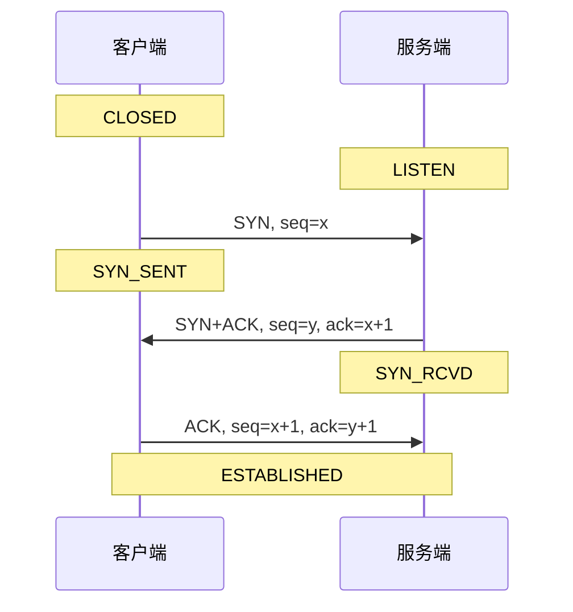
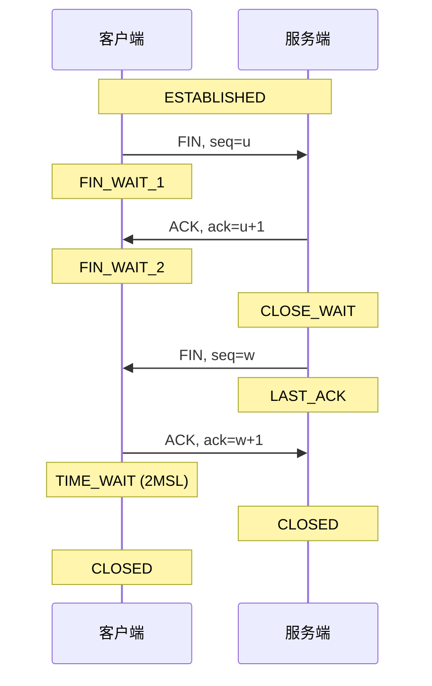

# 网络编程与通信协议技术笔记

## 一、网络基础

### 1.1 OSI七层模型 vs TCP/IP四层

| OSI七层 | TCP/IP四层 | 协议示例 |
|---------|------------|----------|
| 应用层 | 应用层 | HTTP, FTP, MQTT |
| 表示层 | ↑ | SSL/TLS |
| 会话层 | ↑ | RPC |
| 传输层 | 传输层 | TCP, UDP |
| 网络层 | 网络层 | IP, ICMP |
| 数据链路层 | 网络接口层 | Ethernet, ARP |
| 物理层 | ↑ | 电缆, 光纤 |

### 1.2 常用端口号

| 端口 | 协议 | 说明 |
|------|------|------|
| 20/21 | FTP | 文件传输 |
| 22 | SSH | 安全登录 |
| 23 | Telnet | 远程登录 |
| 25 | SMTP | 邮件发送 |
| 53 | DNS | 域名解析 |
| 80 | HTTP | Web |
| 443 | HTTPS | 加密Web |
| 1883 | MQTT | 物联网消息 |
| 3306 | MySQL | 数据库 |

---

## 二、TCP协议详解

### 2.1 三次握手



**为什么是三次？**
- 两次：服务端不知道客户端能否收到响应
- 三次：双方都确认了对方的收发能力

### 2.2 四次挥手



**为什么是四次？**
- TCP是全双工，每个方向的关闭需要单独进行

**TIME_WAIT作用**：
- 确保最后的ACK到达服务端
- 让旧连接的数据包消失

### 2.3 流量控制与拥塞控制

| 机制 | 目的 | 方法 |
|------|------|------|
| 流量控制 | 防止接收方溢出 | 滑动窗口 |
| 拥塞控制 | 防止网络拥塞 | 慢启动、拥塞避免、快重传、快恢复 |

**滑动窗口**：
```
发送方：
[已发送已确认] [已发送未确认] [可发送] [不可发送]
               └─────窗口─────┘

窗口大小 = min(接收窗口, 拥塞窗口)
```

---

## 三、Socket编程

### 3.1 TCP服务端

```cpp
// Qt实现
class TcpServer : public QObject {
    Q_OBJECT
    QTcpServer server_;
    QList<QTcpSocket*> clients_;
    
public:
    bool start(quint16 port) {
        connect(&server_, &QTcpServer::newConnection,
                this, &TcpServer::onNewConnection);
        return server_.listen(QHostAddress::Any, port);
    }
    
private slots:
    void onNewConnection() {
        QTcpSocket* client = server_.nextPendingConnection();
        clients_.append(client);
        
        connect(client, &QTcpSocket::readyRead, this, [=]() {
            QByteArray data = client->readAll();
            // 处理数据
            emit dataReceived(client, data);
        });
        
        connect(client, &QTcpSocket::disconnected, this, [=]() {
            clients_.removeOne(client);
            client->deleteLater();
        });
    }
    
signals:
    void dataReceived(QTcpSocket* client, const QByteArray& data);
};
```

### 3.2 TCP客户端

```cpp
class TcpClient : public QObject {
    Q_OBJECT
    QTcpSocket socket_;
    
public:
    void connectTo(const QString& host, quint16 port) {
        connect(&socket_, &QTcpSocket::connected, this, [=]() {
            emit connected();
        });
        
        connect(&socket_, &QTcpSocket::readyRead, this, [=]() {
            QByteArray data = socket_.readAll();
            emit dataReceived(data);
        });
        
        connect(&socket_, &QTcpSocket::errorOccurred, this, [=](auto error) {
            emit errorOccurred(socket_.errorString());
        });
        
        socket_.connectToHost(host, port);
    }
    
    void send(const QByteArray& data) {
        socket_.write(data);
    }
    
signals:
    void connected();
    void dataReceived(const QByteArray& data);
    void errorOccurred(const QString& error);
};
```

### 3.3 UDP通信

```cpp
// 发送
QUdpSocket sender;
sender.writeDatagram(data, QHostAddress("192.168.1.100"), 8888);

// 接收
QUdpSocket receiver;
receiver.bind(QHostAddress::Any, 8888);

connect(&receiver, &QUdpSocket::readyRead, [&]() {
    while (receiver.hasPendingDatagrams()) {
        QByteArray datagram;
        datagram.resize(receiver.pendingDatagramSize());
        QHostAddress sender;
        quint16 senderPort;
        
        receiver.readDatagram(datagram.data(), datagram.size(),
                              &sender, &senderPort);
        
        // 处理数据
    }
});
```

---

## 四、高级网络编程

### 4.1 I/O多路复用

| 方式 | 平台 | 特点 |
|------|------|------|
| select | 跨平台 | 最多1024连接，每次全量遍历 |
| poll | Linux | 无连接数限制，仍需遍历 |
| epoll | Linux | 事件驱动，高效 |
| IOCP | Windows | 真正异步I/O |
| kqueue | BSD/Mac | 类似epoll |

**epoll使用**：
```cpp
// 创建epoll实例
int epfd = epoll_create1(0);

// 添加监听
struct epoll_event ev;
ev.events = EPOLLIN | EPOLLET;  // 边缘触发
ev.data.fd = listen_fd;
epoll_ctl(epfd, EPOLL_CTL_ADD, listen_fd, &ev);

// 等待事件
struct epoll_event events[MAX_EVENTS];
int n = epoll_wait(epfd, events, MAX_EVENTS, timeout);

for (int i = 0; i < n; i++) {
    if (events[i].data.fd == listen_fd) {
        // 新连接
    } else {
        // 数据可读
    }
}
```

### 4.2 Reactor模式

```cpp
class Reactor {
    std::map<int, std::function<void()>> handlers_;
    int epfd_;
    
public:
    void registerHandler(int fd, std::function<void()> handler) {
        handlers_[fd] = handler;
        
        struct epoll_event ev;
        ev.events = EPOLLIN;
        ev.data.fd = fd;
        epoll_ctl(epfd_, EPOLL_CTL_ADD, fd, &ev);
    }
    
    void run() {
        struct epoll_event events[1024];
        while (running_) {
            int n = epoll_wait(epfd_, events, 1024, -1);
            for (int i = 0; i < n; i++) {
                int fd = events[i].data.fd;
                if (handlers_.count(fd)) {
                    handlers_[fd]();
                }
            }
        }
    }
};
```

---

## 五、协议设计

### 5.1 粘包处理

**方案对比**：

| 方案 | 实现 | 适用场景 |
|------|------|----------|
| 固定长度 | 每包固定N字节 | 简单，浪费带宽 |
| 分隔符 | 用\n等分隔 | 文本协议 |
| 长度字段 | 头部包含长度 | 通用，推荐 |

**长度字段方案**：
```cpp
struct PacketHeader {
    uint32_t magic;    // 魔数 0xDEADBEEF
    uint32_t length;   // 数据长度
    uint16_t type;     // 消息类型
    uint16_t version;  // 协议版本
};

class PacketParser {
    QByteArray buffer_;
    
public:
    void feed(const QByteArray& data) {
        buffer_.append(data);
        
        while (buffer_.size() >= sizeof(PacketHeader)) {
            PacketHeader* header = (PacketHeader*)buffer_.data();
            
            // 检查魔数
            if (header->magic != 0xDEADBEEF) {
                // 同步错误，查找下一个魔数
                resync();
                continue;
            }
            
            // 检查是否收到完整包
            int packetSize = sizeof(PacketHeader) + header->length;
            if (buffer_.size() < packetSize) {
                break;  // 等待更多数据
            }
            
            // 提取完整包
            QByteArray packet = buffer_.left(packetSize);
            buffer_.remove(0, packetSize);
            
            emit packetReceived(packet);
        }
    }
};
```

### 5.2 心跳机制

```cpp
class HeartbeatManager : public QObject {
    Q_OBJECT
    
    QTimer sendTimer_;
    QTimer timeoutTimer_;
    int missCount_ = 0;
    const int MAX_MISS = 3;
    
public:
    void start() {
        // 定期发送心跳
        connect(&sendTimer_, &QTimer::timeout, this, [=]() {
            emit sendHeartbeat();
        });
        sendTimer_.start(5000);  // 5秒发一次
        
        // 检测超时
        connect(&timeoutTimer_, &QTimer::timeout, this, [=]() {
            missCount_++;
            if (missCount_ >= MAX_MISS) {
                emit connectionLost();
            }
        });
        timeoutTimer_.start(8000);  // 8秒超时
    }
    
    void onHeartbeatResponse() {
        missCount_ = 0;
        timeoutTimer_.start();  // 重置超时
    }
    
signals:
    void sendHeartbeat();
    void connectionLost();
};
```

---

## 六、常见协议速查

### 6.1 协议对比表

| 协议 | 传输层 | 特点 | 场景 |
|------|--------|------|------|
| HTTP | TCP | 请求-响应，无状态 | Web |
| WebSocket | TCP | 全双工，长连接 | 实时通信 |
| MQTT | TCP | 发布订阅，轻量 | 物联网 |
| Modbus | TCP/串口 | 主从，工业标准 | 工业控制 |
| UDP | UDP | 快速，不可靠 | 视频/游戏 |

### 6.2 工业协议速查

| 协议 | 物理层 | 特点 |
|------|--------|------|
| Modbus RTU | RS485 | 主从，CRC校验 |
| Modbus TCP | Ethernet | 无CRC，MBAP头 |
| OPC UA | TCP | 安全，复杂 |
| EtherCAT | Ethernet | 实时，硬件要求高 |

---

## 七、面试回答模板

### Q1：TCP三次握手为什么不是两次？

> 两次握手的问题：
> - 服务端发送SYN+ACK后进入ESTABLISHED
> - 但客户端可能没收到（网络丢失）
> - 服务端白白等待，资源浪费
> 
> 三次握手确保：
> - 双方都确认了对方的发送和接收能力
> - 防止旧的重复连接请求导致的问题

### Q2：TCP和UDP的区别？

> | TCP | UDP |
> |-----|-----|
> | 面向连接 | 无连接 |
> | 可靠 | 不可靠 |
> | 有序 | 可能乱序 |
> | 流式 | 报文式 |
> | 慢 | 快 |
> 
> 选择：
> - 需要可靠传输 → TCP
> - 实时性要求高、偶尔丢包可接受 → UDP

### Q3：什么是粘包？怎么解决？

> TCP是字节流，没有消息边界。两个send可能在一个recv中收到。
> 
> 解决方案：
> 1. 固定长度
> 2. 分隔符
> 3. 长度字段（推荐）
> 
> 我的实现：包头带4字节长度 + 2字节类型，状态机解析。

### Q4：epoll和select的区别？

> | select | epoll |
> |--------|-------|
> | 每次传全部fd | 只返回就绪的fd |
> | O(n)遍历 | O(1)事件通知 |
> | 1024限制 | 无限制 |
> | 跨平台 | Linux专用 |
> 
> epoll两种模式：
> - LT（水平触发）：不处理会一直通知
> - ET（边缘触发）：只通知一次，需一次读完

---

## 八、常见问题排查

### 8.1 连接问题

| 现象 | 可能原因 | 排查方法 |
|------|----------|----------|
| 连接超时 | 端口未开放/防火墙 | telnet/nc测试 |
| 连接被拒 | 服务未启动 | netstat查看监听 |
| 连接重置 | 服务崩溃 | 查看服务日志 |

### 8.2 性能问题

| 现象 | 可能原因 | 解决方案 |
|------|----------|----------|
| 延迟高 | Nagle算法 | 禁用Nagle |
| 吞吐低 | 缓冲区小 | 增大缓冲区 |
| CPU高 | 忙等待 | 使用epoll |

```cpp
// 禁用Nagle算法
int flag = 1;
setsockopt(sock, IPPROTO_TCP, TCP_NODELAY, &flag, sizeof(flag));

// 增大缓冲区
int bufSize = 1024 * 1024;
setsockopt(sock, SOL_SOCKET, SO_RCVBUF, &bufSize, sizeof(bufSize));
setsockopt(sock, SOL_SOCKET, SO_SNDBUF, &bufSize, sizeof(bufSize));
```
