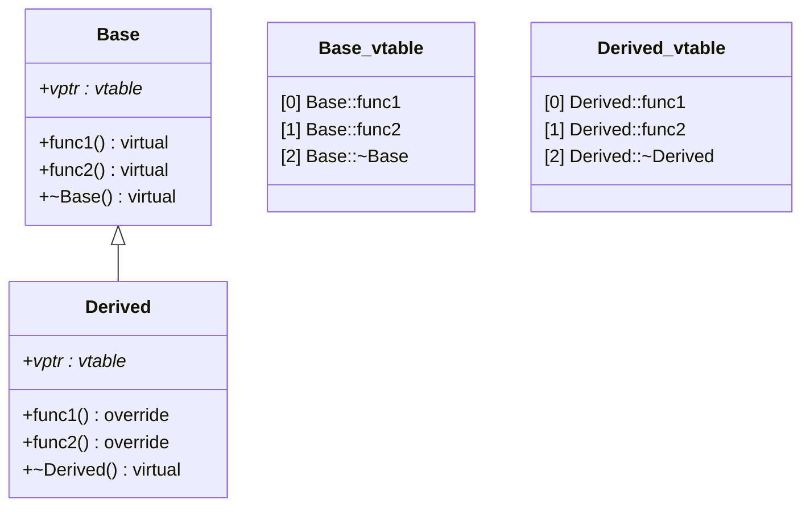
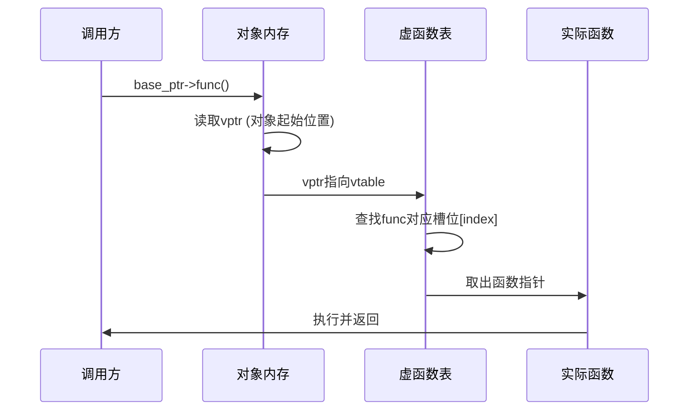

# 虚函数的底层原理是什么？虚函数表和虚指针如何工作？

## 知识点速览

C++多态的核心机制是**虚函数表(vtable)** 和**虚指针(vptr)**。编译器为每个含虚函数的类生成一张函数指针表，对象内隐含一个指向该表的指针，运行时通过这个间接层实现动态分派。



**核心概念：**
- **vtable**：编译期生成，每个类一份，存放虚函数的实际地址
- **vptr**：运行期存在，每个对象一份，构造函数中设置指向本类vtable
- **动态绑定**：`base_ptr->func()` 实际执行 `base_ptr->vptr->vtable[func_slot]()`

## 我的实战经历

**项目背景：** 在南京华乘电气T95带电检测手持终端项目中，我负责核心检测模块架构设计。终端需要支持TEV（暂态地电压）、UHF（超高频局放）、AE（超声波）等多种检测模式，每种模式的数据采集、信号处理、图谱渲染逻辑完全不同。

**遇到的问题：** 早期各检测模块代码独立开发，集成到主框架时用大量if-else判断模块类型来调用对应逻辑。每新增一个检测模块（比如后来加入红外模块），就要改动框架层好几处代码，集成周期长且容易引入回归缺陷。

**分析与解决：** 我设计了`IDetectionModule`抽象基类，通过虚函数定义统一接口：

```cpp
class IDetectionModule {
public:
    virtual ~IDetectionModule() = default;
    virtual void startAcquisition() = 0;
    virtual void stopAcquisition() = 0;
    virtual void processData(const RawDataPacket& packet) = 0;
    virtual QWidget* createDisplayWidget() = 0;
    virtual ModuleType type() const = 0;
};
```

TEV、UHF、AE各自继承并实现，框架层只依赖基类指针。模块注册到工厂后，框架通过基类指针调用虚函数，由vtable分派到具体实现。后来红外模块两周就完成集成，只需实现接口并注册，零框架改动。

**结果：** 模块化集成框架使集成周期从3个月缩短到50天，红外模块2周集成完成。虚析构函数保证了模块对象在`unique_ptr<IDetectionModule>`析构时正确释放派生类资源。

## 深入原理

### 动态绑定调用流程



### vptr在内存中的位置

大多数编译器（GCC/Clang/MSVC）将vptr放在对象内存起始位置：

```
对象内存布局:
+--------+--------+--------+--------+
|  vptr  | 成员1  | 成员2  |  ...   |
+--------+--------+--------+--------+
↓
vtable:
+----------+----------+----------+
| &func1   | &func2   | &~dtor   |
+----------+----------+----------+
```

### 多重继承的vptr

多重继承时对象包含多个vptr，分别对应各基类的vtable。`dynamic_cast`需要借助RTTI信息在vtable中导航。

### 虚函数的代价

| 开销类型 | 说明 |
|---------|------|
| 空间开销 | 每个对象多一个指针(8字节/64位)，每个类一张vtable |
| 时间开销 | 多一次间接寻址，无法内联优化 |
| 缓存开销 | vtable分散在内存中，可能cache miss |

### 常见陷阱

1. **构造函数中调虚函数**：构造时vptr指向当前正在构造的类的vtable，不会调到派生类版本
2. **忘写虚析构函数**：基类指针delete派生对象时只调基类析构，导致资源泄漏
3. **override关键字**：C++11的`override`可让编译器检查是否真的重写了基类虚函数，防止签名不匹配的隐蔽bug

### 面试追问点

- **纯虚函数可以有实现吗？** 可以，但仍使类为抽象类，派生类必须重写。可用于提供默认实现。
- **虚函数表存在哪？** 只读数据段(.rodata)，程序加载时即确定。
- **能手动调用虚函数的非虚版本吗？** 可以，`ptr->Base::func()` 显式指定静态调用。

## 面试表达建议

**开头：** "虚函数的底层靠两个机制——虚函数表和虚指针。编译器为每个有虚函数的类生成一张vtable，每个对象内含一个vptr指向它。"

**重点展开：** 画图解释vtable查找过程，然后结合自己的项目经验说明多态的实际用法——T95终端中用虚函数接口支持多种检测模块的即插即用。

**收尾：** "实际项目中我很注意虚析构函数和override关键字，前者防止内存泄漏，后者让编译器帮忙检查。我们的模块化框架把集成周期从三个月缩短到了50天。"
