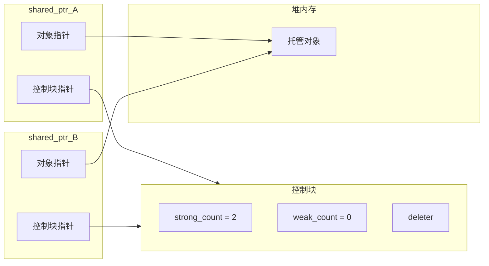

# 智能指针shared_ptr的实现原理？循环引用怎么解决？

## 知识点速览

`shared_ptr`是C++11引入的**共享所有权**智能指针，通过引用计数自动管理对象生命周期。其核心在于**控制块(control block)** 机制和`weak_ptr`对循环引用的破解。



**核心概念：**
- **控制块**：包含强引用计数、弱引用计数、删除器、分配器
- **强引用计数**：shared_ptr拷贝+1，析构-1，归零时销毁对象
- **弱引用计数**：weak_ptr持有时+1，归零时释放控制块
- **make_shared优化**：一次分配同时创建对象和控制块

## 我的实战经历

**项目背景：** 在南京华乘电气T95项目中，我负责设备管理模块的设计。终端需要管理多个检测设备(TEV传感器、UHF天线等)，每个设备对象(Device)需要持有通信模块(CommChannel)的引用来发送指令，同时通信模块也需要持有设备对象的引用来回调数据通知。

**遇到的问题：** 最初两边都用`shared_ptr`互相持有引用，在测试中发现切换检测模式时设备对象和通信模块都不会被释放——内存监控显示每次切换模式内存增长约200KB，运行数小时后手持终端出现内存不足的告警。

**分析与解决：** 用调试工具确认是经典的循环引用问题。分析所有权关系后，Device到CommChannel方向用`shared_ptr`表达所有权，反向改为`weak_ptr`：

```cpp
class CommChannel {
    std::weak_ptr<Device> device_;  // 弱引用，不增加计数
public:
    void onDataReceived(const RawPacket& pkt) {
        if (auto dev = device_.lock()) {  // 提升为shared_ptr
            dev->handleData(pkt);
        }
        // lock()失败说明设备已销毁，安全忽略
    }
};

class Device {
    std::shared_ptr<CommChannel> channel_;  // 强引用，拥有通道
};
```

同时在设备管理器层面用`make_shared`统一创建设备对象，减少内存碎片。

**结果：** 循环引用问题完全消除，连续运行72小时压力测试内存稳定无增长。weak_ptr的lock()还自带了安全检查——通信回调时如果设备已被移除，不会触发空指针崩溃。

## 深入原理

### 引用计数变化时序

| 操作 | strong_count | weak_count | 效果 |
|------|:-----------:|:----------:|------|
| make_shared | 1 | 1 | 创建对象+控制块 |
| 拷贝shared_ptr | +1 | 不变 | 共享所有权 |
| shared_ptr析构 | -1 | 不变 | 若归0销毁对象 |
| 创建weak_ptr | 不变 | +1 | 弱观察 |
| weak_ptr析构 | 不变 | -1 | 若归0释放控制块 |
| weak_ptr::lock() | +1成功 | 不变 | 提升为shared_ptr |

### 循环引用示意


外部释放后A和B的strong_count仍为1，永远不会析构。将B到A改为weak_ptr后，A的strong_count可以正常归零。

### 常见陷阱

1. **同一原始指针构造多个shared_ptr**：产生多个独立控制块，导致double-free
2. **this指针的shared_ptr**：需继承enable_shared_from_this
3. **线程安全**：引用计数操作是原子的，但对象本身的读写不是线程安全的
4. **make_shared的延迟释放**：weak_ptr存在时对象已析构但内存不释放

### 面试追问点

- **shared_ptr是线程安全的吗？** 引用计数原子操作是线程安全的，但指向的对象需要额外同步
- **enable_shared_from_this原理？** 类内持有weak_ptr，shared_from_this()通过lock()返回shared_ptr
- **自定义删除器存在哪？** 控制块里，类型擦除实现

## 面试表达建议

**开头：** "shared_ptr的核心是引用计数+控制块。每个shared_ptr内含两个指针——一个指向对象，一个指向控制块。"

**重点展开：** 先讲控制块结构和计数变化，再讲循环引用问题和weak_ptr的解决方案。结合T95项目中设备与通信模块互引用的案例。

**收尾：** "实际项目中我用make_shared统一创建，循环引用场景下用weak_ptr打破环路。T95终端上做过72小时压力测试，验证了内存稳定性。"