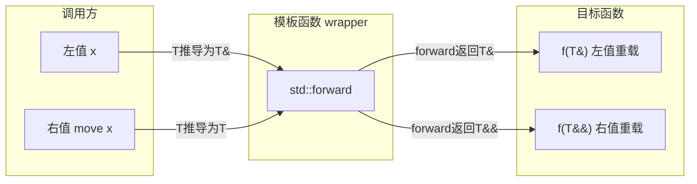
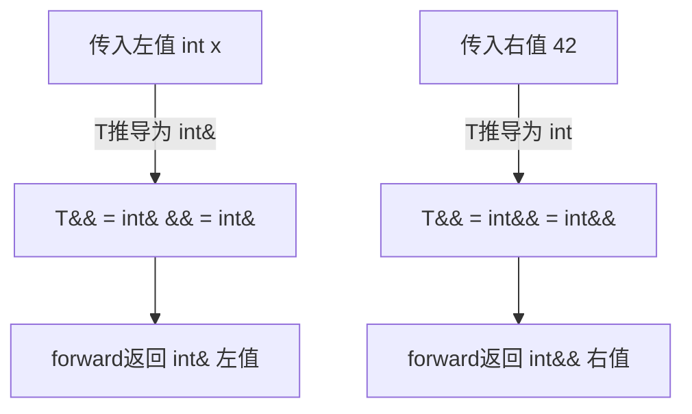

# 什么是完美转发？std::forward的作用是什么？

## 知识点速览

完美转发(Perfect Forwarding)是C++11中让模板函数将参数**原样传递**给其他函数的技术，保持参数的左值/右值属性不变。核心依赖**万能引用**和**引用折叠**两个机制。



**核心概念：**
- **万能引用(Universal Reference)**：`T&&`在模板类型推导语境中，既能绑定左值也能绑定右值
- **引用折叠规则**：`T& &` → `T&`，`T& &&` → `T&`，`T&& &` → `T&`，`T&& &&` → `T&&`
- **std::forward**：条件cast——T为左值引用时保持左值，T为非引用时转为右值
- **不用forward的后果**：具名参数永远是左值，右值实参会退化成拷贝

## 我的实战经历

**项目背景：** 在南京华乘T95项目中，数据管线需要将采集到的数据包分发给不同的处理模块（TEV处理器、UHF处理器、波形记录器等）。每个处理模块接受不同类型的参数，数据包有时需要移动语义（大包传递），有时需要拷贝（多播场景）。

**遇到的问题：** 最初写了一个消息分发器`MessageDispatcher`，用模板转发参数给注册的处理函数。但发现大数据包(约15MB/s数据流中的单个包约64KB)在分发时都被拷贝了一份，CPU占用偏高，profiler显示大量时间花在memcpy上。

**分析与解决：** 问题在于分发函数没有使用完美转发，具名参数丢失了右值属性。改造为：

```cpp
template<typename Handler, typename... Args>
void dispatch(Handler&& handler, Args&&... args) {
    // forward保持每个参数的值类别
    std::invoke(std::forward<Handler>(handler),
                std::forward<Args>(args)...);
}

// 使用示例：
// 移动大包给单个处理器
dispatch(tevProcessor, std::move(largePacket));
// 拷贝给多播（需要保留原始数据）
dispatch(recorder, packet);  // 左值，拷贝
```

对于变参模板中的参数包展开，每个参数独立forward，确保混合场景(部分移动、部分拷贝)也能正确工作。

**结果：** 单播场景下数据包传递从深拷贝变为移动操作，profiler中memcpy热点消失，分发环节CPU占用降低约25%。代码也更通用，新增处理模块时无需为参数类型写特化版本。

## 深入原理

### 引用折叠规则详解



核心规则：**只要有一个左值引用(&)参与折叠，结果就是左值引用**。只有`&& && = &&`。

### std::forward的实现原理

```cpp
// 简化版实现
template<typename T>
T&& forward(std::remove_reference_t<T>& arg) noexcept {
    return static_cast<T&&>(arg);
}
```

- 当T = `int&`时：`static_cast<int& &&>(arg)` 折叠为`int&`，返回左值
- 当T = `int`时：`static_cast<int&&>(arg)` 返回右值引用

### forward vs move 对比

| 特性 | std::move | std::forward |
|------|-----------|-------------|
| 目的 | 无条件转为右值 | 有条件保持值类别 |
| 使用场景 | 明确要移动时 | 模板转发参数时 |
| 依赖模板推导 | 不需要 | 需要T的推导信息 |
| 实质 | static_cast<T&&> | static_cast<T&&> + 引用折叠 |

### 常见陷阱

1. **forward只在模板中有意义**：非模板函数中T是固定的，forward退化为move或无操作
2. **不要forward同一参数两次**：第一次forward为右值后对象可能已被移动，第二次使用是未定义行为
3. **auto&&也是万能引用**：`for(auto&& item : container)` 中item也遵循引用折叠
4. **const T&&不是万能引用**：只有无cv限定的T&&才是万能引用

### 面试追问点

- **forward和move有什么区别？** move无条件转右值，forward有条件保持原始值类别
- **为什么具名右值引用是左值？** 有名字就能取地址，符合左值定义。所以转发时必须再forward
- **emplace_back为什么比push_back快？** emplace_back用完美转发将参数直接传给构造函数，原地构造

## 面试表达建议

**开头：** "完美转发解决的问题是：模板函数接收参数后转发给内层函数时，要保持参数原来的左值或右值身份不变。"

**重点展开：** 讲清楚三个机制——万能引用T&&能同时接受左值和右值、引用折叠规则决定T的推导结果、std::forward根据T有条件地做类型转换。结合T95消息分发器的案例说明完美转发在数据管线中避免大包拷贝的实际价值。

**收尾：** "在我们T95的数据管线中，完美转发让分发模板既能处理移动场景也能处理拷贝场景，分发环节CPU占用降了25%，同时代码更通用，新增模块不需要写特化版本。"