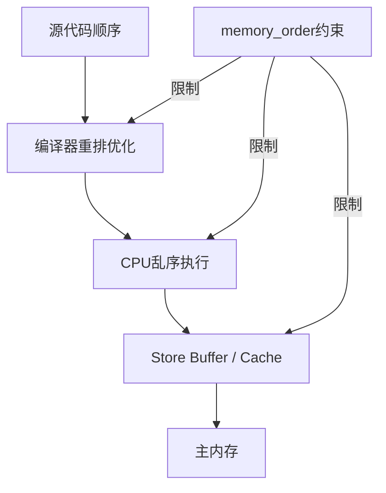

# C++内存模型和原子操作是什么？memory_order有什么用？

## 知识点速览

C++11内存模型定义了多线程程序中内存操作的**可见性**和**顺序性**规则。原子操作(`std::atomic`)配合`memory_order`参数，让程序员精确控制编译器和CPU的指令重排行为。



**核心概念：**
- **原子性**：操作不可分割，不会看到中间状态
- **可见性**：一个线程的写入何时对另一个线程可见
- **顺序性**：操作的执行顺序保证
- **happens-before**：C++内存模型的核心关系，A happens-before B意味着A的效果对B可见

## 我的实战经历

**项目背景：** 在南京华乘T95项目中，我设计了SPSC(单生产者单消费者)无锁队列，用于采集线程向UI线程传递检测数据。数据流量约15MB/s，队列操作的性能直接影响UI刷新延迟。

**遇到的问题：** 最初用`mutex + condition_variable`方案，UI刷新延迟约200ms。改用无锁队列后在x86上测试正常，但代码review时发现memory_order使用不当——全部用的默认`seq_cst`，虽然正确但过于保守，在ARM平台(嵌入式终端用RK3399)上性能会打折扣。

**分析与解决：** 仔细分析了SPSC队列的内存序需求：

```cpp
// 生产者：先写数据，再更新写索引
void push(const T& item) {
    auto cur = write_idx_.load(std::memory_order_relaxed);
    buffer_[cur % capacity_] = item;
    // release保证：item的写入在write_idx_更新之前完成
    write_idx_.store(cur + 1, std::memory_order_release);
}

// 消费者：先读写索引，再读数据
bool pop(T& item) {
    auto cur = read_idx_.load(std::memory_order_relaxed);
    // acquire保证：看到write_idx_更新后，一定能看到item的数据
    if (cur == write_idx_.load(std::memory_order_acquire))
        return false;  // 队列为空
    item = buffer_[cur % capacity_];
    read_idx_.store(cur + 1, std::memory_order_release);
    return true;
}
```

关键是release-acquire配对：生产者store用release确保数据先于索引可见，消费者load用acquire确保读到索引后能看到对应数据。

**结果：** 精确的memory_order选择使队列在ARM平台上的吞吐量提升约15%（减少了不必要的内存屏障），UI延迟从200ms降到50ms，CPU占用降低40%。

## 深入原理

### 六种memory_order对比

| memory_order | 方向 | 保证 | 适用场景 |
|:---:|:---:|------|------|
| relaxed | 无 | 仅原子性 | 计数器、统计量 |
| acquire | 读 | 之后的读写不前移 | 消费者读标志 |
| release | 写 | 之前的读写不后移 | 生产者写标志 |
| acq_rel | 读写 | 双向屏障 | CAS操作 |
| seq_cst | 全局 | 所有线程看到一致顺序 | 默认，简单场景 |

### release-acquire配对示意

```
线程1 (生产者)              线程2 (消费者)
--------------              --------------
data = 42;                      |
flag.store(true, release);      |
        |                       |
        ---- happens-before ----|
                                |
                   flag.load(acquire) == true
                   assert(data == 42);  // 保证成立
```

release写和acquire读之间建立happens-before关系，保证release之前的所有写入对acquire之后可见。

### seq_cst vs release-acquire 的代价

在x86架构上差异较小（x86本身是强内存序模型），但在ARM/POWER等弱内存序架构上：
- `seq_cst`：需要完整的内存屏障(dmb ish)
- `release`：只需store屏障(dmb ishst)
- `relaxed`：无屏障

### 常见陷阱

1. **默认seq_cst的性能开销**：在弱内存序架构上代价显著，应按需选择最宽松的memory_order
2. **relaxed不保证顺序**：两个relaxed操作之间没有任何顺序保证，不能用于同步
3. **atomic不意味着lock-free**：`std::atomic<BigStruct>`可能内部用mutex实现，用`is_lock_free()`检查
4. **volatile不是atomic**：volatile只防编译器优化，不提供原子性和内存序保证

### 面试追问点

- **x86上还需要memory_order吗？** 需要，x86是强序但不是全序，store-load仍可能重排。且memory_order也约束编译器重排。
- **consume和acquire的区别？** consume只保证有数据依赖的操作不重排，但实现困难，C++17已不推荐。
- **如何验证无锁代码的正确性？** ThreadSanitizer(TSan)检测数据竞争，或用模型检查工具如CDSChecker。

## 面试表达建议

**开头：** "C++内存模型解决的核心问题是：多线程环境下，编译器和CPU都会重排指令，memory_order就是告诉它们哪些重排是不允许的。"

**重点展开：** 用生产者-消费者的例子讲release-acquire配对。然后结合T95 SPSC无锁队列的实际案例，说明如何根据场景选择最合适的memory_order。

**收尾：** "在T95项目中，我从seq_cst逐步放松到release-acquire+relaxed的组合，在ARM平台上吞吐量提升了15%。关键是理解每个操作真正需要什么级别的保证。"