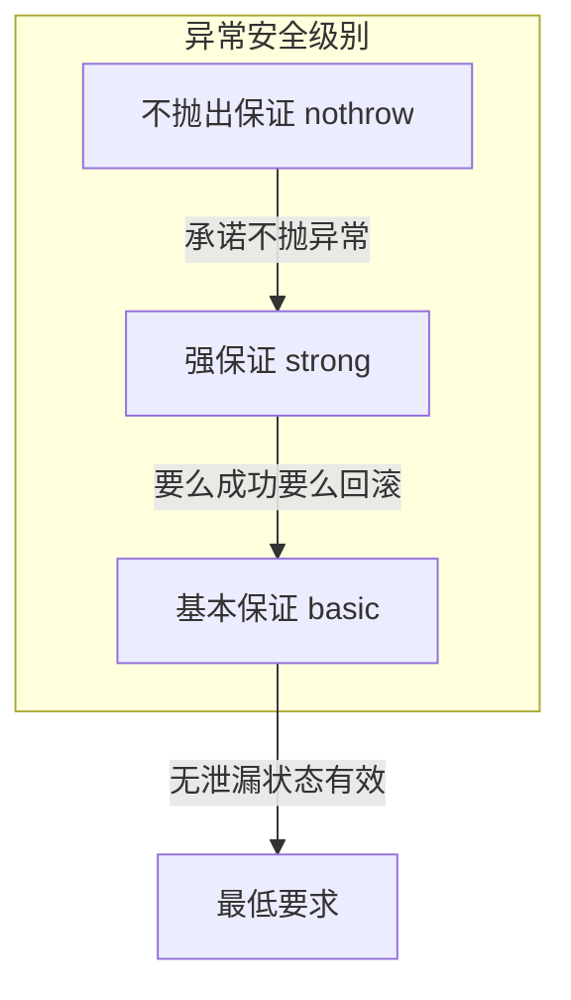
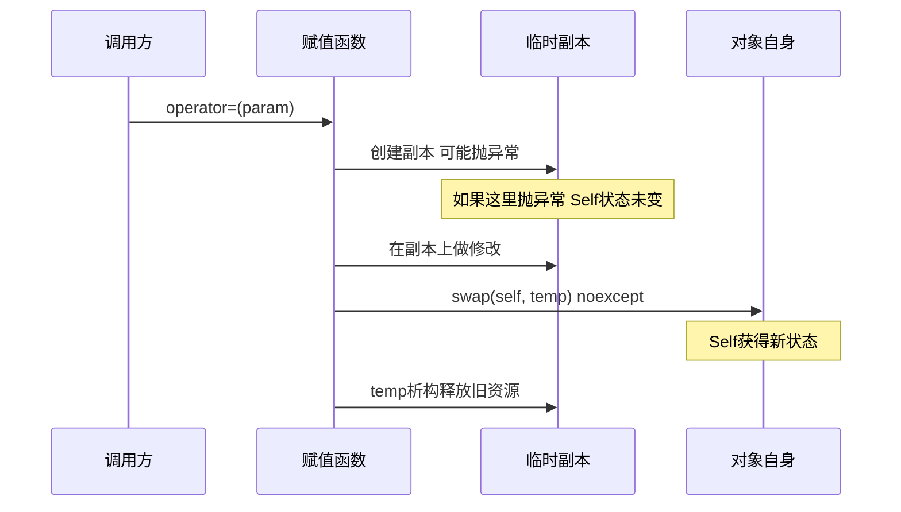

# 异常安全有几个级别？如何编写异常安全的代码？

## 知识点速览

异常安全(Exception Safety)描述的是函数在抛出异常时对程序状态的影响程度。C++中分为三个级别，编写异常安全代码的核心工具是**RAII**和**copy-and-swap**惯用法。



**核心概念：**
- **基本保证**：异常后无资源泄漏，对象处于有效状态（但值可能改变）
- **强保证**：异常后对象状态与调用前完全一致（事务语义）
- **不抛出保证**：操作承诺不会抛出异常（标记noexcept）
- **RAII**：资源获取即初始化，利用析构函数自动释放资源

## 我的实战经历

**项目背景：** 在江苏思行达柜外交互终端项目中，我负责中转服务模块的重构。该模块处理营业厅的交易数据，涉及数据库写入、文件操作和网络通信，任何一步失败都不能让系统处于不一致状态。

**遇到的问题：** 原有代码在交易处理函数中手动管理多个资源(数据库连接、文件句柄、网络socket)，中间任何操作抛异常时，后续的cleanup代码被跳过，导致资源泄漏。运行一段时间后数据库连接池耗尽，故障率高达15%。

**分析与解决：** 分层应用异常安全策略：

```cpp
// RAII封装确保基本保证
class TransactionGuard {
    DBConnection& conn_;
    bool committed_ = false;
public:
    TransactionGuard(DBConnection& conn) : conn_(conn) {
        conn_.beginTransaction();
    }
    void commit() { conn_.commit(); committed_ = true; }
    ~TransactionGuard() {
        if (!committed_) conn_.rollback();  // 异常时自动回滚
    }
};

// copy-and-swap实现强保证
void TradeProcessor::updateRecord(const TradeRecord& newRecord) {
    TradeRecord temp = current_;          // 拷贝(可能抛异常)
    temp.applyUpdate(newRecord);          // 修改副本(可能抛异常)
    validateRecord(temp);                 // 验证(可能抛异常)
    // --- 以下操作不抛出 ---
    std::swap(current_, temp);            // noexcept swap
}
```

所有资源管理改为RAII方式，关键业务逻辑用copy-and-swap实现强保证。

**结果：** 重构后故障率从15%降到接近0，资源泄漏问题完全消除。代码结构也更清晰——不再有繁琐的try-catch清理链条。

## 深入原理

### 三个级别的详细对比

| 级别 | 异常后状态 | 实现手段 | 典型场景 |
|------|-----------|---------|---------|
| 基本保证 | 有效但不确定 | RAII、智能指针 | 大多数函数的最低要求 |
| 强保证 | 回滚到调用前 | copy-and-swap | 事务性操作 |
| 不抛出 | 不会发生异常 | noexcept标记 | 析构、swap、move |

### copy-and-swap惯用法



### 异常安全的编码原则

1. **先分配后释放**：先完成所有可能失败的操作，再修改对象状态
2. **析构函数绝不抛异常**：析构中抛异常可能导致std::terminate
3. **noexcept标记**：move构造/赋值、swap、析构应标记noexcept
4. **分离可失败和不可失败操作**：把可能抛异常的部分放前面

### 常见陷阱

1. **new-new问题**：`f(shared_ptr<A>(new A), shared_ptr<B>(new B))` 中执行顺序不确定。解决：用make_shared
2. **异常+析构**：栈展开期间析构函数再抛异常会调用terminate
3. **catch里忘记rethrow**：捕获异常做部分处理后忘记throw;重新抛出
4. **move语义的异常安全**：vector扩容时move构造可能抛异常会退化为copy

### 面试追问点

- **vector扩容为什么关心noexcept？** 如果move构造抛异常，已搬移的元素无法回退。标记noexcept后vector才会用move。
- **unique_ptr如何帮助异常安全？** 作为RAII封装，作用域退出时自动delete。
- **noexcept函数真的抛了异常会怎样？** 直接调用std::terminate，不进行栈展开。

## 面试表达建议

**开头：** "异常安全分三个级别：基本保证——不泄漏资源，强保证——失败时回滚，不抛出保证——承诺不抛异常。"

**重点展开：** 讲RAII如何实现基本保证，copy-and-swap如何实现强保证。结合思行达项目中交易处理的RAII重构案例。

**收尾：** "我在思行达的中转服务重构中全面应用RAII和copy-and-swap，故障率从15%降到接近0。核心思路是把资源管理交给RAII，把状态变更做成事务性的。"