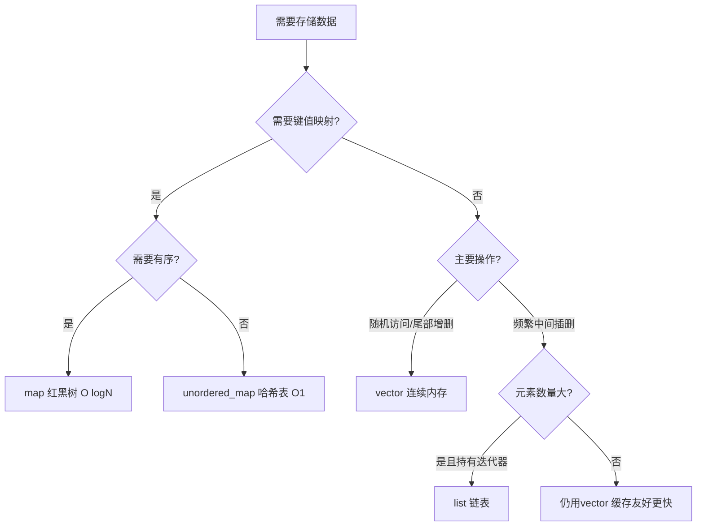

# STL容器怎么选？vector、list、map、unordered_map各自什么时候用？

## 知识点速览

STL容器选型的核心是根据**访问模式**和**操作频率**选择底层数据结构。不同容器在内存布局、时间复杂度和缓存友好性上差异巨大。



**核心概念：**
- **缓存局部性**：vector连续内存对CPU缓存友好，实际性能远超理论复杂度预测
- **时间复杂度不等于实际速度**：O(1)的链表操作可能比O(N)的vector操作还慢
- **默认选vector**：除非有明确理由，否则vector几乎总是最佳选择

## 我的实战经历

**项目背景：** 在南京华乘T95项目中，设备数据处理模块需要根据设备ID快速查找设备配置，同时管理动态的检测模块列表。最初全部用`std::map`实现。

**遇到的问题：** profiler显示在高频数据处理路径上，按设备ID查找配置的`map::find`操作占了较多时间。T95终端同时管理约20个设备，每秒数千次查找，map的O(logN)在热路径上有可测量的开销。

**分析与解决：** 分析后将不需要有序遍历的设备ID查找从map替换为unordered_map：

```cpp
// 之前：map按ID有序，但查找是O(logN)
std::map<DeviceId, DeviceConfig> deviceConfigs_;

// 之后：unordered_map哈希查找O(1)
std::unordered_map<DeviceId, DeviceConfig> deviceConfigs_;
```

对于检测模块列表（通常只有3-5个模块），虽然有动态增删，但数量少且遍历频率远高于增删，仍然用vector。

**结果：** 设备ID查找性能提升约40%，热路径上的容器操作时间从整体的12%降到7%。关键教训是：容器选型不能只看理论复杂度，要结合数据规模和访问模式。

## 深入原理

### 主要容器对比

| 容器 | 底层结构 | 随机访问 | 查找 | 插入删除 | 内存布局 |
|------|---------|---------|------|---------|---------|
| vector | 动态数组 | O(1) | O(N) | 尾部O(1)摊还 | 连续 |
| list | 双向链表 | O(N) | O(N) | 任意O(1) | 分散 |
| map | 红黑树 | - | O(logN) | O(logN) | 树节点分散 |
| unordered_map | 哈希表 | - | O(1)平均 | O(1)平均 | 桶+链表 |

### 缓存友好性的影响

CPU的L1/L2缓存行(64字节)可以一次预取多个vector元素，但list节点分散在堆上，每次访问都可能cache miss。实测中，对于小于1000个元素的容器，vector的线性查找通常比list快。

### 选型决策表

| 场景 | 推荐容器 | 原因 |
|------|---------|------|
| 默认选择 | vector | 缓存友好，接口丰富 |
| 键值查找不关心顺序 | unordered_map | O(1)哈希查找 |
| 键值查找需要有序 | map | O(logN)自动排序 |
| 频繁中间插删持有迭代器 | list | O(1)插删迭代器稳定 |
| 唯一元素集合 | unordered_set/set | 自动去重 |
| FIFO队列 | deque/queue | 双端高效 |

### 常见陷阱

1. **小数据量不要用list**：100个元素以内vector遍历删除通常比list快
2. **unordered_map的哈希冲突**：最坏情况退化为O(N)
3. **reserve减少vector扩容**：已知大小时提前reserve
4. **map的迭代器比vector稳定**：插入不会使已有迭代器失效

### 面试追问点

- **deque和vector区别？** deque两端O(1)插删，内存分段不连续，随机访问略慢
- **vector扩容为什么是2倍？** 几何级增长保证摊还O(1)
- **什么时候用multimap？** 允许重复键的场景

## 面试表达建议

**开头：** "STL容器选型核心看两点：访问模式和数据规模。默认用vector，需要键值查找用unordered_map，需要有序用map。"

**重点展开：** 用表格对比各容器复杂度，强调缓存局部性。结合T95项目中用unordered_map替换map提升40%查找性能的案例。

**收尾：** "实际项目中我学到：不能只看理论复杂度，还要考虑数据规模和缓存效应。小数据量场景下vector几乎总是最快的。"