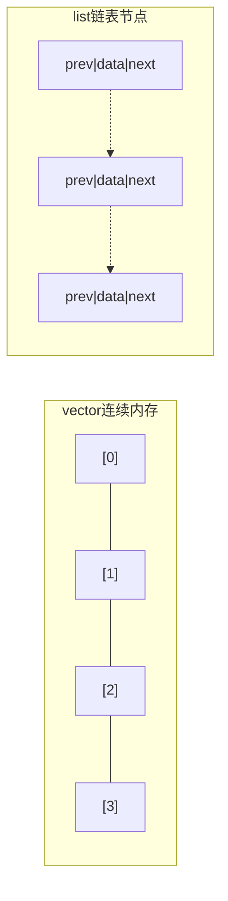
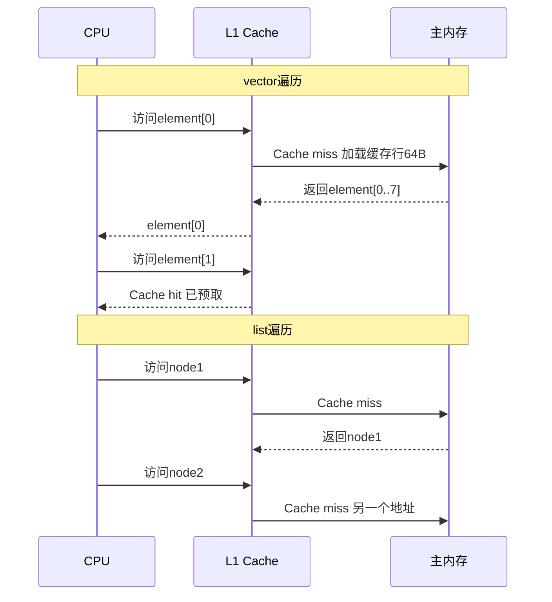

# vector和list有什么区别？什么时候选哪个？

## 知识点速览

vector和list的核心区别在于**内存布局**：vector是连续内存的动态数组，list是分散节点的双向链表。这一差异导致了操作性能、缓存友好性和迭代器稳定性上的显著不同。



**核心概念：**
- **内存连续性**：vector元素紧密排列，list节点散落在堆上
- **缓存局部性**：vector一次缓存行(64B)可预取多个元素，list每次访问可能cache miss
- **迭代器稳定性**：list的插入删除不影响其他迭代器，vector插入可能全部失效
- **实践经验**：小数据量场景，vector即使理论复杂度劣势也比list快

## 我的实战经历

**项目背景：** 在南京华乘T95项目中，我需要管理两类列表：一个是设备列表(约20个设备)，另一个是检测模块的观察者列表(3-8个观察者)。

**遇到的问题：** 初期有同事建议观察者列表用`std::list`，理由是"观察者会动态注册/注销，list插删是O(1)"。但实际分析后发现，观察者通知（遍历列表逐个回调）的频率远高于注册/注销频率——每秒通知数百次，注册/注销可能一天才几次。

**分析与解决：** 两个列表都选用vector：

```cpp
// 设备列表：数量少，按索引快速访问
std::vector<std::shared_ptr<Device>> devices_;

// 观察者列表：遍历通知远多于增删
std::vector<IObserver*> observers_;

// 删除观察者用erase-remove惯用法
void removeObserver(IObserver* obs) {
    observers_.erase(
        std::remove(observers_.begin(), observers_.end(), obs),
        observers_.end());
}
```

vector的连续内存让CPU预取器高效工作。观察者数量少(不超过10个)，即使erase需要移动元素也只是几个指针的复制。

**结果：** 相比list方案，观察者通知遍历性能提升约3倍(通过benchmark验证)。核心收获是"默认用vector"这条实战经验。

## 深入原理

### 操作复杂度对比

| 操作 | vector | list |
|------|--------|------|
| 随机访问 | O(1) | O(N) |
| 头部插入 | O(N) | O(1) |
| 尾部插入 | O(1)摊还 | O(1) |
| 中间插入 | O(N) | O(1)已有迭代器 |
| 查找 | O(N) | O(N) |
| 内存开销 | 连续块+少量冗余 | 每节点额外两个指针 |

### 缓存效应的实际影响



### 迭代器失效规则

| 操作 | vector | list |
|------|--------|------|
| push_back | 若扩容则全部失效 | 不影响 |
| insert | 插入点之后全部失效 | 不影响 |
| erase | 删除点之后全部失效 | 只有被删元素失效 |

### 什么时候真的该用list

1. 元素数量大(>10000)且频繁中间插删
2. 需要在遍历过程中安全地插入/删除（splice操作）
3. 元素很大且不可移动(no move constructor)

### 面试追问点

- **vector扩容时发生了什么？** 分配新内存、移动元素、释放旧内存。几何级扩容保证摊还O(1)
- **deque和vector区别？** deque分段连续，两端O(1)插删，随机访问多一次间接寻址
- **forward_list和list区别？** 单向链表，省一个指针空间，只支持前向遍历

## 面试表达建议

**开头：** "vector和list的核心区别是内存布局——vector连续内存、缓存友好，list链表节点分散。"

**重点展开：** 强调缓存局部性对实际性能的影响。用T95项目中观察者列表选型的案例说明小数据量下vector更快。

**收尾：** "我的实战经验是默认选vector。在T95项目中，即使有少量增删操作，vector在小数据量下的遍历性能也是list的3倍左右。"