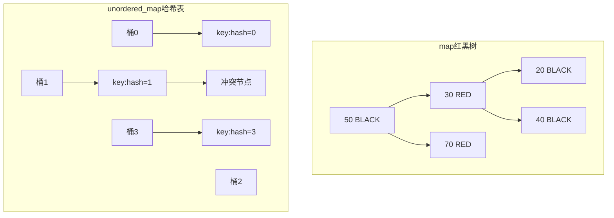
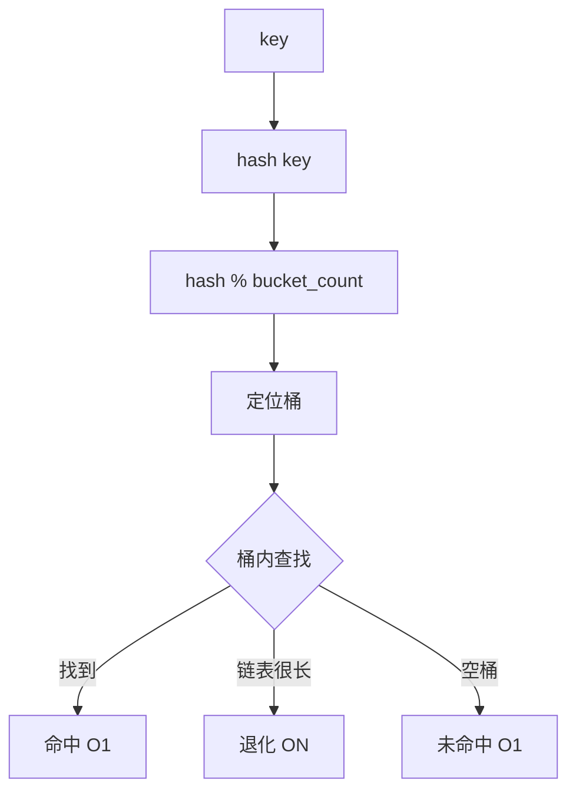

# map和unordered_map有什么区别？

## 知识点速览

`map`和`unordered_map`都是键值容器，核心区别在于**底层数据结构**：map用红黑树（有序），unordered_map用哈希表（无序但更快）。



**核心概念：**
- **map**：红黑树，自平衡BST，元素有序，O(logN)操作
- **unordered_map**：哈希表，桶+链表，元素无序，O(1)平均操作
- **有序性**：map支持范围查询(lower_bound/upper_bound)，unordered_map不支持
- **哈希冲突**：unordered_map最坏退化为O(N)

## 我的实战经历

**项目背景：** 在江苏思行达的柜外交互终端项目中，设备管理框架需要根据设备ID快速查找设备对象。终端连接15+种设备（扫描枪、读卡器、打印机等），设备上下线时需要快速定位。

**遇到的问题：** 初版用`std::map<std::string, DevicePtr>`按设备ID管理设备，功能正常但在设备状态轮询时，每秒需要查找上百次，profiler显示map::find的红黑树分支跳转开销可测量。

**分析与解决：** 分析需求：设备查找不需要有序遍历，纯粹是ID到Device的映射关系。改用unordered_map后提供了合适的哈希函数：

```cpp
// 之前：有序map O(logN)查找
std::map<std::string, std::shared_ptr<IDevice>> devices_;

// 之后：无序哈希表 O(1)平均查找
std::unordered_map<std::string, std::shared_ptr<IDevice>> devices_;

// 设备适配器模式：快速查找
std::shared_ptr<IDevice> DeviceManager::findDevice(const std::string& id) {
    auto it = devices_.find(id);
    return (it != devices_.end()) ? it->second : nullptr;
}
```

对于需要按类型分组遍历的场景，另外维护一个按类型索引的map。

**结果：** 设备查找从O(logN)降为O(1)，轮询路径性能提升约30%。15+种设备的即插即用适配不受影响。

## 深入原理

### 性能对比

| 操作 | map红黑树 | unordered_map哈希表 |
|------|:-----------:|:--------------------:|
| 查找 | O(logN) | O(1)平均 O(N)最坏 |
| 插入 | O(logN) | O(1)平均 O(N)rehash |
| 删除 | O(logN) | O(1)平均 |
| 有序遍历 | 支持 | 不支持 |
| 范围查询 | lower_bound/upper_bound | 不支持 |
| 内存开销 | 每节点3指针+颜色位 | 桶数组+节点+哈希值 |

### 哈希冲突处理



### 何时选map

1. **需要有序遍历**：如按时间戳排序的日志
2. **范围查询**：lower_bound到upper_bound
3. **键类型没有好的哈希函数**：自定义类型写operator<比写hash容易
4. **需要稳定最坏情况**：O(logN)是确定性的

### 何时选unordered_map

1. **纯键值查找**：不需要有序遍历
2. **性能敏感**：O(1)比O(logN)显著更快
3. **键有好的哈希分布**：整数、字符串等标准类型
4. **数据量大**：N越大差距越明显

### 常见陷阱

1. **自定义键类型**：unordered_map需要hash和operator==，map需要operator<
2. **迭代器失效**：unordered_map在rehash时所有迭代器失效
3. **负载因子**：默认1.0，超过时自动rehash
4. **string做键的开销**：长字符串哈希需要遍历整个字符串

### 面试追问点

- **unordered_map的rehash是什么？** 元素数/桶数超过负载因子时扩大桶数组并重新哈希所有元素
- **如何给自定义类型写哈希？** 特化std::hash或传入哈希函数对象
- **红黑树相比AVL树的优势？** 插入删除时旋转次数更少(最多2-3次)

## 面试表达建议

**开头：** "map底层是红黑树，元素有序，操作O(logN)；unordered_map底层是哈希表，元素无序，平均O(1)。"

**重点展开：** 用表格对比两者在各操作上的复杂度，讲有序性的应用场景。结合思行达设备管理框架的案例。

**收尾：** "在思行达15+设备管理的实际项目中，改用unordered_map后查找性能提升约30%。选型原则：需要有序用map，纯查找用unordered_map。"