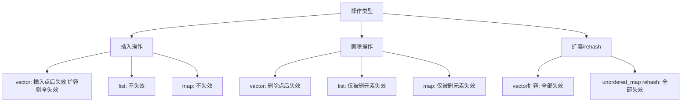
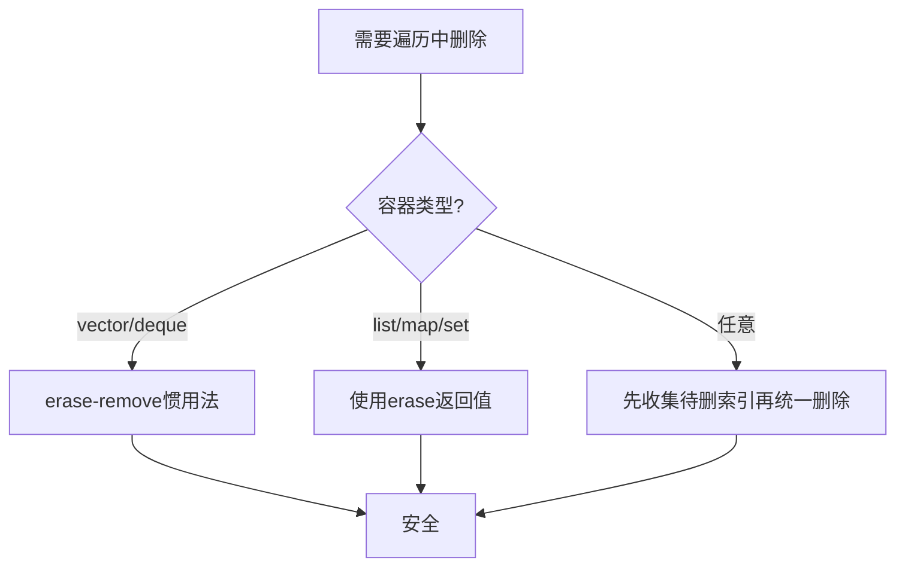

# 什么情况下迭代器会失效？如何避免？

## 知识点速览

迭代器失效(Iterator Invalidation)是C++ STL中最常见的陷阱之一。不同容器的底层结构决定了不同的失效规则。



**核心概念：**
- **vector/deque**：内存重分配导致大面积失效
- **list/set/map**：节点型容器，只有直接操作的节点失效
- **unordered系列**：rehash导致全部失效
- **安全模式**：用erase返回值、erase-remove惯用法

## 我的实战经历

**项目背景：** 在南京华乘T95项目中，检测模块管理器需要动态管理检测模块列表。模块可以在运行时启用/禁用，同时系统需要遍历活跃模块下发数据。

**遇到的问题：** 在一次集成测试中，遍历模块列表并执行健康检查时，如果某个模块检查失败就地移除，导致程序随机崩溃。日志显示是访问了已失效的迭代器——典型的"遍历中删除"问题：

```cpp
// 错误代码：遍历中直接erase导致迭代器失效
for (auto it = modules_.begin(); it != modules_.end(); ++it) {
    if (!(*it)->healthCheck()) {
        modules_.erase(it);  // BUG! it已失效，++it是未定义行为
    }
}
```

**分析与解决：** 使用erase的返回值（指向下一个有效元素的迭代器）来安全删除：

```cpp
// 正确做法1：使用erase返回值
for (auto it = modules_.begin(); it != modules_.end(); ) {
    if (!(*it)->healthCheck()) {
        it = modules_.erase(it);  // erase返回下一个有效迭代器
    } else {
        ++it;
    }
}

// 正确做法2：erase-remove惯用法
modules_.erase(
    std::remove_if(modules_.begin(), modules_.end(),
        [](const auto& m) { return !m->healthCheck(); }),
    modules_.end());
```

同时增加了编码规范：团队要求在循环中修改容器时必须用安全模式。

**结果：** 崩溃问题完全消除。这个经验后来在指导2名初级工程师时专门作为教学案例讲解。

## 深入原理

### 各容器迭代器失效规则

| 容器 | insert | erase | push_back | 扩容/rehash |
|------|--------|-------|-----------|-----------|
| vector | 插入点后失效 扩容全失效 | 删除点后失效 | 可能扩容全失效 | 全失效 |
| deque | 首尾不失效 中间全失效 | 首尾不影响其他 中间全失效 | - | - |
| list | 不失效 | 仅被删元素 | 不失效 | - |
| map/set | 不失效 | 仅被删元素 | - | - |
| unordered系列 | 可能rehash全失效 | 仅被删元素 | - | rehash全失效 |

### 安全删除模式



### vector扩容导致失效的原因

```cpp
std::vector<int> v = {1, 2, 3};
auto it = v.begin() + 1;  // 指向元素2
// 假设v.capacity() == 3
v.push_back(4);  // 触发扩容：分配新内存、移动元素、释放旧内存
// it指向的旧内存已被释放，it是悬垂指针!
*it;  // 未定义行为
```

### C++20的改进

```cpp
// C++20: 更简洁的删除方式
std::erase_if(modules_, [](const auto& m) {
    return !m->healthCheck();
});
```

### 常见陷阱

1. **for-range中修改容器**：`for(auto& x : vec)` 内调用push_back/erase是未定义行为
2. **保存end()迭代器**：修改容器后end()可能已变化
3. **多线程迭代器**：一个线程修改容器会使另一个线程的迭代器失效
4. **deque的特殊规则**：首尾插入不使迭代器失效但引用可能失效

### 面试追问点

- **为什么erase-remove要两步？** remove只把不删的元素移到前面，erase才真正缩小容器
- **map遍历中删除安全吗？** C++11后erase返回下一个有效迭代器
- **如何预防迭代器失效？** reserve预分配、erase返回值、erase-remove、code review

## 面试表达建议

**开头：** "迭代器失效的根本原因是容器内部内存重新分配或节点删除。不同容器规则不同：vector最容易失效，list最稳定。"

**重点展开：** 按容器类型列举失效规则。然后用T95项目中遍历模块列表删除时踩坑的真实案例，展示正确的erase-remove惯用法。

**收尾：** "我在T95项目中因为这个问题制定了编码规范：循环中修改容器必须用erase返回值或erase-remove。后来我带的两名初级工程师也避免了同样的坑。"