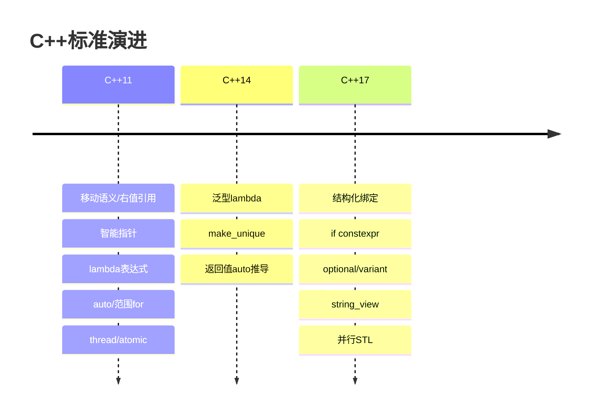

# C++11/14/17分别带来了哪些重要特性？

## 知识点速览

C++11是现代C++的**分水岭**，带来了移动语义、智能指针、多线程库等革命性特性。C++14是小版本补充，C++17进一步增强实用性。



**核心概念：**
- **C++11**：现代C++起点，几乎重新定义了C++编程方式
- **C++14**：对C++11的完善和修补
- **C++17**：大量实用特性，让代码更简洁安全

## 我的实战经历

**项目背景：** 在南京华乘T95项目中，项目使用C++11/14标准（受嵌入式工具链限制）。作为核心模块负责人，我在架构设计中大量使用现代C++特性来提升代码质量和性能。

**C++11特性在T95中的应用：**

```cpp
// 1. 智能指针管理模块生命周期
std::unique_ptr<IDetectionModule> createModule(ModuleType type);

// 2. 移动语义优化数据管线
void DataPipeline::forward(DataPacket&& packet) {
    processor_->process(std::move(packet));  // 避免64KB数据包拷贝
}

// 3. lambda简化回调注册
commChannel_->onData([this](const RawPacket& pkt) {
    this->handleData(pkt);
});

// 4. auto + 范围for简化遍历
for (auto& module : activeModules_) {
    module->processData(packet);
}

// 5. atomic实现无锁队列
std::atomic<size_t> write_idx_{0};
```

**C++14特性使用：**

```cpp
// 泛型lambda简化模板代码
auto makeHandler = [](auto&& callback) {
    return [cb = std::forward<decltype(callback)>(callback)]
           (const Event& e) { cb(e); };
};

// make_unique替代new
auto module = std::make_unique<TEVModule>(config);
```

**结果：** 现代C++特性让T95项目代码量减少约20%（lambda替代functor类、auto减少类型声明），同时通过移动语义和智能指针获得了更好的性能和安全性。

## 深入原理

### C++11核心特性详解

| 特性 | 解决的问题 | 典型应用 |
|------|-----------|---------|
| 移动语义 | 避免不必要的深拷贝 | 返回局部对象、容器操作 |
| 智能指针 | 自动内存管理 | 替代裸指针new/delete |
| lambda | 简化回调和函数对象 | STL算法、异步操作 |
| auto | 减少冗长类型声明 | 迭代器、模板返回值 |
| constexpr | 编译期计算 | 常量、查找表 |
| thread/atomic | 标准化多线程 | 并行处理 |

### C++17实用特性示例

```cpp
// 结构化绑定
auto [id, name, score] = getStudentInfo();
for (auto& [key, value] : myMap) { /* ... */ }

// if constexpr 编译期分支
template<typename T>
auto process(T val) {
    if constexpr (std::is_integral_v<T>) {
        return val * 2;
    } else {
        return val.toString();
    }
}

// std::optional
std::optional<Device> findDevice(const std::string& id);
if (auto dev = findDevice("TEV_01")) {
    dev->start();
}

// string_view 避免字符串拷贝
void log(std::string_view msg);  // 不分配内存
```

### 各版本在嵌入式项目中的采用情况

嵌入式交叉编译工具链通常滞后于桌面编译器，C++11/14已广泛可用，C++17需要较新的工具链。T95项目(RK3399平台)使用GCC 7.x，支持大部分C++17特性但未全面启用。

### 常见陷阱

1. **auto不是万能的**：`auto x = {1,2,3}` 推导为initializer_list而非vector
2. **lambda捕获悬垂引用**：[&]捕获局部变量，lambda存活超过作用域会悬垂
3. **constexpr不保证编译期**：只有在需要编译期结果的上下文中才强制编译期执行
4. **string_view不拥有数据**：底层字符串释放后string_view悬垂

### 面试追问点

- **C++20有什么重要特性？** concepts、ranges、coroutines、modules
- **为什么说C++11是分水岭？** 引入了右值引用、移动语义、智能指针，彻底改变了资源管理方式
- **你项目中用了哪些C++17特性？** 按实际情况回答

## 面试表达建议

**开头：** "C++11是现代C++的分水岭，带来了移动语义、智能指针、lambda、多线程库等核心特性。C++14做了完善，C++17增加了很多实用工具。"

**重点展开：** 挑3-4个自己最熟的特性展开，结合项目说用在哪里。比如T95项目中智能指针管理模块生命周期、移动语义优化数据管线。

**收尾：** "在T95项目中我主要用C++11/14，现代特性让代码量减少了约20%，同时获得了更好的性能和内存安全性。"