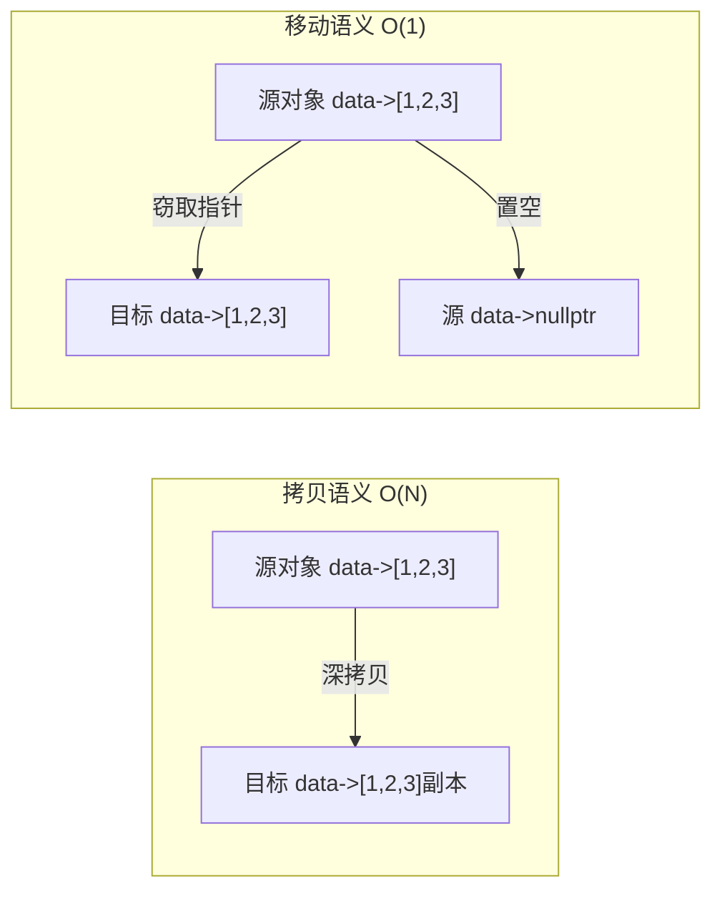

# 移动语义是什么？什么时候会触发移动？

## 知识点速览

移动语义(Move Semantics)是C++11引入的核心特性，允许**窃取**临时对象的资源而非拷贝，将O(N)的深拷贝变为O(1)的指针转移。



**核心概念：**
- **右值引用(T&&)**：绑定到临时对象/即将销毁的对象
- **移动构造/赋值**：接受T&&，把源对象的内部资源搬走
- **std::move**：无条件将左值转为右值引用（只是类型转换，不执行移动）
- **移动后状态**：源对象处于"有效但未指定"状态，可以安全析构

## 我的实战经历

**项目背景：** 在南京华乘T95项目中，数据管线每秒处理约15MB的检测数据，数据包在采集线程、预处理线程、分析线程、UI线程之间传递。每个数据包约64KB。

**遇到的问题：** 初版管线中，数据包(DataPacket)在线程间传递时通过值传递深拷贝。一个64KB缓冲区的DataPacket拷贝需要memcpy整个缓冲区，profiler显示数据传递占了总CPU时间的15%。

**分析与解决：** 为DataPacket实现移动语义，管线中改为移动传递：

```cpp
class DataPacket {
    std::vector<uint8_t> buffer_;   // 64KB数据
    uint64_t timestamp_;
    ModuleType source_;
public:
    // 移动构造：窃取buffer的堆内存
    DataPacket(DataPacket&& other) noexcept
        : buffer_(std::move(other.buffer_))   // vector的move是O(1)
        , timestamp_(other.timestamp_)
        , source_(other.source_) {
        other.timestamp_ = 0;
    }

    // 移动赋值
    DataPacket& operator=(DataPacket&& other) noexcept {
        if (this != &other) {
            buffer_ = std::move(other.buffer_);
            timestamp_ = other.timestamp_;
            source_ = other.source_;
        }
        return *this;
    }
};

// 管线中使用移动传递
void Pipeline::forward(DataPacket packet) {
    nextStage_->enqueue(std::move(packet));
}
```

SPSC无锁队列的push/pop也支持移动语义，整个管线中数据包只在采集时分配一次内存。

**结果：** 数据传递开销从CPU的15%降到不到1%，64KB的memcpy变成了几个指针赋值。配合无锁队列最终实现了UI延迟从200ms到50ms的优化。

## 深入原理

### 触发移动的场景

| 场景 | 示例 | 说明 |
|------|------|------|
| std::move | `f(std::move(x))` | 显式转右值 |
| 函数返回局部对象 | `return localObj;` | NRVO可能省略 |
| 临时对象 | `vec.push_back(T{})` | 临时对象是右值 |
| 容器扩容 | vector resize | 需noexcept |

### 移动构造 vs 拷贝构造

| 对比项 | 拷贝构造 | 移动构造 |
|-------|---------|---------|
| 参数 | const T& | T&& |
| 操作 | 分配+复制资源 | 窃取资源指针 |
| 复杂度 | O(N) | O(1) |
| 源对象 | 不变 | 置为空状态 |
| 异常安全 | 可能抛 | 应标记noexcept |

### NRVO与移动的关系

```cpp
DataPacket createPacket() {
    DataPacket pkt;
    pkt.fill(sensorData);
    return pkt;  // 优先NRVO(直接构造到调用方)
                  // NRVO不可用时触发移动
}
```

编译器优化顺序：NRVO(零成本) > 移动 > 拷贝

### Rule of Five

如果自定义了析构、拷贝构造、拷贝赋值、移动构造、移动赋值中的任何一个，通常需要全部定义（或显式default/delete）。

### 常见陷阱

1. **move后继续使用源对象**：移动后源对象处于有效但未指定状态，读取其值是未定义行为
2. **const对象不会移动**：const string&&匹配的是拷贝构造
3. **忘记noexcept**：移动构造不标noexcept时vector扩容退化为拷贝
4. **自定义了析构忘了移动**：编译器不会自动生成移动构造/赋值

### 面试追问点

- **std::move做了什么？** 只是static_cast<T&&>，本身不做任何移动
- **RVO和移动什么关系？** RVO直接省略构造比移动还快，RVO不可用时才退化到移动
- **移动后的对象能做什么？** 只能安全析构和重新赋值

## 面试表达建议

**开头：** "移动语义的核心思想是窃取而非拷贝。对于持有堆资源的对象，移动只需要转移内部指针，O(1)代替O(N)。"

**重点展开：** 讲移动构造的实现，列举触发移动的场景。结合T95数据管线——64KB数据包从深拷贝到移动传递，CPU开销从15%降到不足1%。

**收尾：** "在T95项目中，移动语义是数据管线性能优化的关键一环。数据类一定要实现移动语义并标记noexcept。"