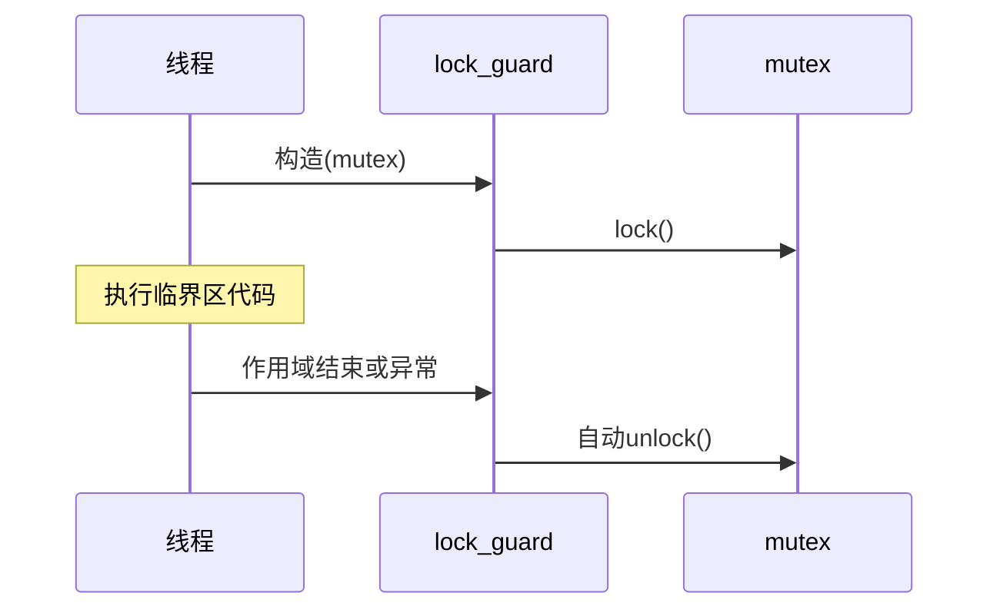
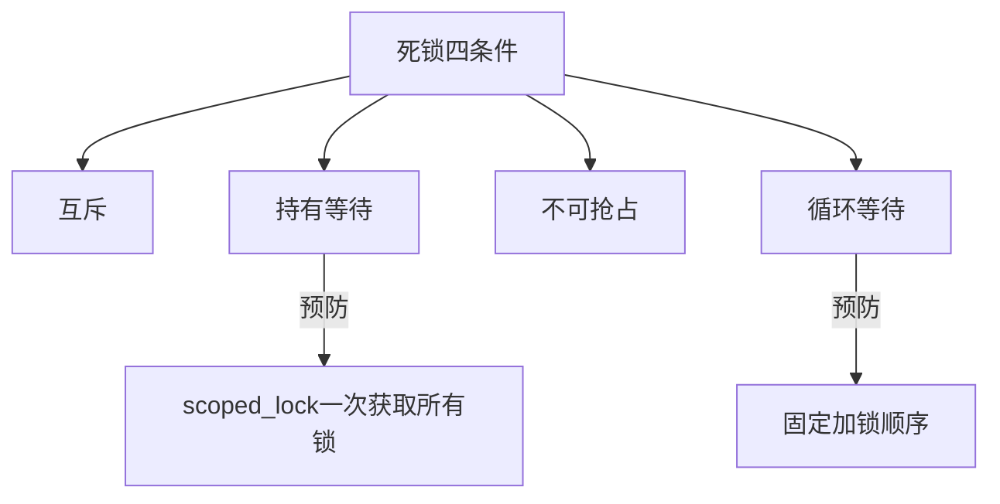

# 多线程编程中如何保证线程安全？

## 知识点速览

线程安全的核心问题是**共享可变状态**的并发访问。保护手段从简单到高级分为多个层次，选择时要平衡安全性和性能。


**核心概念：**
- **数据竞争**：两个线程同时访问同一内存，至少一个是写操作，且没有同步
- **临界区**：需要互斥访问的代码段
- **RAII锁管理**：lock_guard/unique_lock自动获取和释放锁
- **无锁编程**：用原子操作替代锁，避免阻塞和上下文切换

## 我的实战经历

**项目背景：** 在南京华乘T95项目中，数据处理模块需要在多线程间传递数据：采集线程高频写入数据，UI线程读取并渲染，分析线程做FFT频谱计算。

**遇到的问题：** 初版用`std::mutex`+`std::condition_variable`实现线程间数据传递。功能正确但性能不足——mutex的锁竞争在高频场景(15MB/s)下导致UI刷新延迟200ms。

**分析与解决：** 分层优化，针对不同场景选择不同策略：

```cpp
// 层次1：低频配置操作 - mutex + lock_guard
class ModuleManager {
    mutable std::mutex mtx_;
    std::vector<ModulePtr> modules_;
public:
    void addModule(ModulePtr m) {
        std::lock_guard<std::mutex> lock(mtx_);
        modules_.push_back(std::move(m));
    }
};

// 层次2：统计计数器 - atomic
std::atomic<uint64_t> packetsProcessed_{0};
std::atomic<uint64_t> bytesReceived_{0};

// 层次3：高频数据通道 - SPSC无锁队列
template<typename T, size_t Capacity>
class SPSCQueue {
    std::array<T, Capacity> buffer_;
    alignas(64) std::atomic<size_t> write_idx_{0};
    alignas(64) std::atomic<size_t> read_idx_{0};
};
```

三层策略：低频用mutex，计数用atomic，高频管线用SPSC无锁队列。

**结果：** UI延迟从200ms降到50ms，CPU占用降低40%。关键是按场景分层——不是所有地方都需要无锁设计。

## 深入原理

### 同步手段对比

| 手段 | 适用场景 | 开销 | 复杂度 |
|------|---------|------|--------|
| mutex | 通用临界区保护 | 高(系统调用) | 低 |
| shared_mutex | 读多写少 | 中等 | 低 |
| atomic | 单变量操作 | 低(硬件指令) | 中 |
| 无锁结构 | 高频热路径 | 最低 | 高 |
| immutable | 只读数据 | 零 | 零 |

### RAII锁管理



### 死锁预防



### unique_lock vs lock_guard

| 特性 | lock_guard | unique_lock |
|------|-----------|-------------|
| 灵活性 | 构造时锁析构解锁 | 可手动lock/unlock |
| 条件变量 | 不支持 | 支持 |
| 延迟加锁 | 不支持 | defer_lock |
| 移动语义 | 不可移动 | 可移动 |

### 常见陷阱

1. **锁粒度太大**：整个函数加锁导致并发度低
2. **忘记用RAII**：手动lock/unlock在异常路径可能忘unlock
3. **嵌套锁死锁**：用scoped_lock或固定顺序解决
4. **虚假唤醒**：condition_variable的wait必须用循环检查条件
5. **读写锁的陷阱**：写频繁场景shared_mutex可能比mutex更慢

### 面试追问点

- **condition_variable为什么配合unique_lock？** wait()需要先unlock再阻塞，lock_guard不支持
- **mutex和spinlock区别？** mutex让出CPU，spinlock忙等。短临界区用spinlock可能更快
- **什么时候不需要同步？** thread_local、不可变数据、单线程访问的数据

## 面试表达建议

**开头：** "保证线程安全我分层考虑：从mutex到读写锁到原子操作到无锁设计，按场景选择合适的粒度。"

**重点展开：** 讲清楚每层的适用场景和代价。结合T95项目的三层策略——低频用mutex、统计用atomic、高频管线用SPSC无锁队列。

**收尾：** "在T95项目中，这种分层策略让UI延迟从200ms降到50ms。核心思路不是追求全部无锁，而是在正确的地方用正确的工具。"