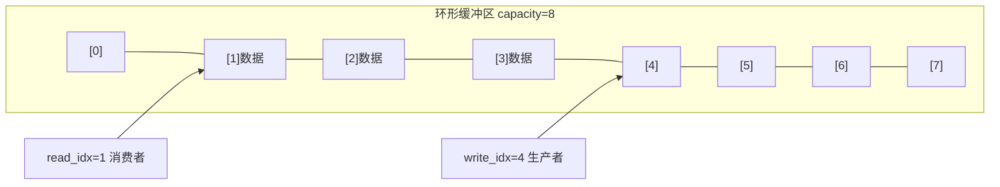

# SPSC无锁队列的原理是什么？为什么比加锁快？

## 知识点速览

SPSC(Single Producer Single Consumer)无锁队列是最简单也最高效的无锁数据结构。基于**环形缓冲区**，生产者和消费者各自维护一个原子索引，通过**memory_order**保证数据可见性。



**核心概念：**
- **环形缓冲区**：固定大小数组，索引取模实现循环
- **单写者原则**：write_idx只有生产者写，read_idx只有消费者写，无竞争
- **release-acquire**：生产者store(release)保证数据先于索引可见，消费者load(acquire)保证看到索引后能看到数据
- **无锁=无系统调用**：不涉及futex/上下文切换

## 我的实战经历

**项目背景：** 在南京华乘T95项目中，这是我最核心的性能优化工作。终端的采集线程以15MB/s的速率产生检测数据（TEV/UHF传感器），需要实时传递给UI线程进行PRPS图谱渲染。

**遇到的问题：** 初版用`std::mutex`+`std::condition_variable`实现线程间队列。在高频数据场景下：
- UI刷新延迟约200ms（用户可感知的卡顿）
- CPU占用偏高，profiler显示30%时间在锁等待和上下文切换
- condition_variable的虚假唤醒进一步恶化延迟

**分析与解决：** 分析场景特点——严格的单生产者(采集线程)单消费者(UI线程)，非常适合SPSC无锁队列：

```cpp
template<typename T, size_t Capacity>
class SPSCQueue {
    static_assert((Capacity & (Capacity - 1)) == 0,
                  "Capacity must be power of 2");

    std::array<T, Capacity> buffer_;
    alignas(64) std::atomic<size_t> write_idx_{0};  // 独占缓存行
    alignas(64) std::atomic<size_t> read_idx_{0};   // 独占缓存行

public:
    bool push(const T& item) {
        const auto w = write_idx_.load(std::memory_order_relaxed);
        const auto r = read_idx_.load(std::memory_order_acquire);
        if (w - r >= Capacity) return false;  // 满
        buffer_[w & (Capacity - 1)] = item;
        write_idx_.store(w + 1, std::memory_order_release);
        return true;
    }

    bool pop(T& item) {
        const auto r = read_idx_.load(std::memory_order_relaxed);
        const auto w = write_idx_.load(std::memory_order_acquire);
        if (r == w) return false;  // 空
        item = std::move(buffer_[r & (Capacity - 1)]);
        read_idx_.store(r + 1, std::memory_order_release);
        return true;
    }
};
```

关键设计点：
- capacity设为2的幂，用位与代替取模
- write_idx和read_idx用alignas(64)分到不同缓存行
- 索引单调递增，用差值判断满/空

**结果：** UI延迟从200ms降到50ms（4倍改善），CPU占用降低40%。队列操作从微秒级降到纳秒级。

## 深入原理

### SPSC vs 加锁队列性能对比

| 加锁队列的开销 | SPSC如何消除 |
|--------------|------------|
| mutex系统调用(futex) | 纯atomic操作用户态完成 |
| 上下文切换(~1-10us) | 无阻塞 spin或yield |
| 锁竞争等待 | 读写索引分离无竞争 |
| cache line bouncing | alignas(64)隔离缓存行 |
| condition_variable虚假唤醒 | 直接轮询索引状态 |

### 为什么SPSC不需要CAS

MPMC(多生产者多消费者)队列需要CAS处理多写者竞争。但SPSC中：
- write_idx只有生产者写，消费者只读
- read_idx只有消费者写，生产者只读
- 没有竞争，不需要CAS重试循环

### 环形缓冲区满/空判断

```
write_idx = 5, read_idx = 2, capacity = 4

可用数据: write_idx - read_idx = 3
空闲空间: capacity - (write_idx - read_idx) = 1

空: write_idx == read_idx
满: write_idx - read_idx >= capacity
```

索引单调递增不回绕，unsigned减法在溢出时仍然正确。

### 常见陷阱

1. **capacity必须是2的幂**：否则位与运算不等于取模
2. **忘记alignas**：write_idx和read_idx在同一缓存行会false sharing
3. **memory_order用错**：relaxed不能保证数据可见性
4. **buffer大小选择**：太小频繁满导致丢数据

### 面试追问点

- **队列满了怎么办？** 可以丢弃、阻塞等待(back-pressure)、或动态扩容
- **SPSC能改成MPMC吗？** 需要CAS操作，复杂度和性能都会变差
- **为什么用单调递增索引？** 避免ABA问题，64位索引实际不会溢出

## 面试表达建议

**开头：** "SPSC无锁队列是环形缓冲区+两个原子索引。因为严格单生产者单消费者，读写索引没有竞争，不需要CAS。"

**重点展开：** 画环形缓冲区示意图，讲push/pop流程和memory_order选择。然后讲T95项目的优化过程——从mutex队列200ms延迟到SPSC无锁队列50ms。

**收尾：** "这是我在T95项目中做的最有成就感的优化。核心是利用SPSC场景的单写者无竞争特性，把线程间通信从微秒级降到纳秒级。"