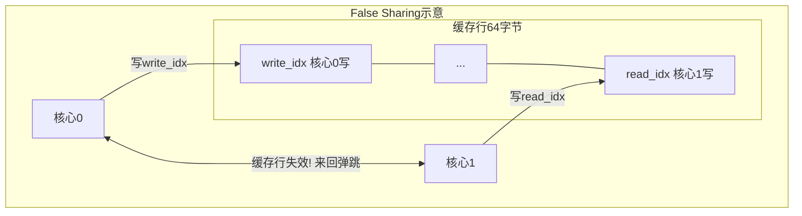
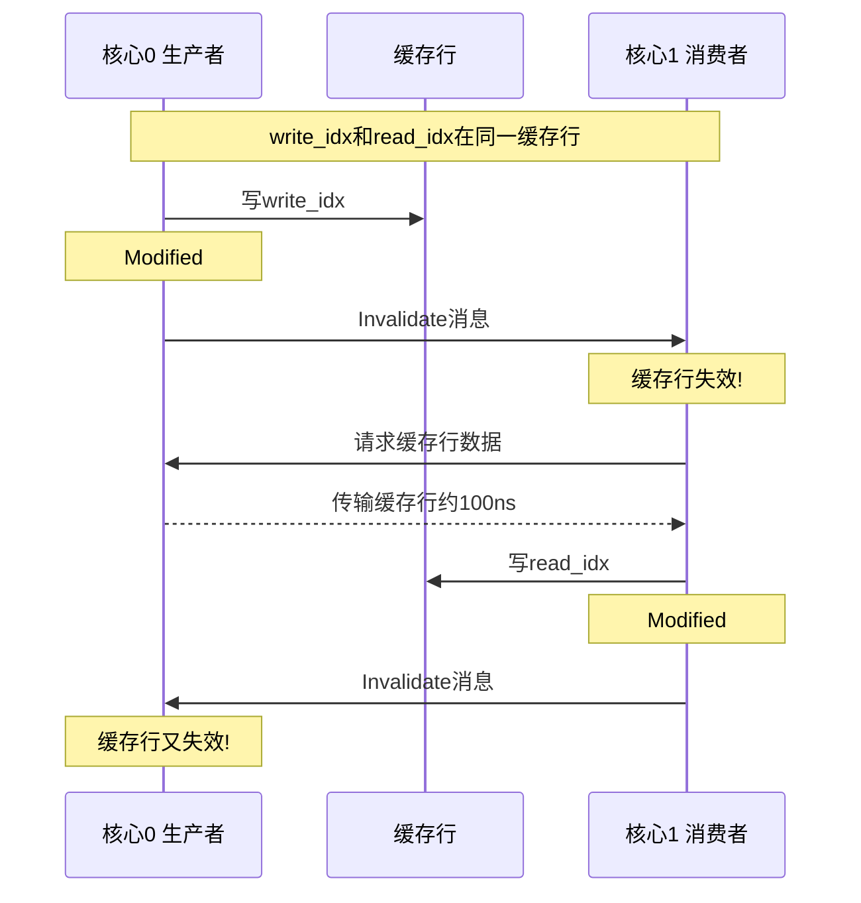

# 什么是false sharing？怎么避免？

## 知识点速览

False sharing是多线程性能的隐形杀手：两个线程修改**不同的变量**，但因为变量在同一个**CPU缓存行**(通常64字节)中，缓存一致性协议(MESI)会导致缓存行在核心间反复失效和传输。



**核心概念：**
- **缓存行(Cache Line)**：CPU缓存的最小操作单位，通常64字节
- **MESI协议**：缓存一致性协议，一个核心写入时通知其他核心该缓存行失效
- **Cache Line Bouncing**：缓存行在多个核心间反复传输和失效
- **解决方案**：alignas(64)或padding让热变量独占缓存行

## 我的实战经历

**项目背景：** 在南京华乘T95项目中，SPSC无锁队列的初版实现功能正确，但benchmark显示吞吐量没有达到预期——理论上无锁应该比mutex快10倍以上，实测只快了3倍。

**遇到的问题：** 用perf工具分析发现大量的L1 cache miss集中在write_idx和read_idx的访问上。检查内存布局发现两个atomic变量在struct中紧挨着，编译器将它们放在了同一个64字节缓存行中。生产者频繁写write_idx，消费者频繁写read_idx，导致严重的false sharing。

**分析与解决：**

```cpp
// 修复前：两个索引可能在同一缓存行
struct SPSCQueue_v1 {
    std::atomic<size_t> write_idx_{0};  // 可能紧挨着
    std::atomic<size_t> read_idx_{0};   // 同一缓存行!
};

// 修复后：alignas(64)确保独占缓存行
struct SPSCQueue_v2 {
    alignas(64) std::atomic<size_t> write_idx_{0};  // 缓存行1
    alignas(64) std::atomic<size_t> read_idx_{0};   // 缓存行2
};
```

另一种方式是手动padding：

```cpp
struct SPSCQueue_v2b {
    std::atomic<size_t> write_idx_{0};
    char pad1_[64 - sizeof(std::atomic<size_t>)];
    std::atomic<size_t> read_idx_{0};
    char pad2_[64 - sizeof(std::atomic<size_t>)];
};
```

**结果：** 修复false sharing后，SPSC队列吞吐量提升约2.5倍，从300万ops/s提升到800万ops/s。perf显示L1 cache miss率从15%降到2%以下。

## 深入原理

### MESI协议与false sharing



### false sharing的性能影响

| 场景 | 延迟 |
|------|------|
| L1 cache hit | ~1ns |
| L2 cache hit | ~5ns |
| 跨核缓存传输(false sharing) | ~40-100ns |
| L3 cache hit | ~20ns |
| 主内存访问 | ~100ns |

false sharing导致的跨核传输延迟是L1 hit的40-100倍。

### 检测方法

1. **perf stat**：观察cache-misses和cache-references比例
2. **perf c2c**：专门检测false sharing的工具
3. **Intel VTune**：可视化缓存行竞争热点
4. **手动检查**：offsetof确认结构体成员偏移

### 常见陷阱

1. **结构体成员顺序**：编译器可能重排成员，用alignas显式控制
2. **数组中的false sharing**：多线程各操作数组不同元素，元素太小也会false sharing
3. **过度padding**：不是所有变量都需要独占缓存行，只有被不同线程频繁写的才需要
4. **栈变量通常不受影响**：不同线程栈地址不同

### 面试追问点

- **怎么确定缓存行大小？** Linux: getconf LEVEL1_DCACHE_LINESIZE，C++17: hardware_destructive_interference_size
- **false sharing和true sharing区别？** true sharing是真的访问同一变量，需要同步机制；false sharing是不同变量同一缓存行，用padding解决
- **alignas(64)会浪费内存吗？** 会，但对于高频热变量这个trade-off是值得的

## 面试表达建议

**开头：** "False sharing是两个线程修改不同变量，但变量在同一个CPU缓存行(64字节)中，缓存一致性协议导致缓存行在核心间反复失效。"

**重点展开：** 画缓存行示意图，讲MESI协议的失效传播。结合T95 SPSC队列中write_idx/read_idx的false sharing问题，展示alignas(64)修复和benchmark对比。

**收尾：** "在T95项目中，修复false sharing是SPSC队列优化的关键一步。无锁数据结构中被不同线程频繁写的变量，一定要用alignas(64)隔离到不同缓存行。"