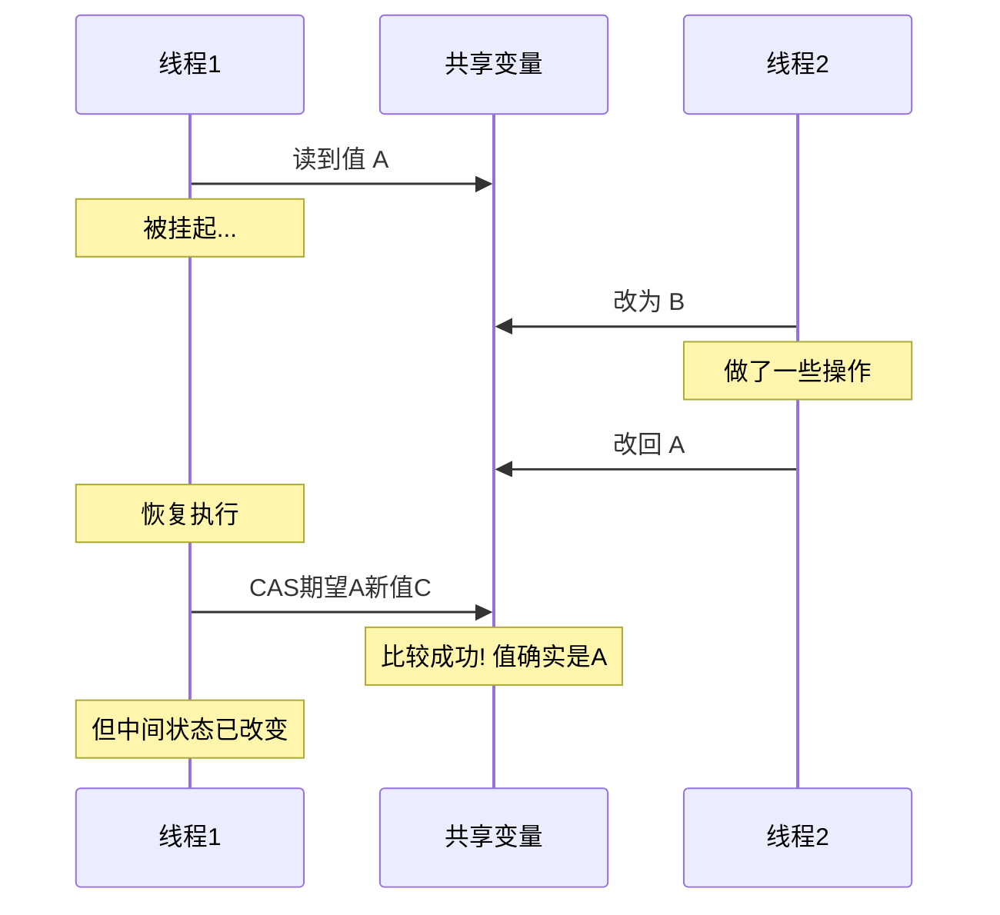
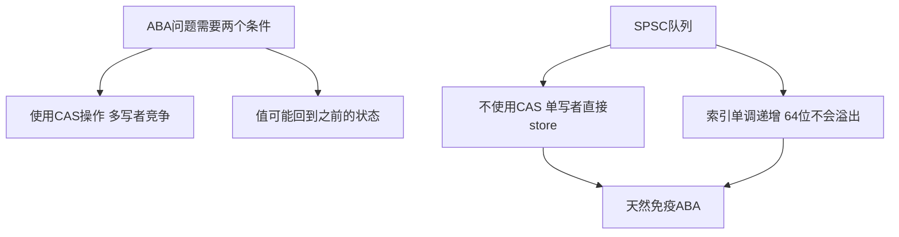

# 什么是ABA问题？无锁编程中如何应对？

## 知识点速览

ABA问题是无锁编程中CAS(Compare-And-Swap)操作的经典陷阱：一个值从A变成B再变回A，CAS看到"还是A"就认为没变化，但实际上中间经历了状态改变。



**核心概念：**
- **CAS操作**：原子地比较并交换——如果当前值等于期望值则替换为新值
- **ABA本质**：CAS只检查值是否相同，不检查中间是否发生过变化
- **危险场景**：值代表指针时，节点可能已被释放并重新分配到同一地址
- **SPSC天然免疫**：单调递增索引不会出现A-B-A的情况

## 我的实战经历

**项目背景：** 在南京华乘T95项目中，我在做SPSC无锁队列的技术方案评审时，团队成员提出了疑问："无锁编程不是有ABA问题吗？你的队列怎么处理的？"

**分析过程：** 这个问题促使我深入分析了SPSC队列为什么不受ABA影响：

```cpp
// SPSC队列的索引是单调递增的
std::atomic<size_t> write_idx_{0};  // 0, 1, 2, 3, ... 永远只增不减
std::atomic<size_t> read_idx_{0};   // 0, 1, 2, 3, ... 永远只增不减

bool push(const T& item) {
    auto w = write_idx_.load(memory_order_relaxed);
    // w从0到1到2到3... 不可能出现A-B-A
    // 而且write_idx_只有生产者一个线程写，根本不需要CAS
    buffer_[w & (Capacity - 1)] = item;
    write_idx_.store(w + 1, memory_order_release);  // store不是CAS
    return true;
}
```

**关键发现：** SPSC队列不受ABA影响有两个原因：
1. **不使用CAS**：write_idx只有一个写者(生产者)，直接store即可
2. **索引单调递增**：即使用CAS，64位索引从0一直递增，不可能回到之前的值（即使1GHz频率也要584年溢出）

**结果：** 这个分析帮助团队理解了SPSC和MPMC无锁队列的本质区别，也验证了T95选择SPSC方案的正确性。

## 深入原理

### ABA问题的典型场景：无锁栈

```
1. 线程1: 读head=A, next=B (准备CAS: head从A改为B)
2. 线程1被挂起
3. 线程2: pop A, pop B, push新的A(可能复用了A的内存)
4. 线程1恢复: CAS(head, 期望A, 新值B) 成功!
5. 但B已经被pop了，head指向已释放的节点!
```

### 解决方案对比

| 方案 | 原理 | 适用场景 | 开销 |
|------|------|---------|------|
| 版本号/标记 | 值+版本号打包 | 值可放进一个字 | 低 |
| 单调递增索引 | 索引只增不减 | SPSC/环形缓冲 | 零 |
| Hazard Pointer | 保护使用中的指针 | MPMC无锁结构 | 中等 |
| RCU | 延迟回收等读者完成 | 读多写少 | 低读/高写 |
| epoch-based回收 | 按时代批量回收 | 通用无锁结构 | 中等 |

### 版本号方案示例

```cpp
// 将值和版本号打包在一起
struct TaggedPointer {
    Node* ptr;
    uint64_t tag;  // 每次修改+1
};

// 使用128位CAS
std::atomic<TaggedPointer> head;

void push(Node* node) {
    TaggedPointer old_head = head.load();
    TaggedPointer new_head;
    do {
        node->next = old_head.ptr;
        new_head = {node, old_head.tag + 1};  // tag递增
    } while (!head.compare_exchange_weak(old_head, new_head));
}
```

即使ptr回到了之前的值，tag不同所以CAS会失败。

### 为什么SPSC天然免疫



### 常见陷阱

1. **以为所有无锁都有ABA**：SPSC不用CAS所以不受影响
2. **32位版本号溢出**：极高频操作理论上可能回绕
3. **double-word CAS可用性**：128位CAS并非所有平台都支持
4. **内存回收是ABA根源**：如果节点不会被释放重用，ABA的危害降低

### 面试追问点

- **SPSC为什么不需要CAS？** 每个索引只有一个线程写，不存在多写者竞争
- **Java的AtomicStampedReference如何解决ABA？** 将引用和stamp打包成一个原子操作
- **hazard pointer是什么？** 每个线程发布正在访问的指针，回收线程检查所有hazard pointer

## 面试表达建议

**开头：** "ABA问题出现在CAS操作中：值从A变成B又变回A，CAS认为没变但实际已经改过了。这在指针场景下尤其危险。"

**重点展开：** 用无锁栈的例子说明ABA的危害，然后讲解决方案。结合T95项目说明SPSC队列为什么不受影响：不用CAS+索引单调递增。

**收尾：** "在T95项目中我选择SPSC方案，除了性能优势外一个重要原因就是它天然避免了ABA问题。无锁编程中选对模型比硬解决问题更重要。"