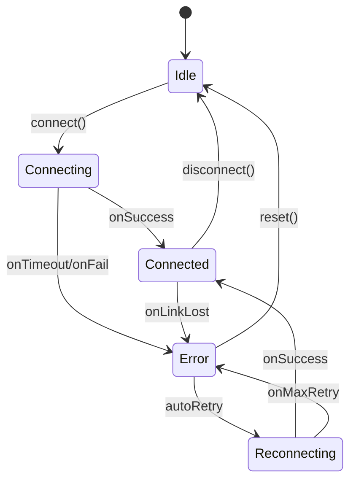
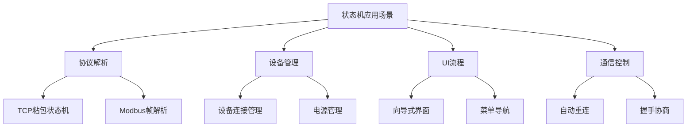

# 状态机/状态模式是什么？项目里怎么用的？

## 知识点速览

有限状态机(FSM, Finite State Machine)是一种将系统行为建模为**有限个状态**和**状态间转换**的计算模型。核心三要素：当前状态(State)、触发事件(Event)、转换规则(当前状态 + 事件 → 动作 + 下一状态)。



**三种实现方式对比：**

| 方式 | 原理 | 优点 | 缺点 |
|------|------|------|------|
| if/switch | 条件分支 | 简单直接 | 状态多时代码膨胀,难维护 |
| 状态模式(GoF) | 每状态一个类,多态分派 | 符合开闭原则 | 类数量多,简单场景过度设计 |
| 表驱动 | 二维表(状态×事件)查表 | 简洁,新增状态加表项 | 复杂动作需额外处理 |

## 我的实战经历

**项目背景：** 在南京华乘电气T95带电检测手持终端项目中，终端需要管理多个检测模块的连接生命周期。每个USB检测模块有明确的状态流转：空闲→连接中→已连接→错误→重连中。不同状态下对用户操作和系统事件的响应完全不同（比如"已连接"状态下才能启动检测，"错误"状态下自动触发重连）。

**遇到的问题：** 最初用if-else实现状态管理：

```cpp
// 反面教材: if-else状态管理
void DeviceManager::handleEvent(Event event) {
    if (m_state == State::Idle) {
        if (event == Event::Connect) { /* ... */ }
        else if (event == Event::Disconnect) { /* 忽略 */ }
    } else if (m_state == State::Connecting) {
        if (event == Event::Success) { /* ... */ }
        else if (event == Event::Timeout) { /* ... */ }
        // 忘记处理Connect事件 -> 潜在bug
    } else if (m_state == State::Connected) {
        // ... 更多嵌套
    }
    // 每增加一个状态,所有分支都要检查
}
```

代码很快膨胀到200+行，充满嵌套的if-else。后来需要新增"固件升级"状态(Upgrading)，发现需要改动十几处分支逻辑，漏改了两处导致升级过程中设备可以被意外断开。

**分析与解决：** 用**表驱动状态机**重构，将状态转换逻辑从代码中提取到数据表：

```cpp
// 状态转换表: {当前状态, 事件} → {动作函数, 下一状态}
struct Transition {
    State current;
    Event event;
    Action action;    // 函数指针: void(Context&)
    State next;
};

const std::vector<Transition> transitionTable = {
    // 当前状态        事件              动作               下一状态
    { State::Idle,       Event::Connect,   &doConnect,       State::Connecting   },
    { State::Connecting, Event::Success,   &onConnected,     State::Connected    },
    { State::Connecting, Event::Timeout,   &onConnectFail,   State::Error        },
    { State::Connecting, Event::Fail,      &onConnectFail,   State::Error        },
    { State::Connected,  Event::Disconnect,&doDisconnect,    State::Idle         },
    { State::Connected,  Event::LinkLost,  &onLinkLost,      State::Error        },
    { State::Connected,  Event::StartTest, &doStartTest,     State::Connected    },
    { State::Error,      Event::Retry,     &doReconnect,     State::Reconnecting },
    { State::Error,      Event::Reset,     &doReset,         State::Idle         },
    { State::Reconnecting,Event::Success,  &onReconnected,   State::Connected    },
    { State::Reconnecting,Event::MaxRetry, &onGiveUp,        State::Error        },
    // 新增升级模式 - 仅添加以下两行:
    { State::Connected,  Event::Upgrade,   &doStartUpgrade,  State::Upgrading    },
    { State::Upgrading,  Event::Complete,  &onUpgradeDone,   State::Connected    },
};

// 状态机引擎 - 查表执行
void StateMachine::processEvent(Event event) {
    for (auto& t : transitionTable) {
        if (t.current == m_state && t.event == event) {
            t.action(m_context);
            State oldState = m_state;
            m_state = t.next;
            emit stateChanged(oldState, m_state);
            return;
        }
    }
    // 未找到匹配转换 → 当前状态下忽略该事件
    qDebug() << "Ignored event" << event << "in state" << m_state;
}
```

**关键设计点：**
1. **表驱动**：所有状态转换一目了然，新增状态只需加表项
2. **动作函数分离**：具体业务逻辑放在独立函数中，状态机引擎不含业务代码
3. **状态变化通知**：通过信号槽通知UI更新、日志记录等
4. **未匹配事件**：状态机默认忽略当前状态下未定义的事件，避免非法操作

**结果：** 新增固件升级状态从改十几处if-else简化为增加2行表项+1个动作函数，10分钟完成。整个状态管理代码从200+行if-else缩减为清晰的转换表+50行引擎代码。代码审查发现，表驱动方式让状态转换关系一目了然，漏处理事件的bug再也没出现过。

## 深入原理

### 三种实现方式的代码量对比

假设5个状态、8种事件：

| 实现方式 | 代码行数 | 新增1个状态的改动 |
|---------|---------|-----------------|
| if/switch | ~200行 | 改动所有分支(~20处) |
| 状态模式 | ~300行(5个类) | 新增1个类+改工厂 |
| 表驱动 | ~80行(表+引擎) | 加几行表项 |

### 状态模式(GoF)的适用场景

当每个状态的行为逻辑很复杂时，表驱动的动作函数会变得臃肿。此时状态模式更合适：

```cpp
// 状态模式: 每个状态是一个类
class IDeviceState {
public:
    virtual ~IDeviceState() = default;
    virtual void onConnect(DeviceContext& ctx) = 0;
    virtual void onDisconnect(DeviceContext& ctx) = 0;
    virtual void onData(DeviceContext& ctx, const QByteArray& data) = 0;
    virtual QString name() const = 0;
};

class IdleState : public IDeviceState {
    void onConnect(DeviceContext& ctx) override {
        ctx.startConnection();
        ctx.setState(std::make_unique<ConnectingState>());
    }
    void onDisconnect(DeviceContext& ctx) override {
        // 空闲状态忽略断开请求
    }
    // ...
};
```

### 状态机在嵌入式中的广泛应用



我在项目中至少有三处使用了状态机：
1. **协议解析**：串口/TCP数据帧的逐字节解析(net_003)
2. **设备连接管理**：USB设备的连接/断开/重连生命周期
3. **检测流程控制**：检测任务的启动/采集/处理/完成/异常流转

### 表驱动 vs 硬编码的可维护性

表驱动的核心优势是**数据和逻辑分离**。转换规则作为数据存在，可以：
- 运行时从配置文件加载（更灵活）
- 自动生成状态转换图（文档化）
- 静态分析检查是否有遗漏的状态×事件组合

### 常见陷阱

1. **状态爆炸**：状态数量呈指数增长时，考虑分层状态机(HSM)或状态图(Statechart)
2. **忘记处理异常事件**：每个状态都应明确处理所有可能的事件（哪怕是忽略）
3. **状态转换中的副作用**：动作函数不应直接修改状态，由引擎统一管理
4. **并发状态机**：多线程环境下状态转换必须是原子的，需要加锁保护

## 面试表达建议

**开头：** "状态机把系统行为建模为有限个状态和状态间的转换。核心是当前状态加触发事件决定执行什么动作和转到哪个状态。"

**实现方式：** "实现上有if-else、GoF状态模式、表驱动三种。我在项目中主要用表驱动，把状态转换规则写成数据表，引擎查表执行。新增状态只需加表项，比if-else可维护性好很多。"

**项目关联：** "T95项目中我用表驱动状态机管理设备连接生命周期——Idle、Connecting、Connected、Error、Reconnecting五个状态。后来新增固件升级模式，只加了2行表项和一个动作函数，10分钟搞定，已有逻辑零改动。"

**答追问准备：**
- 状态模式和策略模式的区别？→ 状态模式侧重状态自动切换，策略模式侧重外部选择算法
- 状态太多怎么办？→ 分层状态机(HSM)，父状态处理公共事件，子状态处理特有事件
- 状态机线程安全怎么保证？→ 事件队列+单线程处理，或状态转换加互斥锁
