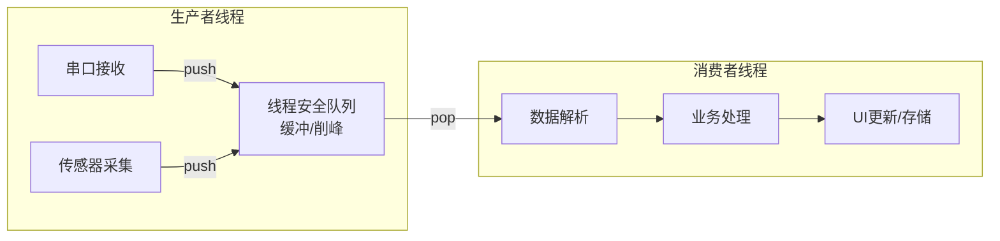
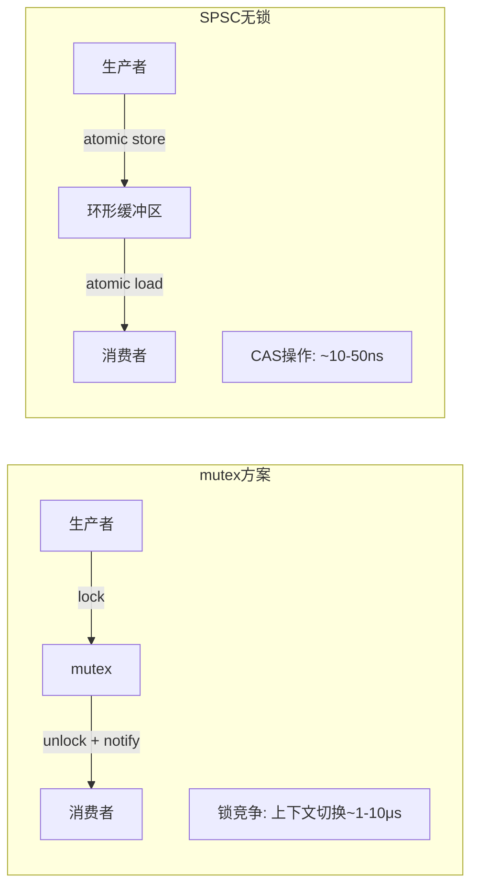

# 生产者-消费者模式怎么设计？哪里用过？

## 知识点速览

生产者-消费者模式是多线程编程中最经典的协作模式，通过一个**线程安全的缓冲队列**解耦数据的生产和消费。生产者和消费者运行在不同线程，速率可以不同，队列起到削峰缓冲的作用。



**两种实现方式：**

| 实现 | 原理 | 适用场景 | 性能 |
|------|------|---------|------|
| mutex + condition_variable | 互斥锁保护队列,条件变量通知 | 通用(多生产者多消费者) | 有锁开销 |
| SPSC无锁队列 | 原子变量+环形缓冲,CAS操作 | 单生产者单消费者 | 极高吞吐 |

## 我的实战经历

**项目背景：** 在南京华乘T95带电检测手持终端项目中，数据处理管线是核心架构。串口接收线程以115200bps持续接收检测模块的原始数据帧，数据解析和业务处理(信号分析、图谱计算)在另一个线程执行，最终结果推送到UI线程渲染。三个环节速率不同，需要用队列缓冲解耦。

**遇到的问题：**

**第一阶段（mutex+cv）：** 初始实现用标准的mutex+condition_variable方案：

```cpp
// V1: mutex + condition_variable
template<typename T>
class ThreadSafeQueue {
    std::queue<T> m_queue;
    std::mutex m_mutex;
    std::condition_variable m_cv;
public:
    void push(const T& item) {
        std::lock_guard<std::mutex> lock(m_mutex);
        m_queue.push(item);
        m_cv.notify_one();
    }
    T pop() {
        std::unique_lock<std::mutex> lock(m_mutex);
        m_cv.wait(lock, [this]{ return !m_queue.empty(); });
        T item = m_queue.front();
        m_queue.pop();
        return item;
    }
};
```

功能正确，但在TEV检测模式下出现问题：TEV数据采集频率高达每秒2000帧，profiling发现mutex竞争占了CPU时间的15%，数据处理管线的端到端延迟约2ms，偶尔出现5ms以上的毛刺（锁等待导致）。

**第二阶段（SPSC无锁队列）：** 分析数据流发现，串口接收到数据解析恰好是**单生产者单消费者(SPSC)**场景。这种情况可以用无锁环形队列消除互斥锁。

```cpp
// V2: SPSC无锁环形队列
template<typename T, size_t Capacity>
class SPSCQueue {
    std::array<T, Capacity> m_buffer;
    alignas(64) std::atomic<size_t> m_head{0}; // 生产者写位置
    alignas(64) std::atomic<size_t> m_tail{0}; // 消费者读位置
    // head和tail分别对齐到cache line,避免false sharing

public:
    bool push(const T& item) {
        size_t head = m_head.load(std::memory_order_relaxed);
        size_t next = (head + 1) % Capacity;
        if (next == m_tail.load(std::memory_order_acquire)) {
            return false; // 队列满
        }
        m_buffer[head] = item;
        m_head.store(next, std::memory_order_release);
        return true;
    }

    bool pop(T& item) {
        size_t tail = m_tail.load(std::memory_order_relaxed);
        if (tail == m_head.load(std::memory_order_acquire)) {
            return false; // 队列空
        }
        item = m_buffer[tail];
        m_tail.store((tail + 1) % Capacity, std::memory_order_release);
        return true;
    }
};
```

**关键设计点：**
1. **环形缓冲**：固定大小数组，head和tail循环使用，无需动态内存分配
2. **原子变量**：head由生产者写/消费者读，tail由消费者写/生产者读，无需mutex
3. **Cache Line对齐**：head和tail分别对齐到64字节，消除false sharing
4. **内存序(memory order)**：release-acquire语义保证数据可见性，比默认的seq_cst开销更小

**整体数据管线架构：**

```cpp
// T95数据管线
class DataPipeline {
    SPSCQueue<RawFrame, 4096>   m_rxQueue;      // 串口→解析
    SPSCQueue<ParsedData, 1024> m_processQueue;  // 解析→业务处理

    void rxThread() {         // 串口接收线程(生产者)
        while (m_running) {
            RawFrame frame = readFromSerial();
            m_rxQueue.push(frame);
        }
    }

    void parseThread() {      // 解析线程(消费者+生产者)
        while (m_running) {
            RawFrame frame;
            if (m_rxQueue.pop(frame)) {
                ParsedData data = protocolParser.parse(frame);
                m_processQueue.push(data);
            }
        }
    }

    void processThread() {    // 业务处理线程(消费者)
        while (m_running) {
            ParsedData data;
            if (m_processQueue.pop(data)) {
                auto result = signalAnalyzer.analyze(data);
                emit resultReady(result); // 信号通知UI线程
            }
        }
    }
};
```

**结果：** 从mutex+cv切换到SPSC无锁队列后，数据管线端到端延迟从2ms降到0.3ms，延迟毛刺彻底消除。CPU占用也从15%的锁竞争开销降到几乎可以忽略。管线在TEV高频采集(2000帧/秒)下稳定运行，72小时压测无数据丢失。

## 深入原理

### mutex+cv vs 无锁队列性能对比



| 指标 | mutex+cv | SPSC无锁 |
|------|---------|---------|
| 单次操作延迟 | 1-10μs | 10-50ns |
| 吞吐量(ops/s) | ~100万 | ~1000万+ |
| CPU开销 | 锁竞争+上下文切换 | 几乎为零 |
| 适用场景 | MPMC通用 | 仅SPSC |
| 实现复杂度 | 低 | 中(需理解内存模型) |

### False Sharing问题

```
Cache Line (64 bytes):
+--------+--------+--------+---
| head   | tail   | 其他   | ...
+--------+--------+--------+---
         ↑
生产者修改head → 整条cache line失效
→ 消费者读tail也要重新从内存加载
→ 性能急剧下降

解决: alignas(64)对齐到不同cache line
+--------+--------+--------+--- Cache Line 1
| head   | padding...      |
+--------+--------+--------+--- Cache Line 2
| tail   | padding...      |
+--------+--------+--------+---
```

### C++内存序(Memory Order)

无锁编程的核心难点是正确使用内存序：

| 内存序 | 含义 | 用途 |
|--------|------|------|
| relaxed | 仅保证原子性 | 计数器、标志位 |
| acquire | 读操作后续不能重排到前面 | 消费者读head前 |
| release | 写操作之前不能重排到后面 | 生产者写head后 |
| seq_cst | 全局一致序(默认) | 最安全但最慢 |

SPSC队列中：
- 生产者先写数据再`release store head` → 保证消费者看到head变化时数据已写好
- 消费者`acquire load head` → 保证读到的数据是最新的

### 队列满/空的处理策略

| 策略 | 队列满时生产者 | 队列空时消费者 |
|------|-------------|-------------|
| 阻塞等待 | 休眠直到有空位 | 休眠直到有数据 |
| 丢弃最新 | 丢弃本次数据,返回false | 返回false |
| 覆盖最旧 | 覆盖最旧数据(环形) | 返回false |
| 动态扩容 | 扩大缓冲区(有锁) | - |

T95项目中采用"丢弃最新"策略：队列满说明消费者处理不过来，丢弃少量新数据比阻塞采集线程更安全。同时设置告警阈值，队列超过80%时发出警告。

### 常见陷阱

1. **ABA问题**：CAS操作的经典陷阱，SPSC场景不受影响（只有一个写者）
2. **消费者忙等(busy-wait)**：空队列时持续轮询浪费CPU。可加退避策略(yield/sleep)
3. **队列大小选择**：太小容易溢出丢数据，太大浪费内存。根据生产/消费速率差和可接受延迟计算
4. **对象拷贝开销**：大对象推送到队列时应使用移动语义或只传指针
5. **内存序用错**：relaxed过松可能看到脏数据，seq_cst过严影响性能

## 面试表达建议

**开头：** "生产者-消费者模式通过一个线程安全的队列解耦数据的生产和消费。两者可以不同速率工作，队列起到缓冲和削峰的作用。"

**演进故事：** "在T95项目中，我的数据管线经历了从mutex+cv到SPSC无锁队列的演进。初始方案功能正确但在高频采集时锁竞争成为瓶颈。分析发现是单生产者单消费者场景，就改用了基于原子变量的无锁环形队列，延迟从2ms降到0.3ms。"

**技术深度：** "无锁队列的关键是正确使用C++内存序——生产者用release store保证数据先于指针可见，消费者用acquire load获取最新数据。还要注意false sharing，head和tail必须对齐到不同cache line。"

**答追问准备：**
- 多生产者多消费者怎么办？→ MPMC无锁队列复杂得多，一般用mutex+cv或concurrent_queue库
- 无锁一定比有锁快吗？→ 不一定。低竞争场景下mutex也很快，无锁在高竞争场景优势大
- 队列满了怎么处理？→ 丢弃/阻塞/覆盖三种策略，T95中用丢弃最新+告警
