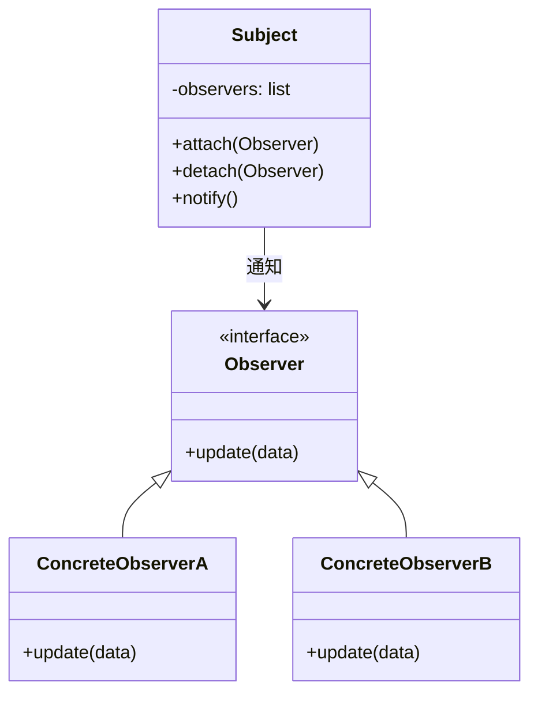
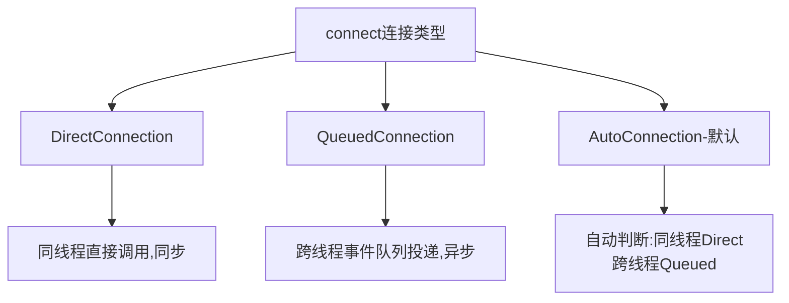

# 什么是观察者模式？Qt信号槽和它的关系？

## 知识点速览

观察者模式(Observer Pattern)定义了对象间**一对多**的依赖关系：当被观察者(Subject/Publisher)状态变化时，所有注册的观察者(Observer/Subscriber)自动收到通知。核心价值是**松耦合**——发布者不需要知道订阅者是谁、有多少个。



**Qt信号槽 vs 经典观察者：**

| 特性 | 经典观察者 | Qt信号槽 |
|------|-----------|---------|
| 注册方式 | attach(observer) | connect(sender, signal, receiver, slot) |
| 通知方式 | 遍历调用update() | emit signal → 自动调用slot |
| 跨线程 | 需手动处理 | QueuedConnection自动切换 |
| 类型安全 | 弱(void*或模板) | 强(编译期参数类型检查) |
| 生命周期 | 手动detach | 对象析构自动断开 |
| 灵活性 | 一个主题一个接口 | 一信号多槽/多信号一槽 |

## 我的实战经历

**项目背景：** 在南京华乘T95带电检测手持终端项目中，检测数据从采集到最终呈现需要经过多个模块处理。以TEV检测为例：原始数据采集后，需要同时完成波形显示、数值计算、告警判断、日志记录四件事。这些模块由不同同事开发，更新频率不同，相互之间不应有依赖。

**遇到的问题：** 早期设计中，数据采集模块直接调用各处理模块的方法：

```cpp
// 反面教材: 采集模块直接调用各处理模块
void DataAcquisition::onNewData(const RawData& data) {
    m_waveformDisplay->updateWaveform(data);  // 直接依赖UI
    m_calculator->calculate(data);             // 直接依赖计算模块
    m_alarmChecker->check(data);               // 直接依赖告警模块
    m_logger->log(data);                       // 直接依赖日志模块
    // 每增加一个消费者,这里就要加一行
    // 采集模块需要#include所有消费者的头文件
}
```

问题很明显：采集模块和所有消费者紧耦合，每增加一个数据消费者就要修改采集模块代码。后来产品经理要求新增PRPS(Phase Resolved Partial Discharge)图谱记录功能，按原来的写法又要改采集模块。

**分析与解决：** 用Qt信号槽实现观察者模式，彻底解耦数据发布和订阅：

```cpp
// 数据采集模块 - 只负责发布数据,不关心谁在订阅
class DataAcquisition : public QObject {
    Q_OBJECT
signals:
    void dataReady(const ParsedData& data);      // 数据就绪信号
    void alarmTriggered(const AlarmInfo& alarm);  // 告警信号

private:
    void onNewData(const RawData& raw) {
        ParsedData data = m_parser->parse(raw);
        emit dataReady(data);  // 只管发射信号

        if (data.exceedsThreshold()) {
            emit alarmTriggered(AlarmInfo(data));
        }
    }
};

// 在主控制器中建立连接关系
void MainController::setupConnections() {
    auto* acq = m_acquisition;

    // 波形显示订阅数据
    connect(acq, &DataAcquisition::dataReady,
            m_waveformWidget, &WaveformWidget::updateDisplay);

    // 数值计算订阅数据
    connect(acq, &DataAcquisition::dataReady,
            m_calculator, &Calculator::processData);

    // 告警模块订阅数据
    connect(acq, &DataAcquisition::dataReady,
            m_alarmChecker, &AlarmChecker::checkData);

    // 日志订阅数据
    connect(acq, &DataAcquisition::dataReady,
            m_logger, &Logger::recordData);

    // 新增PRPS记录 - 只需一行connect,零改动已有代码
    connect(acq, &DataAcquisition::dataReady,
            m_prpsRecorder, &PrpsRecorder::recordPhaseData);

    // 告警推送 - 跨线程自动队列投递
    connect(acq, &DataAcquisition::alarmTriggered,
            m_notifier, &AlarmNotifier::pushAlarm,
            Qt::QueuedConnection);
}
```

**关键优势体现：**

1. **松耦合**：`DataAcquisition`完全不知道有哪些订阅者，不引用任何消费者头文件
2. **开闭原则**：新增PRPS记录只需1行connect，采集模块和其他订阅者完全不改
3. **跨线程安全**：数据采集在工作线程，UI更新在主线程，Qt::QueuedConnection自动安全投递
4. **自动生命周期**：PRPS模块析构时连接自动断开，不会悬挂指针

**结果：** 新增PRPS功能只用了半天（写记录逻辑+connect），完全不动已有代码。整个检测数据管线实现了真正的"发布-订阅"架构，各模块可以独立开发、测试和部署。代码耦合度大幅降低，采集模块的头文件依赖从5个减少到0个。

## 深入原理

### Qt信号槽的连接方式



| 连接类型 | 行为 | 线程安全 | 延迟 |
|---------|------|---------|------|
| Direct | 信号发射时直接调用槽,像函数调用 | 不安全(跨线程) | 零 |
| Queued | 信号转为事件投递到接收者线程队列 | 安全 | 有(事件循环) |
| Auto | 同线程用Direct,跨线程用Queued | 安全 | 视情况 |
| BlockingQueued | 跨线程投递并阻塞等待槽执行完 | 安全 | 大(慎用) |

### 信号槽底层实现原理

Qt信号槽通过MOC(Meta-Object Compiler)实现：

1. MOC扫描含Q_OBJECT宏的头文件
2. 生成moc_xxx.cpp，包含信号的实际实现和元对象信息
3. connect时在元对象中注册连接关系（发送者+信号索引→接收者+槽索引）
4. emit信号时，遍历连接列表依次调用槽函数

```cpp
// emit dataReady(data) 实际展开为:
void DataAcquisition::dataReady(const ParsedData& data) {
    // MOC生成的代码
    void *_a[] = { nullptr, const_cast<void*>(reinterpret_cast<const void*>(&data)) };
    QMetaObject::activate(this, &staticMetaObject, 0, _a);
    // activate遍历连接列表,按连接类型调用各槽函数
}
```

### 经典观察者 vs Qt信号槽 vs std::function回调

| 方案 | 优势 | 劣势 | 适用场景 |
|------|------|------|---------|
| 经典Observer | 设计模式标准,可移植 | 需手动管理生命周期 | 非Qt项目 |
| Qt信号槽 | 跨线程安全,生命周期自动管理 | 依赖Qt,MOC有编译开销 | Qt项目首选 |
| std::function | 轻量灵活,无依赖 | 无跨线程支持,无自动断开 | 简单回调场景 |

### 观察者模式的变体

1. **推模型(Push)**：被观察者把数据推送给观察者——Qt信号槽的默认方式
2. **拉模型(Pull)**：被观察者只通知"有更新"，观察者自己去拉取数据
3. **事件总线**：全局单例做消息中转，任何模块都能发布和订阅——更松耦合但更难追踪数据流

### 常见陷阱

1. **循环通知**：A观察B，B观察A，A变化→通知B→B变化→通知A→无限循环
2. **通知顺序依赖**：多个观察者对通知顺序有要求时需要额外管理
3. **性能问题**：观察者太多时通知遍历耗时，可用异步通知或批量通知优化
4. **内存泄漏**：经典观察者忘记detach导致被观察者持有已析构对象的引用（Qt自动处理了这个问题）
5. **Lambda槽的断开**：connect到lambda时无法用disconnect断开特定连接，需保存connection对象

## 面试表达建议

**开头：** "观察者模式定义一对多的依赖关系，被观察者状态变化时自动通知所有订阅者。核心价值是松耦合——发布者不需要知道订阅者是谁。"

**Qt信号槽：** "Qt的信号槽就是观察者模式的增强实现。信号对应状态变化，槽对应响应方法，connect对应注册订阅。相比经典Observer，Qt额外提供了跨线程安全投递、类型检查、自动生命周期管理。"

**项目关联：** "T95项目中检测数据模块发出dataReady信号，UI、计算、告警、日志分别connect订阅。后来新增PRPS图谱记录功能，只需一行connect就搞定，完全不改采集模块和其他订阅者的代码。这是松耦合带来的真实收益。"

**答追问准备：**
- 信号槽底层怎么实现的？→ MOC预编译生成元对象信息，emit时遍历连接列表调用
- 跨线程怎么安全的？→ QueuedConnection把信号转为事件投递到接收线程事件队列
- 观察者太多性能问题怎么处理？→ 异步通知、批量更新、分级订阅(只订阅感兴趣的变化)
