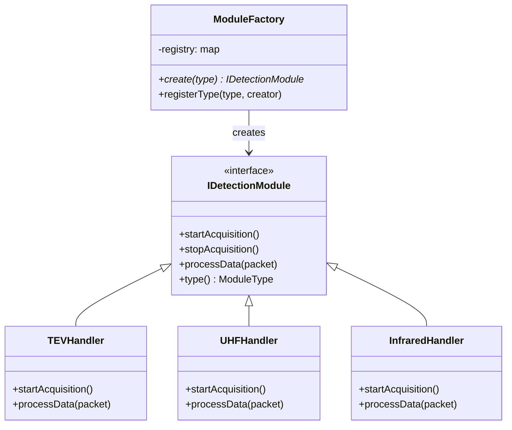
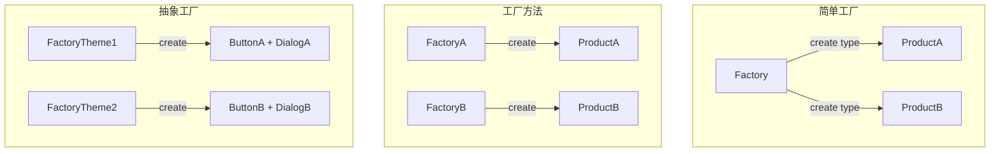

# 工厂模式做什么？根据类型创建对象怎么实现？

## 知识点速览

工厂模式将对象的**创建逻辑**从使用方中分离出来，集中管理。调用方不直接`new`具体类，而是向工厂请求一个接口类型的实例，工厂根据参数决定创建哪个子类。核心价值是**解耦创建和使用**，符合开闭原则。



**三种工厂层次：**

| 层次 | 原理 | 适用场景 |
|------|------|---------|
| 简单工厂 | 一个函数,switch或map分发 | 类型不多,变化不频繁 |
| 工厂方法 | 每个产品有对应的工厂子类 | 需要扩展不同产品族 |
| 抽象工厂 | 创建一系列相关产品 | 多维度产品组合 |

实际项目中**简单工厂+注册表**最实用：用map存储类型到创建函数的映射，新增类型只需注册，工厂代码不变。

## 我的实战经历

**项目背景：** 我在两个项目中都用了工厂模式来管理"多类型设备"的创建：
- **华乘T95**：终端支持TEV、UHF、AE、红外四种检测模块，每种模块的采集逻辑、数据解析、图谱显示完全不同
- **思行达营业厅**：RS485总线上接了15种不同厂商的设备（PLC、电表、温湿度传感器等），每种设备的Modbus寄存器定义不同

**遇到的问题：** T95项目早期，检测模块的创建和初始化散落在主控制器的各处：

```cpp
// 反面教材: 创建逻辑分散在使用方
void MainController::startDetection(ModuleType type) {
    if (type == ModuleType::TEV) {
        auto* handler = new TEVHandler();
        handler->setConfig(m_tevConfig);
        handler->initHardware(m_tevPort);
        m_currentModule = handler;
    } else if (type == ModuleType::UHF) {
        auto* handler = new UHFHandler();
        handler->setConfig(m_uhfConfig);
        handler->initHardware(m_uhfPort);
        m_currentModule = handler;
    }
    // 新增AE模块 → 加else if
    // 新增红外模块 → 再加else if
    // MainController越来越臃肿
}
```

每新增一个检测模块，MainController就要增加一段创建代码，而且创建逻辑散落在多处（启动检测、模块切换、重连恢复），改漏一处就是bug。

**分析与解决：**

**T95检测模块工厂：**

```cpp
// 注册表式工厂: 类型 → 创建函数
class ModuleFactory {
public:
    using Creator = std::function<std::unique_ptr<IDetectionModule>()>;

    // 注册创建函数
    static void registerModule(ModuleType type, Creator creator) {
        registry()[type] = std::move(creator);
    }

    // 按类型创建模块
    static std::unique_ptr<IDetectionModule> create(ModuleType type) {
        auto it = registry().find(type);
        if (it != registry().end()) {
            return it->second();
        }
        qWarning() << "Unknown module type:" << static_cast<int>(type);
        return nullptr;
    }

private:
    static std::map<ModuleType, Creator>& registry() {
        static std::map<ModuleType, Creator> instance;
        return instance;
    }
};

// 各模块自注册 (在各自的.cpp中)
namespace {
    bool registered_tev = [] {
        ModuleFactory::registerModule(ModuleType::TEV, [] {
            return std::make_unique<TEVHandler>();
        });
        return true;
    }();

    bool registered_uhf = [] {
        ModuleFactory::registerModule(ModuleType::UHF, [] {
            return std::make_unique<UHFHandler>();
        });
        return true;
    }();
}
```

使用方变得极其简洁：
```cpp
void MainController::startDetection(ModuleType type) {
    m_currentModule = ModuleFactory::create(type);
    if (m_currentModule) {
        m_currentModule->startAcquisition();
    }
}
// 完全不关心具体是哪种模块, 不import任何Handler头文件
```

**思行达设备适配器工厂：**

```cpp
// 设备适配器工厂 - 管理15种RS485设备
class DeviceAdapterFactory {
public:
    static std::unique_ptr<IDeviceAdapter> create(
        const QString& deviceType, const DeviceConfig& config)
    {
        auto it = registry().find(deviceType);
        if (it != registry().end()) {
            return it->second(config);
        }
        return std::make_unique<GenericModbusAdapter>(config); // 默认通用适配器
    }

    template<typename T>
    static void registerAdapter(const QString& type) {
        registry()[type] = [](const DeviceConfig& cfg) {
            return std::make_unique<T>(cfg);
        };
    }
};

// 注册15种设备适配器
// PM2120电力仪表、DTU数据采集器、温湿度传感器...
DeviceAdapterFactory::registerAdapter<PM2120Adapter>("PM2120");
DeviceAdapterFactory::registerAdapter<DTUAdapter>("DTU_3000");
DeviceAdapterFactory::registerAdapter<TempHumidAdapter>("TH_200");
// ... 共15种
```

**结果：**
- T95新增红外检测模块：实现InfraredHandler类 + 注册到工厂，2周完成集成，MainController零改动
- 思行达新增3种设备类型：实现适配器 + 注册，平均每种设备1天接入，工厂代码和使用方零改动
- 代码耦合度大幅降低：MainController不再依赖任何具体Handler/Adapter的头文件

## 深入原理

### 简单工厂 vs 工厂方法 vs 抽象工厂



| 层次 | 代码量 | 扩展方式 | 典型场景 |
|------|--------|---------|---------|
| 简单工厂 | 最少 | 改工厂代码(或注册表) | 设备Handler创建 |
| 工厂方法 | 中等 | 新增工厂子类 | 框架中的钩子 |
| 抽象工厂 | 最多 | 新增工厂子类(创建一族) | UI主题/跨平台组件 |

### 注册表模式的自动注册技巧

C++中可以利用全局变量初始化实现"自注册"，各模块在自己的.cpp中注册到工厂，无需集中维护注册列表：

```cpp
// 宏简化注册
#define REGISTER_MODULE(Type, Class) \
    static bool _reg_##Class = []{ \
        ModuleFactory::registerModule(Type, []{ \
            return std::make_unique<Class>(); \
        }); \
        return true; \
    }()

// 在tev_handler.cpp中
REGISTER_MODULE(ModuleType::TEV, TEVHandler);

// 在uhf_handler.cpp中
REGISTER_MODULE(ModuleType::UHF, UHFHandler);
```

注意：静态初始化顺序在不同编译单元间是未定义的，但注册表(static local)保证在首次使用时初始化，所以不会出问题。

### 工厂模式 vs 直接new的对比

| 对比项 | 直接new | 工厂模式 |
|--------|---------|---------|
| 耦合度 | 使用方依赖具体类 | 使用方只依赖接口 |
| 新增类型 | 改所有使用处 | 注册到工厂即可 |
| 单元测试 | 难mock(硬编码类型) | 注册mock工厂即可 |
| 代码位置 | 创建逻辑散落各处 | 集中在工厂 |

### 与其他创建型模式的关系

- **工厂 + 单例**：ConfigManager用单例获取唯一实例，工厂用于创建多种类型
- **工厂 + 原型**：通过克隆已有对象创建新对象，适合创建成本高的场景
- **工厂 + 建造者**：复杂对象分步构建，工厂只负责启动建造流程

### 常见陷阱

1. **过度设计**：只有2-3种类型且不会扩展时，简单if-else就够了，不必上工厂模式
2. **静态注册顺序**：跨编译单元的静态初始化顺序未定义，用函数内static local规避
3. **所有权不清**：工厂创建的对象用unique_ptr明确所有权，避免内存泄漏
4. **配置和创建混在一起**：工厂只负责创建，配置应该通过参数或后续设置注入

## 面试表达建议

**开头：** "工厂模式把对象创建的逻辑从使用方中分离出来集中管理。调用方通过工厂按类型获取统一接口的实例，不需要知道具体创建哪个子类。"

**项目关联：** "我在T95项目中用注册表式工厂管理四种检测模块的创建。TEV、UHF、AE、红外各自实现IDetectionModule接口，注册到工厂。MainController通过工厂创建模块，完全不依赖具体Handler。后来新增红外模块，只需实现接口并注册，MainController零改动。"

**第二个例子：** "思行达项目也类似，15种RS485设备各有一个适配器，全部注册到设备适配器工厂。新增设备类型平均一天就能接入。"

**答追问准备：**
- 简单工厂和工厂方法的区别？→ 简单工厂一个类集中创建，工厂方法每个产品对应一个工厂子类
- 注册表怎么防止名称冲突？→ 用枚举类型(type-safe)而非字符串，编译期检查
- 什么时候不需要工厂？→ 类型少且固定，直接new更简单。模式的价值随类型数量增长而体现
