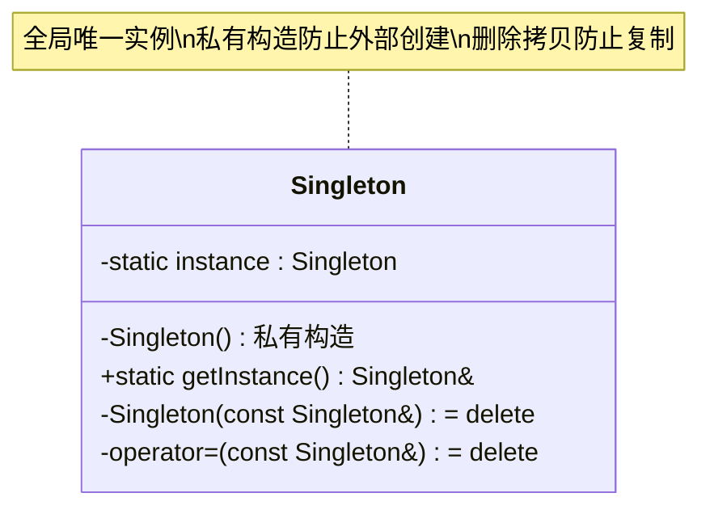
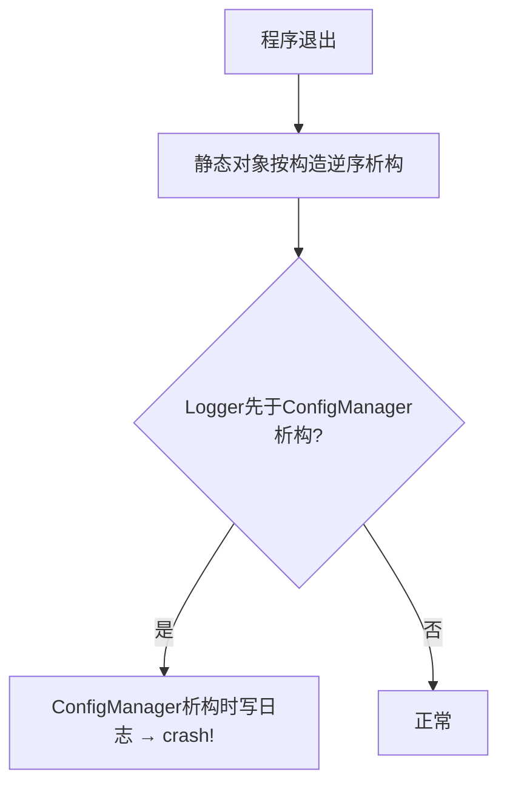

# 什么是单例模式？如何实现线程安全的单例？

## 知识点速览

单例模式(Singleton)确保一个类在整个程序中**只有一个实例**，并提供一个全局访问点。典型场景：配置管理器、日志系统、设备管理器等天然全局唯一的资源。



**C++中的单例实现演进：**

| 方式 | 线程安全 | 懒加载 | 复杂度 | 推荐 |
|------|---------|--------|--------|------|
| 全局变量 | 是(C++11) | 否(饿汉) | 低 | 简单场景 |
| DCLP(双重检查锁) | 需小心(C++11前不安全) | 是 | 高 | 不推荐 |
| call_once | 是 | 是 | 中 | C++11前的方案 |
| **Magic Static** | **是(C++11保证)** | **是** | **低** | **推荐** |

**C++11 Magic Static（推荐写法）：**

```cpp
class Singleton {
public:
    static Singleton& getInstance() {
        static Singleton instance; // C++11保证线程安全初始化
        return instance;
    }
    // 禁止拷贝和赋值
    Singleton(const Singleton&) = delete;
    Singleton& operator=(const Singleton&) = delete;

private:
    Singleton() = default; // 私有构造
    ~Singleton() = default;
};
```

## 我的实战经历

**项目背景：** 在南京华乘T95手持终端项目中，有两个天然需要全局唯一的组件：配置管理器(ConfigManager)和日志器(Logger)。ConfigManager管理所有检测参数、设备配置、用户偏好设置，程序各处都需要读取配置。Logger记录系统运行日志和检测数据日志，所有模块都需要写日志。

**遇到的问题：** 初版ConfigManager用全局指针实现，在main()中手动new：

```cpp
// 反面教材: 全局指针+手动管理
ConfigManager* g_configManager = nullptr;

int main() {
    g_configManager = new ConfigManager();
    g_configManager->loadFromFile("config.ini");
    // ... 程序运行 ...
    delete g_configManager; // 容易忘记,或异常退出时泄漏
}

// 使用处
void SomeModule::doWork() {
    auto value = g_configManager->get("key"); // 如果还没初始化?
}
```

问题：1）初始化顺序依赖——某些模块的静态初始化阶段就要读配置，但ConfigManager可能还没创建；2）多线程环境下首次访问可能还没初始化完成；3）程序异常退出时内存泄漏。

**分析与解决：** 用C++11 Magic Static重新实现，同时在思行达项目中也统一采用：

```cpp
// ConfigManager单例 - Magic Static
class ConfigManager {
public:
    static ConfigManager& instance() {
        static ConfigManager inst;
        return inst;
    }

    // 线程安全的配置读取
    QVariant get(const QString& key) const {
        QReadLocker locker(&m_lock);
        return m_settings.value(key);
    }

    // 线程安全的配置写入
    void set(const QString& key, const QVariant& value) {
        QWriteLocker locker(&m_lock);
        m_settings.insert(key, value);
        m_dirty = true;
    }

    // 从文件加载
    bool loadFromFile(const QString& path) {
        QWriteLocker locker(&m_lock);
        // 解析INI/JSON配置文件
        return parseConfigFile(path, m_settings);
    }

    // 保存到文件(脏写回)
    void saveIfDirty() {
        QReadLocker locker(&m_lock);
        if (m_dirty) {
            locker.unlock();
            QWriteLocker wlocker(&m_lock);
            writeConfigFile(m_path, m_settings);
            m_dirty = false;
        }
    }

    ConfigManager(const ConfigManager&) = delete;
    ConfigManager& operator=(const ConfigManager&) = delete;

private:
    ConfigManager() { /* 默认配置初始化 */ }
    ~ConfigManager() { saveIfDirty(); } // 析构时自动保存

    mutable QReadWriteLock m_lock;
    QMap<QString, QVariant> m_settings;
    bool m_dirty = false;
    QString m_path;
};

// Logger单例
class Logger {
public:
    static Logger& instance() {
        static Logger inst;
        return inst;
    }

    void log(LogLevel level, const QString& module, const QString& msg) {
        // 异步写入日志文件,避免阻塞调用方
        QMutexLocker locker(&m_mutex);
        m_logQueue.enqueue(formatLog(level, module, msg));
        m_cv.wakeOne();
    }

    Logger(const Logger&) = delete;
    Logger& operator=(const Logger&) = delete;

private:
    Logger() {
        // 启动日志写入线程
        m_writerThread = std::thread(&Logger::writerLoop, this);
    }
    ~Logger() {
        m_running = false;
        m_cv.wakeAll();
        if (m_writerThread.joinable())
            m_writerThread.join();
    }
    // ...
};
```

使用方式简洁安全：
```cpp
// 任何地方都可以安全使用,首次调用时自动初始化
auto& config = ConfigManager::instance();
int threshold = config.get("tev/threshold").toInt();

Logger::instance().log(LogLevel::Info, "TEV", "Detection started");
```

**结果：** Magic Static方案解决了所有初始化顺序和线程安全问题。ConfigManager支持多线程并发读取（用读写锁优化），Logger通过异步写入避免了日志操作阻塞业务线程。两个单例在T95和思行达项目中稳定运行，零初始化错误、零内存泄漏。

## 深入原理

### C++11 Magic Static的底层实现

C++11标准(6.7/4)规定：如果多个线程同时首次进入含static局部变量的代码块，只有一个线程执行初始化，其他线程阻塞等待。编译器通常用一个隐藏的原子标志位实现：

```cpp
// 编译器生成的伪代码
Singleton& getInstance() {
    static bool initialized = false;
    static char storage[sizeof(Singleton)]; // 对齐的原始内存

    if (!initialized) {          // 原子检查
        lock(guard_variable);    // 同步原语
        if (!initialized) {      // 双重检查
            new (storage) Singleton(); // placement new
            initialized = true;
            atexit(destructor);  // 注册析构
        }
        unlock(guard_variable);
    }
    return *reinterpret_cast<Singleton*>(storage);
}
```

GCC用`__cxa_guard_acquire`/`__cxa_guard_release`实现，MSVC用类似机制。

### DCLP(双重检查锁)为什么在C++11前不安全

```cpp
// C++11前的DCLP - 有问题!
Singleton* Singleton::getInstance() {
    if (instance == nullptr) {          // 第一次检查(无锁)
        std::lock_guard<std::mutex> lock(mtx);
        if (instance == nullptr) {      // 第二次检查(有锁)
            instance = new Singleton(); // 问题在这里!
        }
    }
    return instance;
}
```

`new Singleton()`实际包含三步：1)分配内存 2)构造对象 3)赋值给instance。C++11前编译器和CPU可以重排为1→3→2，导致线程A把未构造完成的指针赋给instance，线程B看到非null但对象还没构造好。

C++11引入了内存模型(memory model)，`std::atomic`和magic static从语言层面解决了这个问题。

### 单例的析构顺序问题



如果Logger比ConfigManager先构造（先被首次调用），则Logger后析构——这时ConfigManager析构时如果尝试写日志就会崩溃。

**解决方案：**
1. 首次使用顺序控制：确保Logger先于ConfigManager初始化
2. Nifty Counter技巧：确保全局对象的构造析构顺序
3. 不在析构函数中使用其他单例

### 单例模式的争议和替代方案

| 问题 | 说明 | 替代方案 |
|------|------|---------|
| 全局状态 | 隐式依赖,难以追踪 | 依赖注入(DI) |
| 测试困难 | 无法mock/替换 | 接口+工厂 |
| 生命周期 | 析构顺序不可控 | 手动管理生命周期 |
| 隐藏耦合 | 代码中到处.instance() | 构造函数注入 |

实际项目中的平衡做法：
- 配置和日志等确实全局唯一的用单例
- 业务组件用依赖注入
- 单元测试中通过接口mock单例

### 饿汉式 vs 懒汉式

```cpp
// 饿汉式: 程序启动即创建(简单但可能浪费)
class EagerSingleton {
    static EagerSingleton instance; // 全局静态
public:
    static EagerSingleton& getInstance() { return instance; }
};
EagerSingleton EagerSingleton::instance; // 程序启动时构造

// 懒汉式: 首次使用时创建(Magic Static)
class LazySingleton {
public:
    static LazySingleton& getInstance() {
        static LazySingleton instance; // 首次调用时构造
        return instance;
    }
};
```

| 方式 | 初始化时机 | 线程安全 | 资源利用 |
|------|-----------|---------|---------|
| 饿汉 | main()前 | 安全(C++11) | 可能浪费 |
| 懒汉 | 首次调用 | 安全(Magic Static) | 按需加载 |

### 常见陷阱

1. **忘记delete拷贝构造和赋值**：`Singleton s = Singleton::getInstance()` 会创建副本
2. **返回指针而非引用**：用户可能delete指针，导致单例被销毁
3. **过度使用单例**：不是所有"只有一个"的对象都需要单例模式，很多时候一个普通对象传递引用就够了
4. **多DLL/so问题**：动态库各自有独立的静态变量，可能产生多个"单例"实例
5. **析构中的交叉引用**：两个单例互相依赖，析构时先死的那个已经不可用

## 面试表达建议

**开头：** "单例模式确保一个类只有一个实例，提供全局访问点。C++11推荐用Magic Static实现——函数内的static局部变量，标准保证线程安全的初始化。"

**代码展示：** 写出getInstance()函数，强调private构造函数和delete拷贝/赋值。

**项目关联：** "T95项目中ConfigManager和Logger都用单例实现。ConfigManager用读写锁支持多线程并发读取配置，Logger用异步队列写入日志避免阻塞业务线程。思行达项目的配置管理器也是同样的模式。"

**答追问准备：**
- 为什么不用全局变量？→ 全局变量无法控制初始化顺序，单例(Magic Static)首次使用时初始化
- 单例怎么做单元测试？→ 通过接口抽象，测试时注入mock实现
- 单例和静态类的区别？→ 单例可以实现接口/被继承/有状态管理，静态类只是一组静态方法
