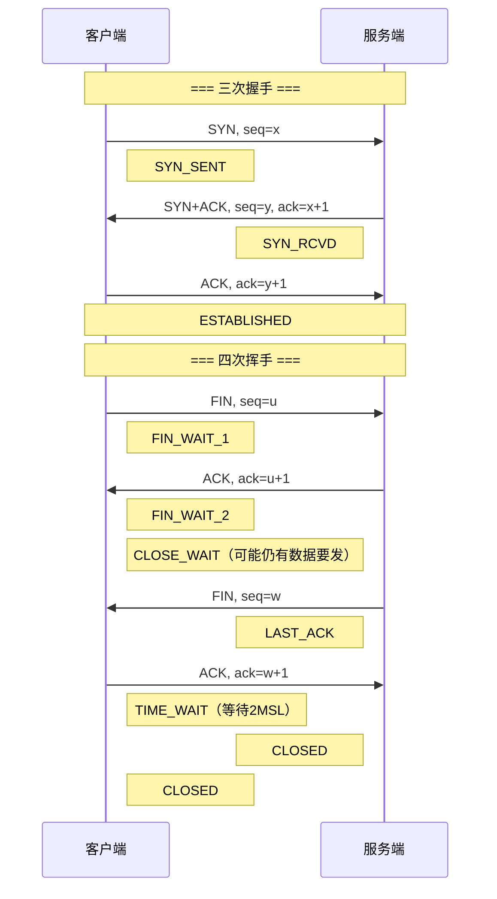
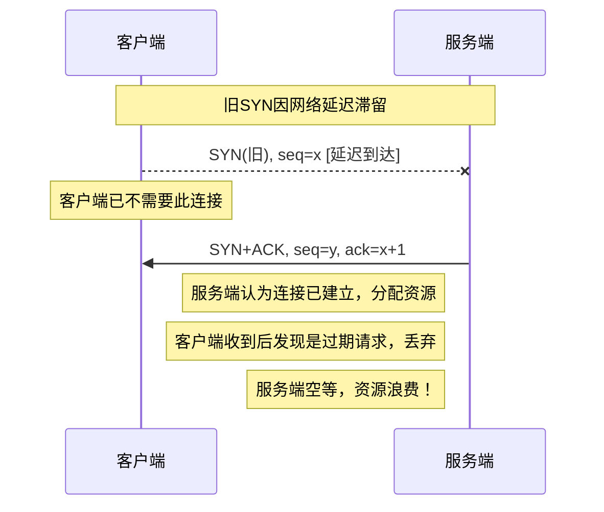

# TCP三次握手和四次挥手的过程？为什么这样设计？

## 知识点速览

TCP是面向连接的可靠传输协议，通信前必须建立连接（三次握手），通信后必须释放连接（四次挥手）。握手的目的是同步双方的初始序列号并确认双方的收发能力；挥手多一次是因为TCP全双工通信，每个方向需要独立关闭。



**核心要点：**
- **三次握手的必要性**：两次握手无法让服务端确认客户端的接收能力，也无法防止过期SYN引发错误连接
- **四次挥手的原因**：TCP全双工，被动方收到FIN后可能还有数据未发完，ACK和FIN不能合并
- **TIME_WAIT**：等待2MSL(Maximum Segment Lifetime)，确保最后一个ACK送达，同时让网络中残余报文消散
- **SYN Flood攻击**：利用半连接队列耗尽资源，防御手段包括SYN Cookie、限制半连接数

## 我的实战经历

**项目背景：** 在江苏思行达柜外交互终端项目中，终端设备需要通过TCP长连接与营业厅后台服务器通信，实时上报设备状态数据和接收控制指令。终端部署在配电柜旁边的户外环境，网络条件不稳定，经常出现断线和重连的情况。

**遇到的问题：** 上线初期发现终端偶尔出现"假连接"现象——终端认为连接正常，但实际数据发不出去。分析后发现两个原因：一是网络闪断后旧TCP连接未正确关闭，服务端仍占着资源；二是终端快速重连时，旧连接的TIME_WAIT状态导致端口暂时不可用。在户外弱网环境下，这些问题严重影响了数据上报的实时性。

**分析与解决：** 我从TCP连接生命周期的角度做了三项优化：

1. **心跳检测机制**：每15秒发送一次心跳包，连续3次无响应判定断线，主动执行四次挥手关闭旧连接后再重建新连接。这样避免了"假连接"长时间占用资源
2. **SO_REUSEADDR选项**：服务端套接字设置地址复用，解决TIME_WAIT期间端口不可用的问题
3. **连接超时控制**：三次握手过程设置5秒超时，超时后立即重试，避免在弱网环境下长时间阻塞

```cpp
// 心跳超时后的重连逻辑
void TcpClient::onHeartbeatTimeout() {
    // 主动关闭旧连接 (触发四次挥手)
    shutdown(m_socket, SHUT_RDWR);
    close(m_socket);
    // 重建连接 (触发三次握手)
    reconnect();
}
```

**结果：** 连接可靠性从约92%提升到99.5%以上，终端在弱网环境下的平均重连时间从30秒缩短到8秒。服务端也不再出现大量CLOSE_WAIT积压的问题。

## 深入原理

### 为什么不能两次握手？

假设只有两次握手（客户端SYN → 服务端SYN+ACK即建立连接）：



三次握手中，客户端不会对过期的SYN+ACK回复第三次ACK，服务端收不到确认就不会建立连接。

### 四次挥手中的半关闭状态

TCP支持**半关闭(half-close)**：一方关闭发送但仍可接收。这在实际场景中是有意义的：

| 阶段 | 主动方状态 | 被动方状态 | 数据流向 |
|------|-----------|-----------|---------|
| FIN发送后 | FIN_WAIT_1 | CLOSE_WAIT | 被动方→主动方仍可 |
| 被动方ACK后 | FIN_WAIT_2 | CLOSE_WAIT | 被动方→主动方仍可 |
| 被动方FIN后 | TIME_WAIT | LAST_ACK | 双向均关闭 |

### TIME_WAIT的2MSL原因

1. **确保最后的ACK到达**：如果最后的ACK丢失，被动方会重传FIN，主动方在TIME_WAIT期间可以重发ACK
2. **消散旧报文**：2MSL保证网络中属于旧连接的报文全部消失，防止新连接收到旧数据

### 常见状态异常及排查

| 异常状态 | 原因 | 排查方法 |
|---------|------|---------|
| 大量TIME_WAIT | 短连接频繁关闭 | `netstat -an | grep TIME_WAIT`，设置SO_REUSEADDR |
| 大量CLOSE_WAIT | 被动方未调close() | 检查代码是否有fd泄漏，用lsof确认 |
| 大量SYN_RCVD | SYN Flood攻击 | 开启SYN Cookie，限制半连接队列 |

### 三次握手中的序列号同步

初始序列号(ISN)不是从0开始的，而是基于时钟的半随机值。这样做的原因：
- 防止不同连接的报文混淆
- 防止攻击者猜测序列号进行TCP劫持
- Linux中ISN每4微秒加1，约4.55小时循环一次

## 面试表达建议

**开头：** "TCP三次握手的核心目的是同步双方的初始序列号，同时确认双方的收发能力。三次是完成这个确认的最小次数。"

**画图辅助：** 边说边画SYN、SYN+ACK、ACK的时序图，标注seq和ack号。然后画四次挥手，强调中间的半关闭状态。

**项目关联：** "在思行达的柜外终端项目中，我对TCP的连接管理有实际体验。户外弱网环境下我们通过心跳检测+超时重连+SO_REUSEADDR解决了假连接和TIME_WAIT的问题，连接可靠性从92%提到了99.5%。"

**答追问准备：**
- TIME_WAIT太多怎么办？→ SO_REUSEADDR + 连接池复用
- 三次握手能携带数据吗？→ 第三次可以，TCP Fast Open允许SYN带数据
- CLOSE_WAIT积压怎么排查？→ lsof查fd泄漏，检查代码是否忘记close
