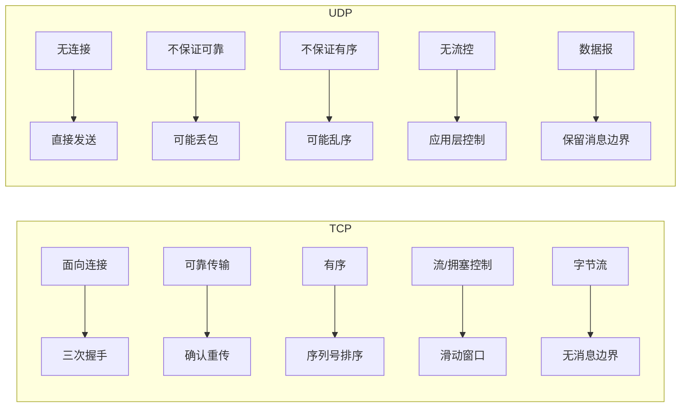
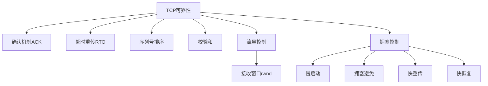
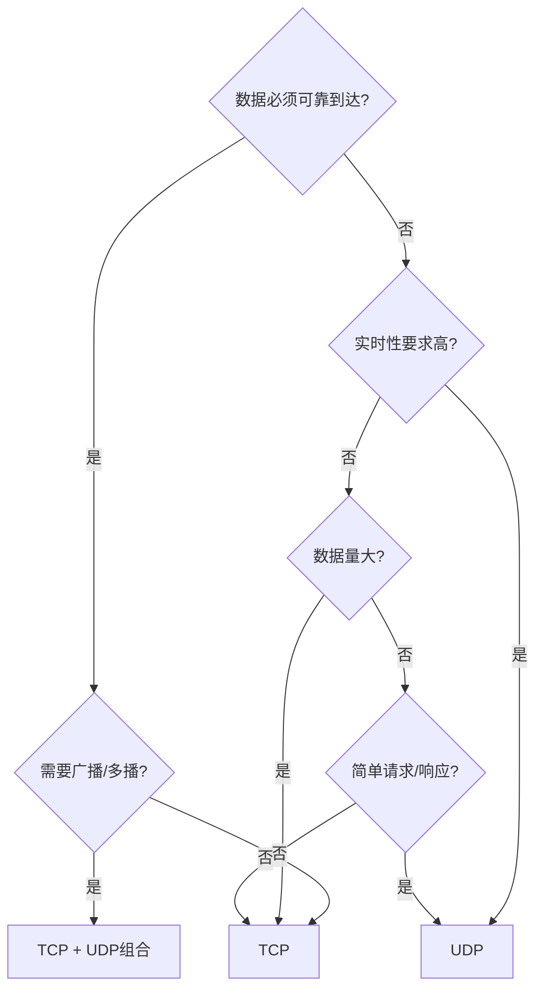

# TCP和UDP有什么区别？怎么选型？

## 知识点速览

TCP和UDP是传输层两大核心协议，本质区别在于TCP提供可靠的、面向连接的字节流传输，而UDP提供不可靠的、无连接的数据报传输。选型的关键取决于应用场景对可靠性、实时性和开销的权衡。



**对比一览表：**

| 特性 | TCP | UDP |
|------|-----|-----|
| 连接方式 | 面向连接(三次握手) | 无连接 |
| 可靠性 | 可靠(ACK+重传) | 不可靠 |
| 有序性 | 保证有序 | 不保证 |
| 头部开销 | 20字节起 | 固定8字节 |
| 传输方式 | 字节流(无消息边界) | 数据报(有消息边界) |
| 流量控制 | 滑动窗口 | 无 |
| 拥塞控制 | 慢启动/拥塞避免 | 无 |
| 支持模式 | 点对点 | 点对点/广播/多播 |

## 我的实战经历

**项目背景：** 在江苏思行达营业厅柜外交互终端项目中，系统需要与多种后端服务通信——营业厅后台管理系统、MQTT Broker、以及同局域网内的其他终端设备。不同场景对通信的要求差异很大，需要合理选择传输协议。

**遇到的问题：** 项目初期所有通信一律使用TCP。后来新增需求要求终端启动时自动发现局域网内的其他终端设备，并且要支持同时向多台终端广播告警通知。如果用TCP实现，每个终端都需要维护到其他所有终端的连接，连接管理的复杂度随终端数量平方级增长。

**分析与解决：** 根据不同通信场景的特点进行协议选型：

1. **终端↔后台管理系统**：TCP长连接。控制指令和状态数据必须可靠到达，丢失任何一条指令都可能导致设备状态不一致。加上自定义帧格式处理TCP粘包问题
2. **终端↔MQTT Broker**：TCP(MQTT底层就是TCP)。设备状态上报和告警消息需要QoS保证，MQTT协议本身在TCP之上实现
3. **设备发现**：UDP广播。终端启动时在局域网内发送UDP广播包(255.255.255.255)，其他终端监听并回复自身信息。UDP天然支持广播，无需预先知道对方地址
4. **告警广播**：UDP多播。紧急告警向同组终端多播，可容忍偶尔丢包(告警会重复发送)，时效性更重要

```cpp
// 设备发现 - UDP广播
void DeviceDiscovery::broadcastPresence() {
    QUdpSocket socket;
    QByteArray data = buildDiscoveryPacket(m_deviceInfo);
    socket.writeDatagram(data, QHostAddress::Broadcast, DISCOVERY_PORT);
}

// 设备控制 - TCP连接
void DeviceControl::sendCommand(const Command& cmd) {
    // 控制指令必须可靠到达, 使用TCP
    m_tcpSocket->write(frameEncode(cmd));
    // 等待ACK确认
}
```

**结果：** 混合使用TCP和UDP后，设备发现功能秒级完成，告警广播延迟从原来的逐一TCP推送平均800ms降到UDP多播50ms以内。TCP通道专注于需要可靠性保证的指令和数据传输，系统整体通信架构更清晰。

## 深入原理

### TCP可靠性的实现机制



TCP的可靠性并非免费午餐，带来的代价：
- **延迟增加**：三次握手至少1.5RTT才能开始传数据
- **头部开销**：TCP头20-60字节，UDP头仅8字节
- **吞吐量受限**：拥塞控制会主动降速

### UDP的"不可靠"并不意味着不能用

很多重要协议构建在UDP之上，在应用层实现所需的可靠性：

| 协议 | 基于UDP的原因 |
|------|-------------|
| DNS | 查询-响应简单，一个包就够，超时重发即可 |
| DHCP | 客户端没有IP地址，无法建立TCP连接 |
| RTP/RTSP | 实时音视频，丢帧比等帧体验更好 |
| QUIC(HTTP/3) | 解决TCP队头阻塞，在UDP上实现可靠传输 |
| 游戏同步 | 位置状态需要最新值，旧数据不值得重传 |

### 字节流 vs 数据报的本质区别

TCP是字节流协议，意味着发送方写入的数据边界在接收方看来是透明的：
- 发送方两次write(100字节 + 200字节) → 接收方可能一次read到300字节(粘包)
- 发送方一次write(1000字节) → 接收方可能两次read(600字节 + 400字节)(拆包)

UDP是数据报协议，保留消息边界：
- 发送方一次sendto的数据，接收方一次recvfrom完整接收
- 不存在粘包问题，但存在大小限制(通常建议不超过MTU 1500-IP头-UDP头=1472字节)

### 选型决策树



### 常见陷阱

1. **UDP不是万能加速器**：在高丢包网络下UDP丢包需应用层重传，效果可能不如TCP的拥塞控制好
2. **TCP粘包不是bug**：这是字节流协议的设计特性，需要应用层定义消息边界
3. **UDP有大小限制**：理论最大65507字节，实际建议不超1472字节避免IP分片
4. **NAT穿透**：UDP比TCP更适合P2P NAT穿透(打洞)，TCP打洞成功率低

## 面试表达建议

**开头：** "TCP和UDP最核心的区别在于TCP提供面向连接的可靠字节流传输，UDP提供无连接的数据报传输。选型要看场景对可靠性和实时性的权衡。"

**项目关联：** "在思行达的项目中，我们根据场景做了差异化选型：设备控制指令走TCP保证可靠到达，设备发现和告警广播走UDP利用其多播能力。TCP通道自然需要处理粘包问题，我们用了定长包头+长度字段的方式。"

**答追问准备：**
- QUIC协议了解吗？→ 基于UDP实现可靠传输，解决TCP队头阻塞，HTTP/3的基础
- 如何基于UDP实现可靠传输？→ 序列号+ACK+重传+排序，参考QUIC/KCP
- TCP和UDP可以同时使用同一端口吗？→ 可以，端口号是独立的命名空间
