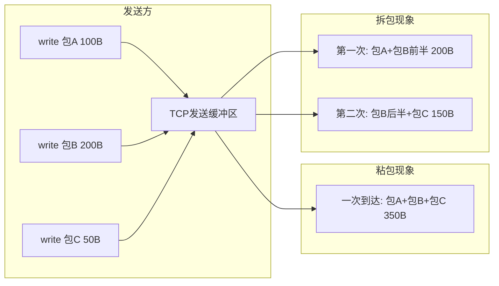
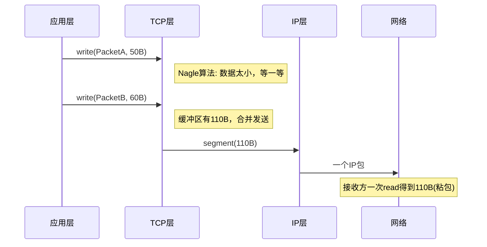

# TCP粘包是什么？怎么处理？

## 知识点速览

TCP是**字节流**协议，不保留应用层消息边界。发送方多次写入的数据在接收方可能被合并接收（粘包），或一次写入被拆成多次接收（拆包）。这不是TCP的bug，而是字节流的设计特性，需要在应用层定义消息分界。



**产生原因：**
- **Nagle算法**：TCP会合并小包减少网络开销
- **接收方读取慢**：缓冲区积压了多个包的数据
- **MSS/MTU限制**：大于MSS的数据被TCP分段发送

**常见解决方案：**

| 方案 | 原理 | 优缺点 |
|------|------|--------|
| 固定长度 | 每条消息定长填充 | 简单但浪费带宽 |
| 分隔符 | 用特殊字符分割(如\r\n) | HTTP头用此方式，数据中不能含分隔符 |
| 包头+长度 | 定长包头含数据长度字段 | 最通用，需要状态机解析 |

## 我的实战经历

**项目背景：** 在江苏思行达柜外交互终端项目中，终端通过TCP与后台服务器通信，同时通过串口与RS485设备通信。不论TCP还是串口，底层都是字节流，都面临粘包/拆包问题。我负责设计统一的通信协议和解析框架。

**遇到的问题：** 最初的TCP通信实现比较简单——发送方直接write序列化的JSON字符串，接收方read后直接解析。上线后立刻出问题：设备状态上报密集时（每100ms一条），接收方经常收到两条JSON粘在一起的数据，JSON解析失败导致数据丢失。偶尔网络波动时，一条完整的JSON被拆成两次接收，前半段解析也会失败。

**分析与解决：** 我设计了统一的二进制帧格式和状态机解析器，同时适用于TCP和串口通信：

帧格式设计：
```
+--------+--------+--------+--------+---------+--------+
| 帧头   | 地址   | 命令   | 长度   | 数据    | CRC16  |
| 0x55AA | 1字节  | 1字节  | 2字节  | N字节   | 2字节  |
+--------+--------+--------+--------+---------+--------+
```

状态机解析器——逐字节处理，天然适配流式数据：

```cpp
enum class ParseState {
    WAIT_HEADER_1,  // 等待0x55
    WAIT_HEADER_2,  // 等待0xAA
    WAIT_ADDR,
    WAIT_CMD,
    WAIT_LEN_LOW,
    WAIT_LEN_HIGH,
    WAIT_DATA,
    WAIT_CRC_LOW,
    WAIT_CRC_HIGH
};

void ProtocolParser::feedData(const QByteArray& raw) {
    for (uint8_t byte : raw) {
        switch (m_state) {
        case ParseState::WAIT_HEADER_1:
            if (byte == 0x55) m_state = ParseState::WAIT_HEADER_2;
            break;
        case ParseState::WAIT_HEADER_2:
            if (byte == 0xAA) m_state = ParseState::WAIT_ADDR;
            else m_state = ParseState::WAIT_HEADER_1;
            break;
        // ... 其他状态逐字节推进 ...
        case ParseState::WAIT_CRC_HIGH:
            if (verifyCRC()) emit frameReady(m_frame);
            m_state = ParseState::WAIT_HEADER_1;
            break;
        }
    }
}
```

状态机的优势在于：无论数据如何到达（粘包、拆包、甚至一次只来1个字节），解析器都能正确工作。配合循环缓冲区，多余的数据自动进入下一帧的解析流程。

**结果：** 统一帧格式 + 状态机解析器同时应用于TCP和串口通道，解决了所有粘包/拆包问题。上线后协议解析零错误，通信优化后响应时间从100ms缩短到60ms。这个解析模块后来在华乘T95项目中直接复用。

## 深入原理

### 粘包发生的底层原因



**Nagle算法的逻辑：**
- 如果有已发送未确认的数据，将新的小数据缓存起来
- 直到收到之前的ACK，或缓存数据累积到MSS大小
- 可通过`TCP_NODELAY`选项关闭，但要权衡（关闭后小包多，网络开销大）

### 循环缓冲区配合状态机

实际工程中，TCP recv或串口read到的数据先写入循环缓冲区，状态机从缓冲区消费数据：

```
循环缓冲区 (Ring Buffer):
写入位置
    ↓
+---+---+---+---+---+---+---+---+
| A | A | B | B | B | C |   |   |
+---+---+---+---+---+---+---+---+
        ↑
    读取位置 (状态机消费)
```

优势：
- 数据零拷贝（生产者写入和消费者读取独立进行）
- 天然处理部分到达（数据不够一帧时状态机暂停，新数据到达后继续）
- 内存固定不会增长

### 三种方案的适用场景对比

| 方案 | 实现复杂度 | 带宽效率 | 典型应用 |
|------|-----------|---------|---------|
| 固定长度 | 低 | 低(需填充) | 金融交易报文 |
| 分隔符(\r\n) | 中 | 高 | HTTP头、Redis协议、FTP |
| 包头+长度字段 | 高 | 高 | 自定义二进制协议、Protobuf |

### CRC校验的作用

帧尾的CRC16不仅检测数据传输错误，还有一个隐藏作用：**验证帧同步的正确性**。如果状态机误将数据中的0x55AA当作帧头（假帧头），后续解析出的CRC校验必然失败，状态机会丢弃这个错误帧并重新搜索真正的帧头。

### 常见陷阱

1. **用JSON+\n做TCP协议**：简单场景可以，但JSON内容本身如果包含换行符就会出错
2. **直接按write次数read**：TCP不保证一次write对应一次read，这是最常见的错误
3. **忘记处理半包**：recv到的数据可能不够一个完整帧，状态机必须能暂停并等待更多数据
4. **大端小端不一致**：长度字段的字节序必须在协议中明确规定，跨平台通信时尤其要注意

## 面试表达建议

**开头：** "TCP粘包的根本原因是TCP是字节流协议，没有消息边界的概念。应用层的多次write在TCP看来只是往字节流里追加数据。"

**方案重点：** "最通用的解决方案是定长包头+长度字段。我在思行达项目中设计的帧格式是0x55AA魔数+地址+命令+长度+数据+CRC16，配合逐字节的状态机解析。状态机的好处是无论数据怎么到达——粘包、拆包、甚至每次只收到1字节——都能正确解析。"

**项目关联：** "这套解析框架我在思行达TCP通信和华乘T95的USB串口通信中都用了，效果很好。串口通信本质上也是字节流，同样的状态机解析器可以直接复用。"

**答追问准备：**
- Nagle算法是什么？→ 合并小包减少网络开销，TCP_NODELAY关闭
- UDP有粘包问题吗？→ 没有，UDP是数据报协议，保留消息边界
- 如何处理帧头碰撞(数据中出现0x55AA)？→ CRC校验兜底，或用转义字符(字节填充)
