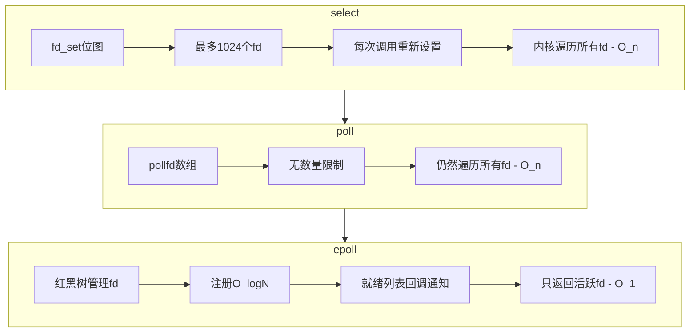
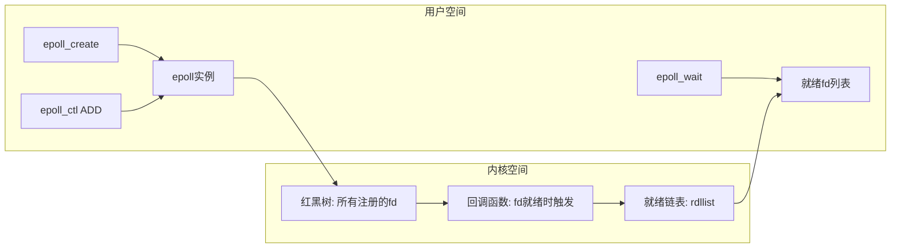

# select、poll、epoll的区别？

## 知识点速览

I/O多路复用是指用**一个线程**同时监控多个文件描述符(fd)的就绪状态，避免为每个连接创建一个线程。select、poll、epoll是Linux下三种I/O多路复用机制，核心演进方向是减少无效遍历和内核/用户态数据拷贝。



**对比总结：**

| 特性 | select | poll | epoll |
|------|--------|------|-------|
| fd上限 | 1024(FD_SETSIZE) | 无限制 | 无限制 |
| 数据结构 | fd_set位图 | pollfd数组 | 红黑树+就绪链表 |
| 内核遍历 | O(n)全部遍历 | O(n)全部遍历 | O(1)回调机制 |
| fd拷贝 | 每次调用都拷贝 | 每次调用都拷贝 | epoll_ctl注册一次 |
| 触发模式 | 仅LT | 仅LT | LT+ET |
| 跨平台 | 所有平台 | 大多数Unix | 仅Linux |

## 我的实战经历

**项目背景：** 在江苏思行达营业厅平台项目中，我负责开发柜外终端上的嵌入式HTTP服务器。这个服务器运行在RK3399(ARM)平台上，需要同时处理来自营业厅前端页面的HTTP请求、后台管理系统的控制指令、以及MQTT消息。终端资源有限（ARM Cortex-A72 + 2GB RAM），不适合用多线程模型。

**遇到的问题：** 最初采用"每连接一线程"模型实现HTTP服务器。小规模测试时没问题，但营业厅实际部署后，前端页面会建立多个并发请求（页面数据+设备状态轮询+文件上传），加上后台长连接和MQTT，并发连接数经常达到30-50个。频繁的线程创建销毁导致嵌入式平台CPU占用飙高，偶尔还出现线程数耗尽的情况。

**分析与解决：** 将HTTP服务器改为事件驱动架构，底层使用epoll I/O多路复用：

1. **epoll替代多线程**：一个主线程通过epoll_wait监控所有连接fd，有事件就绪时分发处理。避免了线程创建销毁的开销
2. **ET模式+非阻塞I/O**：使用边缘触发模式减少epoll_wait的唤醒次数，配合非阻塞I/O确保不会漏读数据
3. **路径+方法路由分发**：解析HTTP请求后按URL路径和HTTP方法分发到对应处理函数，实现RESTful风格

```cpp
// 事件驱动的HTTP服务器核心循环
void HttpServer::eventLoop() {
    int epfd = epoll_create1(0);
    // 注册监听socket
    epoll_ctl(epfd, EPOLL_CTL_ADD, m_listenFd, &ev);

    while (m_running) {
        int nfds = epoll_wait(epfd, events, MAX_EVENTS, timeout_ms);
        for (int i = 0; i < nfds; i++) {
            if (events[i].data.fd == m_listenFd) {
                acceptConnection(epfd);  // 新连接
            } else {
                handleRequest(events[i]); // 数据就绪
            }
        }
    }
}
```

**结果：** 改造后单线程即可处理50+并发连接，CPU占用从多线程模型的35%降到12%，内存占用减少约60%。HTTP请求的平均响应时间也从15ms降到8ms，在嵌入式平台上表现优秀。

## 深入原理

### epoll的内部实现



**epoll三部曲：**
1. `epoll_create`：内核创建一个epoll实例，包含红黑树和就绪链表
2. `epoll_ctl(ADD/MOD/DEL)`：将fd插入/修改/删除红黑树，同时注册回调。O(logN)
3. `epoll_wait`：检查就绪链表，有就绪fd直接返回，没有则阻塞。O(活跃fd数)

关键优势在于**回调机制**：当fd的底层设备就绪（如网卡收到数据），设备驱动会调用注册的回调函数，将该fd加入就绪链表。epoll_wait只需检查链表是否非空，不需要遍历所有fd。

### LT(水平触发) vs ET(边缘触发)

| 特性 | LT(Level Triggered) | ET(Edge Triggered) |
|------|---------------------|---------------------|
| 通知条件 | fd处于就绪状态就一直通知 | 仅在状态变化时通知一次 |
| 数据处理 | 可以不一次读完，下次还会通知 | 必须一次读完，否则可能丢失事件 |
| 编程难度 | 简单，select/poll兼容 | 复杂，必须配合非阻塞I/O |
| 性能 | epoll_wait唤醒次数多 | 唤醒次数少，高并发时更高效 |

ET模式的典型读取模式：
```cpp
// ET模式必须循环读取直到EAGAIN
void handleReadET(int fd) {
    while (true) {
        ssize_t n = read(fd, buf, sizeof(buf));
        if (n == -1) {
            if (errno == EAGAIN) break; // 读完了
            // 真正的错误处理
        } else if (n == 0) {
            // 对端关闭
        }
        processData(buf, n);
    }
}
```

### select的1024限制来源

`FD_SETSIZE`是编译时常量，定义fd_set位图大小。修改需要重新编译内核和应用，实际操作中不现实。这也是select在现代高并发场景中被淘汰的主要原因之一。

### 性能对比(连接数vs活跃数)

- **连接数少**(<100)：三者差异不大，select因跨平台可能更好
- **连接多活跃多**：epoll和poll差距缩小（活跃fd多时回调开销也大）
- **连接多活跃少**：epoll优势最大（典型场景：长连接服务器，大多数连接在等待）

### 跨平台I/O多路复用

| 平台 | 推荐方案 |
|------|---------|
| Linux | epoll |
| macOS/FreeBSD | kqueue |
| Windows | IOCP (完成端口) |
| 跨平台框架 | libevent / libuv / Qt事件循环 |

## 面试表达建议

**开头：** "select、poll、epoll都是I/O多路复用机制，核心思想是用一个线程监控多个fd。演进方向是减少无效遍历——select O(n)遍历且有1024限制，poll去掉了数量限制但仍O(n)，epoll通过红黑树+回调+就绪链表实现O(1)。"

**项目关联：** "在思行达项目中，我在嵌入式平台上实现了事件驱动的HTTP服务器，用epoll ET模式替代了每连接一线程模型，单线程就能处理50+并发连接，CPU占用从35%降到12%。"

**答追问准备：**
- ET和LT的区别？→ LT持续通知，ET仅状态变化通知一次。ET必须配合非阻塞I/O循环读取到EAGAIN
- epoll为什么用红黑树？→ 插入删除查找都是O(logN)，适合频繁增删fd的场景
- Reactor和Proactor模式？→ Reactor同步I/O+事件分发(epoll)，Proactor异步I/O+完成通知(IOCP)
