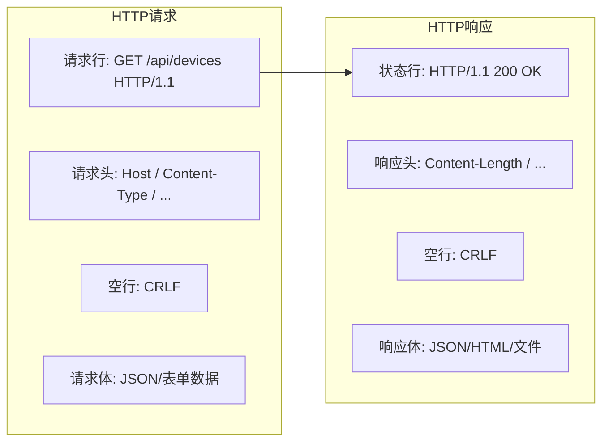
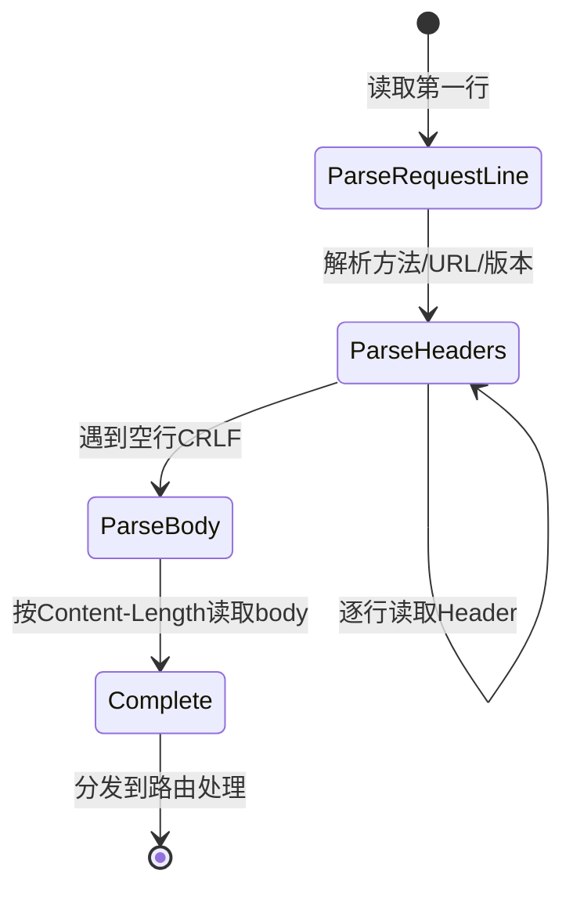

# HTTP协议的基本结构？项目中如何应用？

## 知识点速览

HTTP(HyperText Transfer Protocol)是应用层协议，基于**请求-响应模型**，底层通常使用TCP传输。HTTP是无状态协议，每个请求独立处理。



**核心要素：**

| 组件 | 说明 | 示例 |
|------|------|------|
| 请求方法 | 对资源的操作类型 | GET/POST/PUT/DELETE |
| URL | 资源标识 | /api/devices/001 |
| 状态码 | 服务端处理结果 | 200/404/500 |
| Content-Type | 数据格式 | application/json |
| Content-Length | 响应体长度 | 1024 |

**RESTful设计原则：**
- **资源用名词URL表示**：/api/devices 而非 /api/getDevices
- **操作用HTTP方法区分**：GET查询、POST创建、PUT更新、DELETE删除
- **状态码语义化**：200成功、201已创建、400请求错误、404不存在、500服务端错误

## 我的实战经历

**项目背景：** 在江苏思行达营业厅平台项目中，柜外交互终端需要提供Web管理界面，营业员通过浏览器访问终端IP即可查看设备状态、下发控制指令、查询历史数据。因为终端运行在嵌入式RK3399平台上，不能跑Nginx或Node.js这类重量级服务，所以我用C++从底层实现了一个轻量级HTTP服务器。

**遇到的问题：** 初版HTTP服务器功能简陋，URL和处理函数硬编码在一起，每新增一个接口都要改核心代码。前端开发的同事反馈接口风格不统一：有的接口用GET参数传设备ID，有的用POST body；返回的JSON格式也不一致，错误处理各异。前端对接成本高。

**分析与解决：** 我按RESTful规范重新设计了接口架构：

1. **路径+方法二维路由表**：支持路径参数匹配，如 `/api/devices/:id/status`
2. **统一的请求解析**：解析HTTP报文为结构化对象(method, path, headers, body)
3. **统一的响应格式**：所有接口返回标准JSON `{ "code": 0, "data": {...}, "msg": "ok" }`
4. **中间件机制**：请求日志、CORS跨域、身份验证作为中间件统一处理

```cpp
// RESTful路由注册
void HttpServer::setupRoutes() {
    // 设备管理
    GET("/api/devices",           &DeviceCtrl::list);
    GET("/api/devices/:id",       &DeviceCtrl::detail);
    POST("/api/devices/:id/ctrl", &DeviceCtrl::control);

    // 告警管理
    GET("/api/alarms",            &AlarmCtrl::list);
    PUT("/api/alarms/:id/ack",    &AlarmCtrl::acknowledge);

    // 静态文件(前端页面)
    STATIC("/", "./www");
}

// 路由匹配核心逻辑
void HttpServer::dispatch(const HttpRequest& req) {
    for (auto& route : m_routes) {
        if (route.method == req.method &&
            route.matchPath(req.path, params)) {
            route.handler(req, params, response);
            return;
        }
    }
    response.status(404).json({{"msg", "Not Found"}});
}
```

接口示例：
```
GET /api/devices              → 获取设备列表
GET /api/devices/rs485_003    → 获取3号RS485设备详情
POST /api/devices/rs485_003/ctrl  → 下发控制指令(body: {"action":"restart"})
GET /api/alarms?level=critical → 查询严重告警
```

**结果：** RESTful接口规范化后，前端对接效率提升了约60%（从接口文档到联调的时间显著缩短）。新增接口只需注册路由和编写处理函数，HTTP框架代码零改动。后来这套HTTP服务器被提取为通用组件，在其他终端产品中也有复用。

## 深入原理

### HTTP报文解析的实际处理

HTTP头部以`\r\n`分隔，头部和body之间用空行(`\r\n\r\n`)分隔。底层TCP收到数据后需要解析：



需要注意的问题：
- **请求行和头部**用`\r\n`分隔，本质上是用分隔符解决TCP粘包
- **Body部分**用Content-Length确定长度，或Transfer-Encoding: chunked分块传输
- **大文件上传**：需要流式处理，不能一次性把整个body读入内存

### HTTP/1.0 vs 1.1 vs 2.0

| 版本 | 关键改进 |
|------|---------|
| HTTP/1.0 | 每次请求新建TCP连接 |
| HTTP/1.1 | 持久连接(keep-alive)、管线化、Host头 |
| HTTP/2.0 | 多路复用(一个TCP连接并行多个请求)、头部压缩、服务器推送 |
| HTTP/3.0 | 基于QUIC(UDP)、解决TCP队头阻塞 |

### 嵌入式HTTP服务器 vs 标准服务器

| 考虑因素 | 嵌入式自研 | Nginx/Apache |
|---------|-----------|-------------|
| 资源占用 | 极低(<1MB) | 较高(>10MB) |
| 功能 | 按需实现 | 功能完整 |
| 并发能力 | 够用(50-100) | 很高(10K+) |
| 维护成本 | 需自行维护 | 社区维护 |
| 适用场景 | 嵌入式/IoT | 通用Web服务 |

### 常见陷阱

1. **忘记Content-Length**：响应不带Content-Length，客户端不知道body何时结束
2. **CORS跨域问题**：浏览器的同源策略要求服务端正确设置Access-Control-Allow-Origin
3. **URL编码**：URL中的中文和特殊字符需要percent-encoding(%xx)
4. **幂等性**：GET/PUT/DELETE应该是幂等的，POST不是。设计API时要注意

## 面试表达建议

**开头：** "HTTP是基于请求-响应模型的应用层协议。请求由请求行、请求头、空行、请求体四部分组成，响应结构类似，状态行替代请求行。"

**项目关联：** "在思行达项目中，我在嵌入式平台上用C++实现了轻量HTTP服务器，按RESTful规范设计接口。用路径加方法做二维路由分发，统一了请求响应格式。前端通过浏览器访问终端IP就能管理设备。"

**答追问准备：**
- HTTP keep-alive的作用？→ 复用TCP连接避免重复握手，HTTP/1.1默认开启
- GET和POST的区别？→ GET幂等读取、参数在URL上、有长度限制；POST非幂等、参数在body中
- HTTPS和HTTP的区别？→ HTTPS = HTTP + TLS/SSL加密，防窃听篡改冒充
