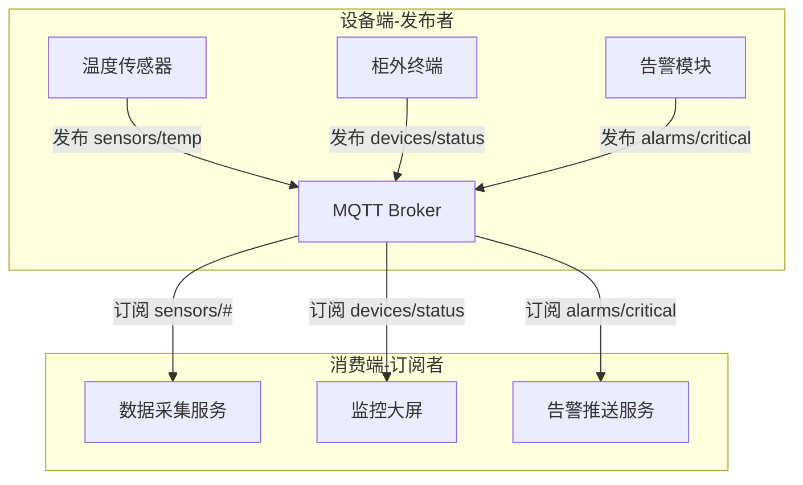
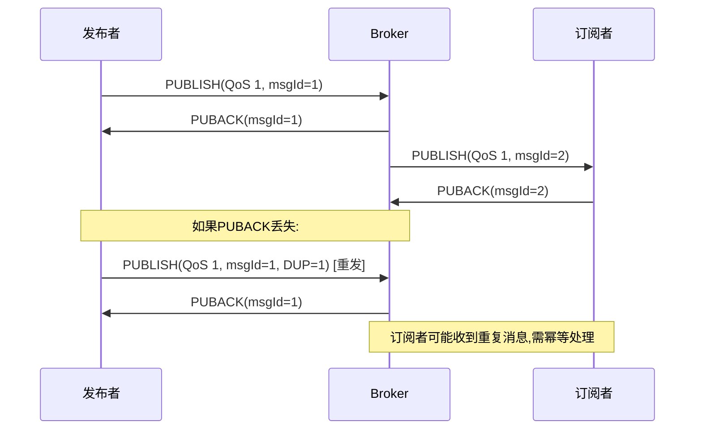

# MQTT协议的模型、QoS等级和应用场景？

## 知识点速览

MQTT(Message Queuing Telemetry Transport)是一种轻量级的**发布/订阅**消息协议，专为IoT场景设计。与HTTP的请求-响应模式不同，MQTT通过中间代理(Broker)解耦发布者和订阅者，天然适合一对多消息分发。



**QoS等级对比：**

| QoS | 名称 | 机制 | 特点 | 适用场景 |
|-----|------|------|------|---------|
| 0 | 最多一次 | 发了就不管 | 可能丢失，开销最小 | 环境数据采样 |
| 1 | 至少一次 | PUBLISH→PUBACK | 不会丢但可能重复 | 告警通知、状态上报 |
| 2 | 恰好一次 | 四步握手 | 不丢不重，开销最大 | 计费、关键控制指令 |

**核心特性：**
- **Topic层级结构**：`building/floor1/room101/temp`，支持`+`单层通配和`#`多层通配
- **遗嘱消息(LWT)**：客户端异常断开时Broker自动发布预设消息
- **保留消息(Retained)**：新订阅者立即收到Topic最后一条消息
- **持久会话**：断线重连后补发离线期间的QoS 1/2消息

## 我的实战经历

**项目背景：** 在江苏思行达营业厅平台项目中，我负责设计设备监控通信架构。营业厅部署了多种终端设备（柜外交互终端、排队叫号机、自助缴费机等），需要实时监控所有设备的在线状态、运行数据，并在异常时及时告警。后台管理系统需要同时订阅多台设备的状态。

**遇到的问题：** 最初用TCP长连接做状态上报，后台需要维护与每台设备的独立连接。新增一个监控大屏就要让每台设备多建一路连接。设备数量增长到30+后，连接管理变得复杂，且后台任何一个订阅者重启都需要所有设备重新连接。

**分析与解决：** 引入MQTT协议重构设备监控架构：

1. **Topic规范设计**：按层级组织，便于灵活订阅
   - 设备状态：`hall/{hall_id}/device/{device_id}/status`
   - 设备告警：`hall/{hall_id}/device/{device_id}/alarm`
   - 控制指令：`hall/{hall_id}/device/{device_id}/control`

2. **QoS差异化策略**：
   - 周期性状态上报(每30秒)：QoS 0，丢一次没关系，下次会补上
   - 告警消息：QoS 1，必须送达但重复收到可接受（幂等处理）
   - 远程控制指令：QoS 1 + 应用层确认（设备执行后回复结果）

3. **设备上线/离线检测**：利用MQTT遗嘱消息(LWT)机制
   - 设备连接时设置遗嘱消息：`{device_id}/status` → `{"online": false}`
   - 设备正常上线后发布：`{device_id}/status` → `{"online": true}` (retained)
   - 设备异常断开时，Broker自动发布离线遗嘱，后台即时感知

```cpp
// MQTT连接配置
void DeviceMonitor::connectBroker() {
    MqttConnectOptions opts;
    opts.setKeepAliveInterval(60);
    opts.setCleanSession(false); // 持久会话,断线恢复

    // 设置遗嘱消息: 异常断开时自动发布离线状态
    QString willTopic = QString("hall/%1/device/%2/status")
                        .arg(m_hallId).arg(m_deviceId);
    opts.setWill(willTopic, R"({"online":false})", QOS_1, true);

    m_client->connectToHost(opts);
}

// 告警消息发布 - QoS 1保证送达
void DeviceMonitor::publishAlarm(const AlarmInfo& alarm) {
    QString topic = QString("hall/%1/device/%2/alarm")
                    .arg(m_hallId).arg(m_deviceId);
    m_client->publish(topic, alarm.toJson(), QOS_1);
}
```

**结果：** MQTT架构上线后，设备监控的订阅者（管理后台、监控大屏、告警服务）完全解耦，任一组件重启不影响其他部分。设备离线检测延迟从原来的心跳超时45秒缩短到Broker遗嘱发布的5秒以内。新增监控维度只需订阅对应Topic，零代码改动。

## 深入原理

### QoS 1的消息流



### QoS 2的四步握手

QoS 2保证消息恰好传递一次，代价是四次网络交互：
1. PUBLISH → 2. PUBREC(收到确认) → 3. PUBREL(释放) → 4. PUBCOMP(完成)

实际项目中QoS 2很少用，因为开销太大。通常用QoS 1 + 应用层去重替代。

### MQTT vs HTTP长轮询 vs WebSocket

| 特性 | MQTT | HTTP长轮询 | WebSocket |
|------|------|-----------|-----------|
| 协议开销 | 极低(2字节起) | 高(HTTP头) | 中(帧头2-14字节) |
| 发布订阅 | 原生支持 | 不支持 | 需自行实现 |
| QoS保证 | 协议内置 | 无 | 无 |
| 离线消息 | 持久会话支持 | 不支持 | 不支持 |
| 适用场景 | IoT/设备监控 | Web实时更新 | Web双向通信 |

### Topic设计最佳实践

1. **层级清晰**：`区域/设备类型/设备ID/数据类型`
2. **不要以/开头**：`/sensors/temp`会多一个空层级
3. **通配符谨慎使用**：`#`订阅所有可能收到海量消息
4. **保留消息用于状态**：新订阅者能立即获取设备最新状态
5. **遗嘱消息用于离线检测**：比心跳超时更及时准确

### 常见陷阱

1. **QoS是端到端的吗？** 不是。发布者→Broker和Broker→订阅者的QoS独立设置，取较低值
2. **Clean Session的坑**：设为true时每次连接丢弃旧订阅和离线消息
3. **消息积压**：QoS 1/2持久会话中，设备长时间离线后重连可能收到大量积压消息
4. **Broker选型**：Mosquitto轻量适合嵌入式，EMQX适合大规模集群

## 面试表达建议

**开头：** "MQTT是轻量级的发布订阅协议，专为IoT场景设计。核心架构是Broker做消息代理，设备作为Client按Topic发布和订阅消息，通过QoS等级控制消息可靠性。"

**项目关联：** "在思行达营业厅项目中，我用MQTT重构了设备监控架构。设计了层级化的Topic规范，告警消息用QoS 1保证送达，普通状态用QoS 0控制开销。利用遗嘱消息实现了设备离线秒级检测，比之前心跳超时快了很多。"

**答追问准备：**
- 遗嘱消息怎么工作？→ 连接时预设，Broker检测到异常断开时自动发布
- MQTT底层用什么传输？→ 默认TCP，也支持WebSocket(适配Web端)
- 百万设备怎么处理？→ Broker集群(EMQX)，Topic分片，桥接转发
