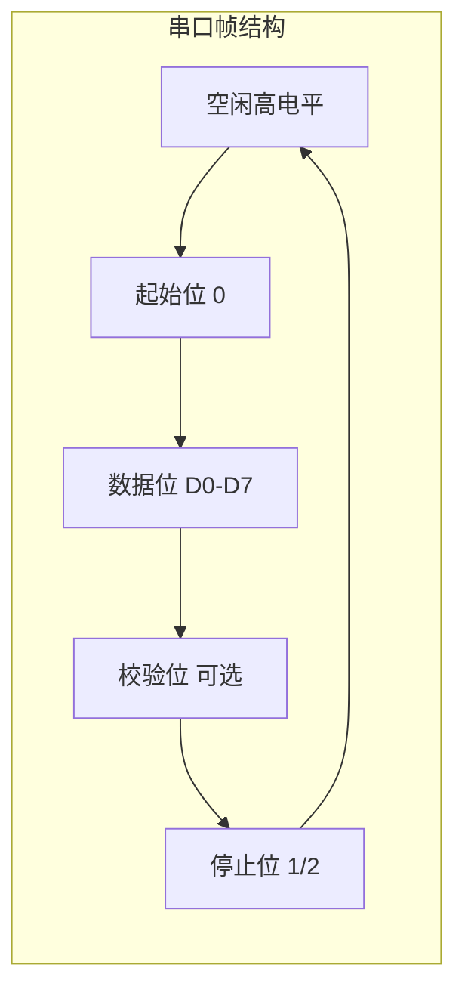
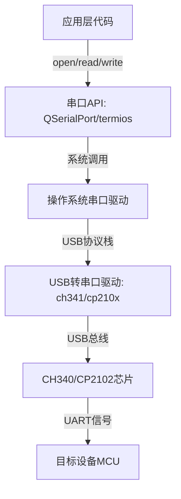

# 串口通信的基本参数？USB虚拟串口是什么？

## 知识点速览

串口(UART/Serial)是最基础的设备间通信方式，广泛用于嵌入式系统、工业控制、调试接口。它是**异步通信**，不需要时钟线，靠约定波特率和起始位实现同步。



**串口五要素：**

| 参数 | 说明 | 常见值 |
|------|------|--------|
| 波特率 | 每秒传输的位数(bps) | 9600/115200/921600 |
| 数据位 | 每帧有效数据位数 | 7/8位(通常8) |
| 停止位 | 帧结束标志位数 | 1/1.5/2位(通常1) |
| 校验位 | 奇偶校验 | None/Odd/Even |
| 流控 | 收发速度控制 | 无/RTS-CTS/XON-XOFF |

- **8N1**表示8数据位、无校验(None)、1停止位，是最常用配置
- 波特率115200时，每字节传输约87us（1起始+8数据+1停止=10位，10/115200s）
- 收发双方所有参数必须**完全一致**，否则数据乱码

**USB虚拟串口**：通过USB转串口芯片（CH340/CP2102/FTDI）将USB接口模拟为标准串口，操作系统安装驱动后映射为COM端口（Windows）或/dev/ttyUSB设备（Linux），应用层代码与真实串口编程接口完全一致。

## 我的实战经历

**项目背景：** 在南京华乘电气T95带电检测手持终端项目中，终端主板通过USB虚拟串口与多个检测模块（TEV、UHF、AE、红外等）通信。每个检测模块内含独立MCU，通过CH340 USB转串口芯片接入终端主控。我负责设计和实现整个串口通信框架。

**遇到的问题：**

1. **设备识别混乱**：多个检测模块同时通过USB接入，每次插入的COM口号不固定(COM3/COM5/COM7随机)。早期通过硬编码COM号配置，换个USB口就要改配置
2. **通信不稳定**：CH340芯片在高波特率(115200)下偶尔出现字节丢失，特别是连续发送大量数据时
3. **热插拔处理**：检测过程中USB线松动导致串口突然断开，程序直接崩溃

**分析与解决：**

1. **USB设备枚举识别**：通过VID/PID(厂商ID/产品ID)识别具体检测模块，不再依赖COM口号。每个模块的CH340配置了不同的序列号，即使插在不同USB口也能正确识别

```cpp
// 通过USB VID/PID + 序列号识别设备
QList<ModuleInfo> DeviceEnumerator::scanModules() {
    QList<ModuleInfo> result;
    for (auto& port : QSerialPortInfo::availablePorts()) {
        if (port.vendorIdentifier() == CH340_VID &&
            port.productIdentifier() == CH340_PID) {
            ModuleType type = identifyBySerial(port.serialNumber());
            result.append({type, port.portName()});
        }
    }
    return result;
}
```

2. **通信参数优化**：115200波特率,8N1配置。发送端在每帧之间增加1ms间隔，避免CH340缓冲区溢出。接收端使用循环缓冲区暂存数据，状态机解析时处理不完整帧

3. **热插拔状态机**：监听USB设备的插入/拔出事件，串口断开时自动进入Reconnecting状态，设备重新插入后自动重连恢复

```cpp
// 串口配置
void SerialChannel::openPort(const QString& portName) {
    m_serial.setPortName(portName);
    m_serial.setBaudRate(QSerialPort::Baud115200);
    m_serial.setDataBits(QSerialPort::Data8);
    m_serial.setParity(QSerialPort::NoParity);
    m_serial.setStopBits(QSerialPort::OneStop);
    m_serial.setFlowControl(QSerialPort::NoFlowControl);

    if (!m_serial.open(QIODevice::ReadWrite)) {
        emit errorOccurred("Failed to open " + portName);
        return;
    }
    // 清空缓冲区,避免残留数据干扰
    m_serial.clear();
}
```

**结果：** USB虚拟串口通信框架稳定运行，支持4个检测模块同时在线通信。设备识别改为VID/PID+序列号后，彻底解决了COM口漂移问题。热插拔处理使得现场操作人员可以安全地拔插检测模块，无需重启终端。通信丢包率从初始的约2%降到0.01%以下。

## 深入原理

### UART硬件层时序

```
    空闲    起始位  D0   D1   D2   D3   D4   D5   D6   D7  停止位   空闲
     ___          ___  ___       ___  ___       ___  ___  _______  ___
    |   |________|   ||   |_____|   ||   |_____|   ||   ||       ||
    高         低                                            高

    ←───── 一个字节帧 (10位 @ 115200bps ≈ 87μs) ─────→
```

- 空闲状态为高电平
- 起始位拉低，接收方检测到下降沿开始采样
- 按波特率时钟在每个位中心采样
- 停止位回到高电平，准备下一帧

### USB虚拟串口的驱动层架构



关键点：从应用层看，USB虚拟串口和真实串口没有任何区别。驱动层完成了USB协议到串口信号的透明转换。

### 常见USB转串口芯片对比

| 芯片 | 厂商 | 价格 | 最大波特率 | 驱动支持 | 特点 |
|------|------|------|-----------|---------|------|
| CH340 | 南京沁恒 | 低 | 2Mbps | 需装驱动 | 国产性价比高 |
| CP2102 | Silicon Labs | 中 | 1Mbps | 免驱(Win10+) | 稳定性好 |
| FT232 | FTDI | 高 | 3Mbps | 免驱 | 工业级首选 |
| PL2303 | Prolific | 低 | 1.2Mbps | 驱动问题多 | 山寨芯片泛滥 |

### 串口通信 vs 其他设备通信方式

| 方式 | 线数 | 距离 | 速率 | 拓扑 | 适用场景 |
|------|------|------|------|------|---------|
| UART串口 | 2(TX/RX) | 15m | ~1Mbps | 点对点 | 调试/模块通信 |
| SPI | 4+ | 短(板级) | ~50Mbps | 主从(多从) | 高速外设(Flash) |
| I2C | 2(SDA/SCL) | 短(板级) | ~3.4Mbps | 多主多从 | 传感器/EEPROM |
| RS485 | 2(A/B) | 1200m | ~10Mbps | 多点总线 | 工业现场 |

### 常见陷阱

1. **波特率不匹配**：最常见的问题，收到的全是乱码。排查时先用示波器或逻辑分析仪抓波形
2. **TX/RX接反**：串口是交叉连接（A的TX接B的RX），直连线和交叉线容易搞混
3. **电平不匹配**：TTL(3.3V/5V)和RS232(±12V)电平不同，需要MAX3232等电平转换
4. **缓冲区溢出**：高波特率持续发送时，接收方来不及处理，需要流控或应用层节流
5. **CH340驱动兼容性**：不同版本Windows需要不同版本驱动，部分山寨CH340芯片驱动不兼容

## 面试表达建议

**开头：** "串口通信有五个核心参数——波特率、数据位、停止位、校验位和流控，收发双方必须完全一致。最常见的配置是115200波特率、8N1。"

**USB虚拟串口：** "USB虚拟串口是通过CH340这类转换芯片，把USB接口模拟成标准串口。操作系统装驱动后，应用层代码和操作真实串口完全一样，获得了USB即插即用的便利性。"

**项目关联：** "在T95项目中，四个检测模块都通过CH340 USB虚拟串口接入终端。我通过VID/PID加序列号解决了COM口漂移问题，实现了热插拔支持，通信丢包率控制在万分之一以下。"

**答追问准备：**
- 波特率是怎么约定的？→ 标准值系列(9600/19200/38400/57600/115200)，收发方预先配置一致
- 串口怎么调试？→ 串口助手工具、逻辑分析仪抓波形、回环测试(TX接RX自发自收)
- CH340和FTDI怎么选？→ 成本敏感用CH340，可靠性要求高用FTDI，CH340在国产嵌入式项目中更普遍
