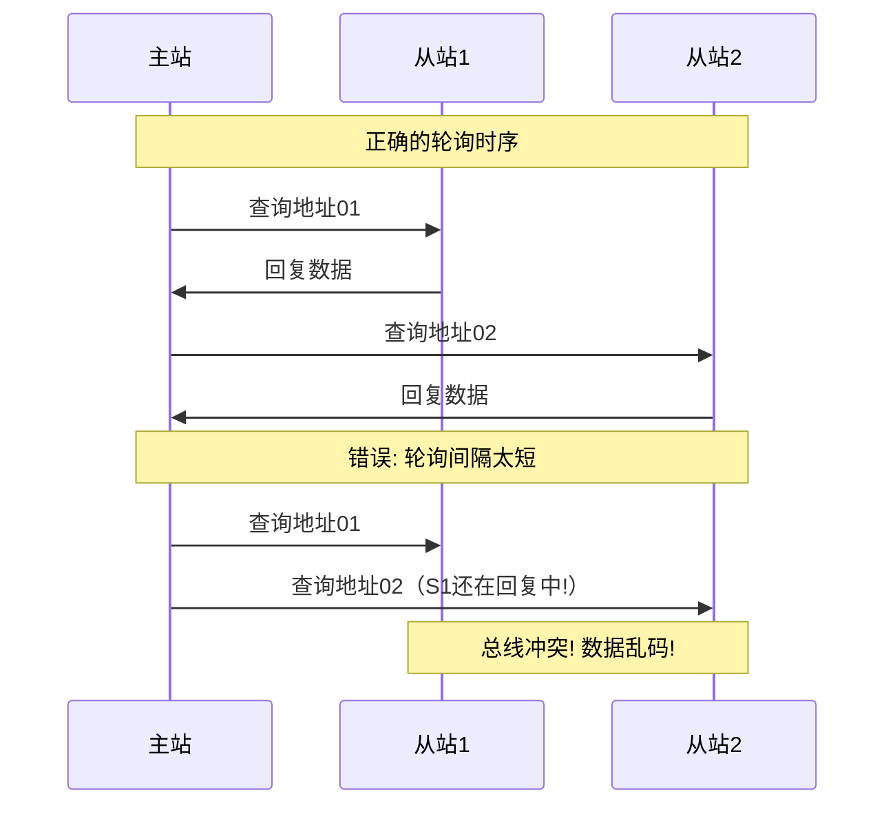

# RS485和RS232有什么区别？RS485总线如何避免冲突？

## 知识点速览

RS232和RS485都是串行通信的**物理层标准**，定义电气特性和信号方式。RS232是最早的串口标准，适合短距离点对点；RS485针对工业环境设计，支持远距离多点通信。

```mermaid
graph TB
    subgraph RS232-点对点
        A[设备A TX] -->|单端信号 ±12V| B[设备B RX]
        C[设备A RX] <--|单端信号 ±12V| D[设备B TX]
        E[GND] --- F[GND]
    end
    subgraph RS485-多点总线
        G[主站] -->|差分信号 A/B线| H[从站1]
        G -->|差分信号 A/B线| I[从站2]
        G -->|差分信号 A/B线| J[从站N]
    end
```

**核心对比：**

| 特性 | RS232 | RS485 |
|------|-------|-------|
| 信号方式 | 单端(对地电压) | 差分(A-B电压差) |
| 电平 | ±3V~±15V | 差分±1.5V~±6V |
| 传输距离 | ~15m | ~1200m |
| 最大速率 | ~115.2kbps | ~10Mbps |
| 拓扑 | 点对点(2设备) | 多点总线(32~256节点) |
| 通信方式 | 全双工 | 半双工(2线)/全双工(4线) |
| 抗干扰 | 差 | 强(差分信号抑制共模干扰) |
| 应用场景 | 调试口、近距通信 | 工业现场、楼宇自控 |

## 我的实战经历

**项目背景：** 在江苏思行达营业厅柜外交互终端项目中，终端需要采集和控制营业厅内多种设备——PLC控制器、温湿度传感器、电力仪表、门禁控制器等共15种以上。这些设备分布在营业厅各处，最远距离约80米，且都支持RS485接口。我负责设计RS485通信总线的软硬件方案。

**遇到的问题：**

1. **总线冲突**：初始测试时偶尔出现数据乱码。排查发现是两个从站同时往总线上发数据导致的信号冲突。虽然理论上主站轮询不应该出现这种情况，但代码中轮询间隔太短，上一个从站还没回复完，主站就开始查询下一个
2. **通信距离和抗干扰**：营业厅内有大功率设备（空调、LED屏），电磁干扰导致偶尔CRC校验失败
3. **从站无响应处理**：某个从站离线（如传感器断电）时，主站轮询等待超时会拖慢整个总线的采集周期

**分析与解决：**

1. **严格的主站轮询协议**：
   - 主站发送查询帧(含从站地址)后等待回复
   - 从站收到匹配地址的查询后，延迟3ms再回复（给收发器切换时间）
   - 主站收到回复或超时后，再间隔5ms发起下一个查询
   - 任何时刻只有一个设备在发送，从根本上避免总线冲突

2. **硬件抗干扰措施**：
   - RS485收发器选用MAX485，总线两端加120Ω终端电阻匹配
   - A/B线使用双绞屏蔽线，屏蔽层单端接地
   - 软件层面：每帧加CRC16校验，校验失败立即重发（最多3次）

3. **自适应超时策略**：
   - 正常从站响应超时设为50ms
   - 连续3次超时标记该从站离线，轮询时跳过
   - 每10个周期尝试探测一次离线从站是否恢复

```cpp
// RS485主站轮询核心逻辑
void Rs485Master::pollCycle() {
    for (auto& slave : m_slaves) {
        if (slave.isOffline() && !slave.shouldProbe()) {
            continue; // 跳过离线设备,定期探测
        }

        // 发送查询帧
        QByteArray query = buildQueryFrame(slave.address, slave.regStart, slave.regCount);
        m_serial.write(query);

        // 等待回复(自适应超时)
        if (waitForResponse(slave.timeout_ms)) {
            slave.markOnline();
            processResponse(slave, m_rxBuffer);
        } else {
            slave.incrementTimeout();
            if (slave.timeoutCount >= 3) {
                slave.markOffline();
                emit deviceOffline(slave.address);
            }
        }

        // 轮询间隔: 给从站切换收发方向的时间
        QThread::msleep(5);
    }
}
```

**结果：** RS485总线稳定接入15种共30+台设备，采集周期控制在2秒内完成一轮全量轮询。CRC校验+重发机制使数据正确率达到99.99%。自适应超时策略避免了离线设备拖慢正常采集，单台设备离线不影响其他设备的数据更新。

## 深入原理

### RS485差分信号原理

```
正常逻辑1: A-B > +200mV
正常逻辑0: A-B < -200mV

   A线: ─┐     ┌─┐     ┌─────
         │     │ │     │
         └─────┘ └─────┘
   B线: ─────┐ ┌─────┐ ┌─┐
             │ │     │ │ │
             └─┘     └─┘ └───

差分: 共模干扰同时影响A和B线
      A-B差值不变,干扰被抵消
```

差分信号的关键优势：电磁干扰同时耦合到A和B两根线上（共模干扰），做差后干扰分量被抵消。这就是RS485能在工业环境中远距离传输的原因。

### 总线冲突的危害和防御



防御措施：
- 主站必须等收到回复或超时后才发下一个查询
- 从站回复前延迟几毫秒（收发器方向切换时间）
- 总线空闲时所有从站的发送器处于高阻态(禁用)

### RS485总线拓扑和终端电阻

```
  主站 ─── [120Ω] ─── 从站1 ─── 从站2 ─── ... ─── 从站N ─── [120Ω]
         A  │          │           │                    │
         B  │          │           │                    │
```

- 终端电阻只在总线两端加，中间节点不加
- 阻值120Ω匹配双绞线特征阻抗
- 分支线(stub)长度越短越好，建议不超过1m

### 常见陷阱

1. **收发方向切换**：RS485半双工需要控制DE/RE引脚，发送完毕后必须及时切回接收模式
2. **地址冲突**：两个从站配置了相同地址会导致总线冲突，上线前必须逐一配置检查
3. **总线负载**：标准RS485最多32个节点(单位负载)，超过需要中继器或选用1/4负载收发器
4. **接地问题**：RS485是差分但仍需共地，长距离传输时地电位差可能损坏收发器
5. **波特率和距离的权衡**：1200m只能用低波特率(9600)，115200波特率实际可靠距离约200-300m

## 面试表达建议

**开头：** "RS232和RS485最大的区别在于信号方式——RS232是单端信号，RS485是差分信号。差分信号抗干扰能力强，支持远距离(1200m)和多点总线通信，这是RS485在工业场景广泛使用的根本原因。"

**总线冲突：** "RS485多点总线避免冲突的核心方法是主站轮询。只有主站有权发起通信，从站被查询时才回复。任何时刻只有一个设备在发送，从根本上避免了冲突。"

**项目关联：** "在思行达的项目中，我用RS485总线接入了15种共30多台设备。用CRC校验加超时重发保证可靠性，自适应超时策略避免离线设备拖慢采集周期，一轮全量轮询控制在2秒内。"

**答追问准备：**
- RS485能全双工吗？→ 四线RS485可以，但成本高且很少用，通常半双工够用
- 怎么调试RS485？→ USB转RS485适配器+串口助手，或用示波器看波形
- RS485和CAN总线比？→ CAN有仲裁机制，不需要主站轮询，但协议更复杂，RS485更简单灵活
