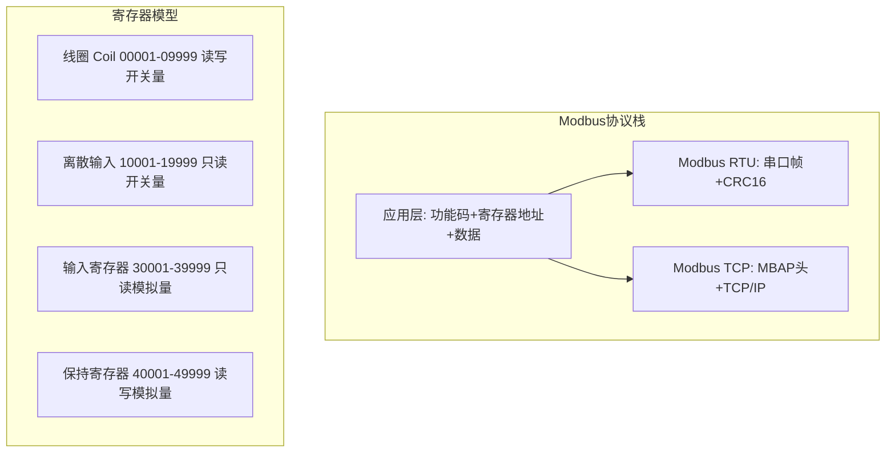

# 什么是Modbus协议？RTU和TCP有什么区别？

## 知识点速览

Modbus是最经典的工业通信协议之一，诞生于1979年，至今仍广泛应用。核心设计思想是将所有设备数据统一抽象为**寄存器**的读写操作，不关心底层数据含义，由上层应用解释。



**四种寄存器类型：**

| 类型 | 地址范围 | 数据类型 | 读写 | 示例 |
|------|---------|---------|------|------|
| 线圈(Coil) | 0xxxx | 1位(ON/OFF) | 读写 | 继电器输出 |
| 离散输入 | 1xxxx | 1位(ON/OFF) | 只读 | 开关状态 |
| 输入寄存器 | 3xxxx | 16位 | 只读 | 传感器测量值 |
| 保持寄存器 | 4xxxx | 16位 | 读写 | 控制参数/设定值 |

**常用功能码：**
- 01: 读线圈 / 02: 读离散输入
- 03: 读保持寄存器 / 04: 读输入寄存器
- 05: 写单个线圈 / 06: 写单个寄存器
- 15: 写多个线圈 / 16: 写多个寄存器

## 我的实战经历

**项目背景：** 在江苏思行达和南京华乘两个项目中，我都需要接入各种工控设备。思行达项目中，柜外交互终端通过RS485总线连接PLC控制器、电力仪表、温湿度传感器等15种以上设备，几乎全部使用Modbus RTU协议。华乘T95终端也需要读取部分Modbus设备的检测数据。

**遇到的问题：** 15种设备来自不同厂商，虽然都支持Modbus RTU，但各自的寄存器地址、数据类型、字节序都不同。早期为每种设备写独立的通信代码，导致代码重复度高达70%以上，且每接入一种新设备就要重新写一套。更麻烦的是，部分设备的寄存器文档不准确，调试时要反复试错。

**分析与解决：** 我设计了一套配置驱动的Modbus通信框架，将设备差异抽象为配置文件：

1. **寄存器表配置化**：每种设备用JSON描述寄存器映射表，包括寄存器地址、数据类型(int16/uint16/float32)、字节序(大端/小端/中间序)、缩放系数

```json
{
  "device_type": "PM2120_PowerMeter",
  "slave_addr": 1,
  "registers": [
    {"name": "voltage_a", "addr": 0x0000, "count": 2, "type": "float32_be", "unit": "V"},
    {"name": "current_a", "addr": 0x0002, "count": 2, "type": "float32_be", "unit": "A"},
    {"name": "power",     "addr": 0x0010, "count": 2, "type": "float32_be", "unit": "kW"}
  ]
}
```

2. **通用Modbus引擎**：根据配置文件自动生成读取请求，解析响应数据并转换类型

```cpp
// 通用Modbus读取引擎
QVariantMap ModbusEngine::readDevice(const DeviceConfig& config) {
    QVariantMap result;
    for (auto& reg : config.registers) {
        // 构造Modbus RTU请求帧
        QByteArray request = buildReadRequest(
            config.slaveAddr, 0x03, reg.addr, reg.count);
        // CRC16校验
        appendCRC16(request);
        // 发送并等待回复
        QByteArray response = sendAndWait(request, 50);
        if (verifyCRC16(response)) {
            // 按配置的数据类型和字节序解析
            result[reg.name] = parseRegValue(response, reg.type);
        }
    }
    return result;
}
```

3. **RTU和TCP统一接口**：底层传输层抽象为接口，RTU走串口+CRC，TCP走Socket+MBAP头，上层业务代码不需要关心传输方式

**结果：** 新设备接入从平均3天缩短到半天——只需填写寄存器配置表，不写任何代码。框架成功接入15种设备，后续又轻松扩展了3种新型号。配置驱动的方式也大幅减少了因手写解析代码引入的bug。

## 深入原理

### Modbus RTU帧格式

```
+----------+----------+---------+----------+
| 从站地址 | 功能码   | 数据    | CRC16    |
| 1字节    | 1字节    | N字节   | 2字节    |
+----------+----------+---------+----------+
```

帧间分隔：3.5个字符时间的静默间隔（@9600bps约4ms，@115200bps约0.3ms）

请求示例（读从站01的保持寄存器，起始0x0000，数量2个）：
```
01 03 00 00 00 02 C4 0B
│  │  │     │     │
│  │  │     │     └── CRC16
│  │  │     └── 数量: 2个寄存器
│  │  └── 起始地址: 0x0000
│  └── 功能码: 03(读保持寄存器)
└── 从站地址: 01
```

### Modbus TCP帧格式(MBAP头)

```
+--------+--------+--------+--------+----------+---------+
| 事务ID | 协议ID | 长度   | 单元ID | 功能码   | 数据    |
| 2字节  | 2字节  | 2字节  | 1字节  | 1字节    | N字节   |
+--------+--------+--------+--------+----------+---------+
```

- 无CRC校验（TCP本身保证可靠传输）
- 事务ID用于匹配请求和响应（支持并发请求）
- 协议ID固定为0x0000
- 默认端口502

### RTU vs TCP详细对比

| 特性 | Modbus RTU | Modbus TCP |
|------|-----------|------------|
| 物理层 | RS485/RS232串口 | 以太网TCP/IP |
| 编码 | 二进制(紧凑) | 二进制+MBAP头 |
| 校验 | CRC16 | TCP校验(无需应用层CRC) |
| 帧分隔 | 3.5字符时间间隔 | TCP流+MBAP长度字段 |
| 寻址 | 从站地址(1-247) | IP地址+单元ID |
| 并发 | 不支持(半双工轮询) | 支持(事务ID区分) |
| 网关 | 需要专用网关 | 可直接远程访问 |

### 浮点数的字节序问题

Modbus寄存器是16位的，但浮点数(float32)需要两个寄存器。不同厂商的字节序可能不同：

| 字节序 | 寄存器1 | 寄存器2 | 说明 |
|--------|---------|---------|------|
| Big-Endian | 高16位 | 低16位 | 最常见(AB CD) |
| Little-Endian | 低16位 | 高16位 | 部分国产设备(CD AB) |
| Mid-Big | 高8位+低8位交换 | (BA DC) | 少数设备 |
| Mid-Little | (DC BA) | 更少见 |

这是Modbus接入中最容易出错的地方。我在配置文件中明确标注每种设备的字节序，解析引擎自动处理转换。

### 常见陷阱

1. **寄存器地址偏移**：有的文档地址从1开始(Modbus地址)，有的从0开始(协议地址)，差1导致读错寄存器
2. **3.5字符间隔**：RTU帧间依赖静默间隔分隔，高波特率下间隔很短(0.3ms)，软件定时器精度可能不够
3. **广播地址0**：地址0是广播，所有从站都响应但不回复。误用会导致所有设备同时执行写操作
4. **功能码错误响应**：从站返回功能码+0x80表示异常，如0x83表示读保持寄存器异常，需解析异常码

## 面试表达建议

**开头：** "Modbus是工业领域最经典的通信协议，核心思想是把所有数据抽象为寄存器的读写。主站发功能码指定操作类型和寄存器地址，从站执行并返回结果。"

**RTU vs TCP：** "RTU和TCP的区别主要在传输层——RTU走串口用CRC校验，TCP走以太网用MBAP头替代CRC。但上层的功能码和寄存器模型完全一致，可以通过网关互转。"

**项目关联：** "在思行达项目中我接入了15种Modbus RTU设备。为了避免给每种设备写独立代码，我设计了配置驱动的通信框架，设备差异全部抽象为寄存器配置表。新设备接入从3天缩短到半天，且大幅减少了解析代码的bug。"

**答追问准备：**
- Modbus RTU帧怎么分隔？→ 3.5个字符时间的静默间隔，不是特殊字符
- 浮点数怎么传？→ 两个16位寄存器拼接，注意厂商字节序差异
- Modbus有什么局限？→ 寄存器模型简单但不灵活，不支持主动上报(只能轮询)，无加密安全机制
