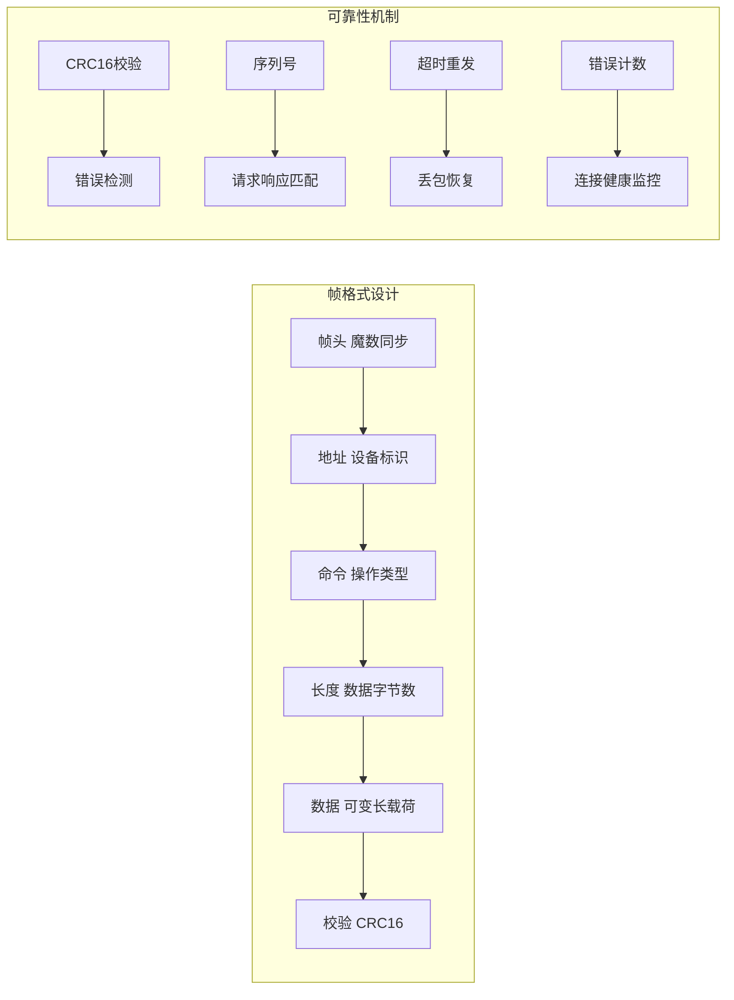
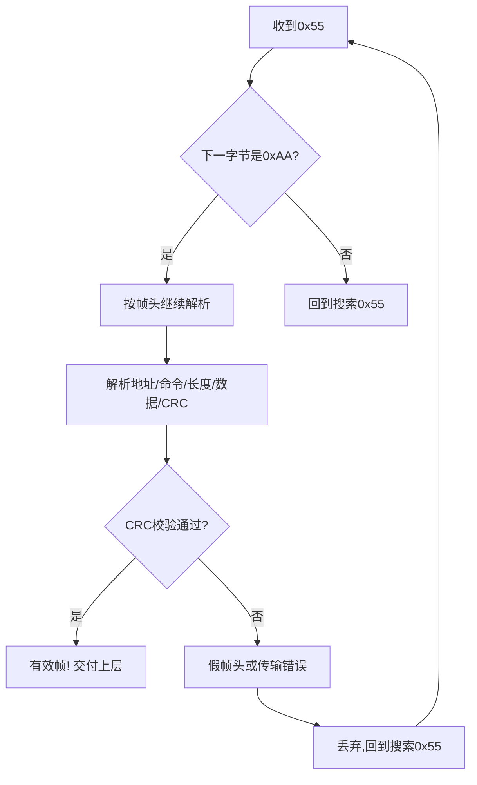

# 如何设计串口/USB通信协议？丢包和校验怎么处理？

## 知识点速览

串口和USB虚拟串口都是字节流传输，需要在应用层设计通信协议来定义消息边界、保证数据完整性、处理传输异常。好的协议设计遵循**统一帧格式 + 状态机解析 + 超时重发**三个核心原则。



**协议设计四要素：**

| 要素 | 作用 | 实现方式 |
|------|------|---------|
| 帧同步 | 接收方找到帧起始位置 | 魔数(0x55AA)标记帧头 |
| 消息边界 | 确定一帧数据的长度 | 长度字段指明数据区大小 |
| 完整性校验 | 检测传输错误 | CRC16覆盖地址到数据的所有字段 |
| 丢包恢复 | 处理无响应情况 | 超时重发 + 序列号 |

## 我的实战经历

**项目背景：** 我在三个项目中都涉及串口/USB通信协议设计：南京华乘T95手持终端（USB虚拟串口与检测模块通信）、江苏思行达柜外终端（RS485串口与工控设备通信，TCP与后台通信）、江西威力固PCB喷墨机（串口与运动控制器通信）。三个项目的通信需求不同，但底层都面临相同的字节流解析和可靠性问题。

**遇到的问题：** 威力固PCB喷码机项目是我最早接触协议设计的项目，当时经验不足，协议设计存在几个问题：
1. 帧头只有1字节(0xAA)，数据区容易出现0xAA导致误同步
2. 没有序列号，无法区分重发帧和新帧
3. 校验用简单累加和，检错能力弱
4. 错误处理靠上层业务代码，分散在各处

到了思行达和华乘项目，我吸取教训做了系统性改进。

**分析与解决：** 经过三个项目的迭代，最终形成了成熟的协议设计模式：

**1. 帧格式设计（T95版本）：**
```
+--------+--------+--------+----------+---------+--------+
| 帧头   | 地址   | 命令   | 长度     | 数据    | CRC16  |
| 0x55AA | 1字节  | 1字节  | 2字节LE  | 0~1024B | 2字节  |
+--------+--------+--------+----------+---------+--------+
```

改进点：
- 双字节帧头0x55AA，误同步概率从1/256降到1/65536
- 长度字段限制最大1024字节，防止异常帧消耗过多内存
- CRC16-MODBUS算法，检错能力远超简单累加和

**2. 状态机解析器（跨项目复用）：**

```cpp
class ProtocolParser {
public:
    // 喂入原始字节流,可以是任意长度
    void feedData(const uint8_t* data, size_t len) {
        for (size_t i = 0; i < len; i++) {
            processByte(data[i]);
        }
    }

private:
    void processByte(uint8_t byte) {
        switch (m_state) {
        case State::WAIT_SYNC1:
            if (byte == 0x55) m_state = State::WAIT_SYNC2;
            break;
        case State::WAIT_SYNC2:
            m_state = (byte == 0xAA) ? State::WAIT_ADDR : State::WAIT_SYNC1;
            break;
        case State::WAIT_ADDR:
            m_frame.addr = byte;
            m_state = State::WAIT_CMD;
            break;
        case State::WAIT_CMD:
            m_frame.cmd = byte;
            m_state = State::WAIT_LEN_L;
            break;
        case State::WAIT_LEN_L:
            m_frame.dataLen = byte;
            m_state = State::WAIT_LEN_H;
            break;
        case State::WAIT_LEN_H:
            m_frame.dataLen |= (byte << 8);
            if (m_frame.dataLen > MAX_DATA_LEN) {
                m_state = State::WAIT_SYNC1; // 长度异常,丢弃
            } else if (m_frame.dataLen == 0) {
                m_state = State::WAIT_CRC_L;
            } else {
                m_dataIndex = 0;
                m_state = State::WAIT_DATA;
            }
            break;
        case State::WAIT_DATA:
            m_frame.data[m_dataIndex++] = byte;
            if (m_dataIndex >= m_frame.dataLen)
                m_state = State::WAIT_CRC_L;
            break;
        case State::WAIT_CRC_L:
            m_crcReceived = byte;
            m_state = State::WAIT_CRC_H;
            break;
        case State::WAIT_CRC_H:
            m_crcReceived |= (byte << 8);
            if (m_crcReceived == calcCRC16(m_frame)) {
                emit frameReady(m_frame); // 完整帧就绪
            } else {
                m_stats.crcErrors++;
            }
            m_state = State::WAIT_SYNC1;
            break;
        }
    }
};
```

**3. 超时重发机制：**

```cpp
class ReliableSender {
public:
    bool sendAndWait(const Frame& frame, int maxRetries = 3) {
        for (int retry = 0; retry <= maxRetries; retry++) {
            m_port->write(frame.encode());
            if (waitForAck(frame.seq, m_timeout_ms)) {
                return true; // 收到确认
            }
            m_stats.retryCount++;
            // 指数退避: 50ms, 100ms, 200ms
            m_timeout_ms = std::min(m_timeout_ms * 2, 500);
        }
        m_stats.failCount++;
        return false; // 彻底失败
    }
};
```

**4. 错误计数与连接健康监控：**
- CRC错误、超时次数、重发次数分别统计
- 错误率超过阈值触发重连或告警
- 定期清零计数器,只关注短期窗口内的错误率

**结果：** 这套协议框架在T95项目中实现零丢包（连续运行测试72小时，100万帧无一丢失）。威力固PCB喷墨机项目后期也回溯升级了协议栈，系统响应速度提升约10%。协议解析模块作为独立库在三个项目间复用，新项目接入只需配置帧格式参数。

## 深入原理

### CRC16校验原理

CRC(循环冗余校验)基于多项式除法，将数据视为二进制多项式对生成多项式求余：

```
CRC16-MODBUS生成多项式: x^16 + x^15 + x^2 + 1 (0xA001反转)

数据:    [地址][命令][长度][数据...]
         ↓ 逐字节计算
CRC16:   2字节校验值

检测能力:
- 所有单bit错误: 100%
- 所有双bit错误: 100%
- 所有奇数位错误: 100%
- 突发错误(≤16位): 100%
- 随机错误漏检概率: 约 1/65536
```

### 假帧头处理策略

数据区可能包含0x55AA序列（假帧头）。状态机处理策略：



CRC校验是最后一道防线：假帧头导致的错误解析几乎必然CRC校验失败。

### 协议设计的演进对比

| 版本 | 威力固v1 | 思行达v2 | 华乘T95 v3 |
|------|---------|---------|-----------|
| 帧头 | 0xAA(1字节) | 0x55AA(2字节) | 0x55AA(2字节) |
| 校验 | 累加和 | CRC16 | CRC16 |
| 序列号 | 无 | 有 | 有 |
| 最大帧长 | 无限制 | 512字节 | 1024字节 |
| 超时重发 | 无 | 固定3次 | 指数退避 |
| 错误统计 | 无 | 简单计数 | 滑动窗口统计 |
| 解析器 | 硬编码 | 状态机 | 状态机(模块化) |

### 超时时间的设定依据

```
超时时间 > 发送时间 + 对方处理时间 + 回复传输时间 + 余量

例(@115200bps, 数据帧50字节):
- 发送时间: 50×10/115200 ≈ 4.3ms
- 对方处理: ~10ms (MCU解析+业务处理)
- 回复传输: ~4.3ms
- 余量: 30%
- 超时 ≈ (4.3+10+4.3)×1.3 ≈ 25ms → 取30ms
```

### 常见陷阱

1. **帧头选择不当**：单字节帧头误同步概率高；应选多字节且不常出现的模式
2. **长度字段溢出**：不校验长度上限可能导致分配巨大内存缓冲区
3. **CRC计算范围不一致**：发送方和接收方必须对完全相同的字节序列计算CRC
4. **重发风暴**：超时设置太短导致频繁重发，加剧总线负担。应使用指数退避
5. **字节序约定**：多字节字段（长度、CRC）的大端/小端必须在协议文档中明确

### 与标准协议的对比

| 自定义协议 | Modbus RTU | Protobuf |
|-----------|-----------|----------|
| 灵活可定制 | 标准化通用 | 跨语言序列化 |
| 帧格式自定 | 帧格式固定 | 无帧概念(需包装) |
| 适合专用设备 | 适合工控设备 | 适合通用软件系统 |
| CRC自选 | CRC16-MODBUS | 无(依赖传输层) |

## 面试表达建议

**开头：** "设计串口通信协议的核心是三件事：定义帧格式让接收方能分辨消息边界，用CRC校验保证数据完整性，用超时重发机制处理丢包。"

**帧格式：** "我设计的帧格式是0x55AA双字节帧头加地址加命令加长度加数据加CRC16。用状态机逐字节解析，天然适配字节流的粘包和拆包。"

**项目关联：** "我在三个项目中都用到了这套协议模式。从威力固PCB喷墨机的简单累加和校验，到思行达的CRC16加序列号，再到T95的指数退避重发和错误统计，经历了三次迭代。最终的协议解析模块作为独立库跨项目复用，T95连续运行72小时百万帧零丢失。"

**答追问准备：**
- CRC和校验和有什么区别？→ CRC基于多项式除法，检错能力远强于简单累加和
- 为什么不用现成协议？→ 自定义设备/MCU资源有限/性能要求，标准协议(如Protobuf)开销太大
- 如何测试协议？→ 回环测试、模拟丢包/错帧注入、压力测试、长时间稳定性测试
