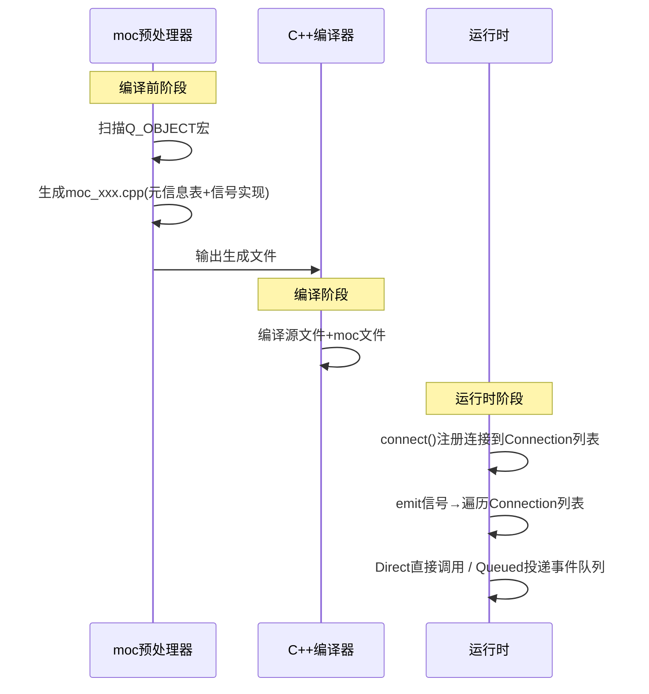
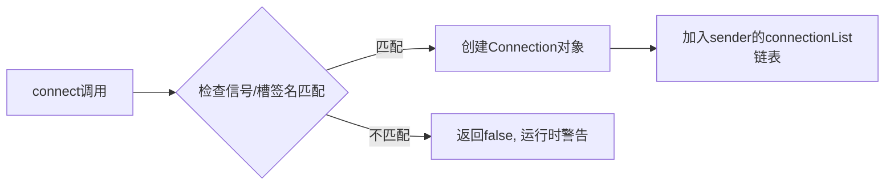

# Qt信号槽机制的工作原理是什么？

## 知识点速览

Qt信号槽是一种**类型安全的观察者模式**实现，是Qt框架最核心的通信机制。它让对象之间的通信完全解耦——发送者不需要知道谁在接收，接收者也不需要知道信号从哪来。

整个机制依赖**元对象系统(Meta-Object System)**，涉及三个关键组件：`Q_OBJECT`宏、`moc`预处理器、`QMetaObject`元信息。



**核心流程：**

| 阶段 | 动作 | 产物 |
|------|------|------|
| 预处理 | moc扫描Q_OBJECT | moc_*.cpp，包含元信息表和信号函数实现 |
| 编译期 | 正常C++编译 | 元信息嵌入二进制 |
| 运行时connect | 在sender的connectionList注册 | Connection记录(receiver指针+槽index) |
| 运行时emit | 遍历connectionList，按连接类型分发 | 直接调用或事件队列投递 |

## 我的实战经历

**项目背景：** 在南京华乘电气T95带电检测手持终端项目中，我负责核心模块架构设计。终端要同时支持TEV、UHF、AE等多种检测方式，各模块产生的数据需要同时送到UI显示、日志记录、告警判断等多个消费方。

**遇到的问题：** 项目初期，数据模块直接持有UI组件的指针来更新显示。后来要加日志模块和告警模块时，数据模块的代码越改越乱——每加一个消费方就要改数据模块的头文件引入新依赖，模块间耦合严重。有一次改告警逻辑，连带UI刷新出了bug，排查半天才定位到。

**分析与解决：** 我把数据模块重构为纯粹的信号发射者。每当采集到一帧数据，数据模块只管`emit dataReady(const DetectionData& data)`，不关心谁在用这个数据。

```cpp
// 数据模块——只发信号，不依赖任何消费方
class DetectionDataModule : public QObject {
    Q_OBJECT
signals:
    void dataReady(const DetectionData& data);
    void deviceStatusChanged(DeviceStatus status);
    void errorOccurred(int code, const QString& msg);
};
```

在主窗口初始化阶段统一做connect：

```cpp
// UI模块订阅数据
connect(dataModule, &DetectionDataModule::dataReady,
        waveformWidget, &WaveformWidget::updateWaveform);
// 日志模块订阅
connect(dataModule, &DetectionDataModule::dataReady,
        logger, &DataLogger::recordData);
// 告警模块订阅数据和状态
connect(dataModule, &DetectionDataModule::dataReady,
        alarmManager, &AlarmManager::checkThreshold);
connect(dataModule, &DetectionDataModule::deviceStatusChanged,
        alarmManager, &AlarmManager::onDeviceStatusChanged);
```

**结果：** 后来产品经理要求加远程数据上传功能，我只需写好上传模块加一行connect，数据模块一行代码不动。整个架构变成了"发布-订阅"模式，新增功能集成时间从之前一两天缩短到几个小时。因为数据模块和UI模块在不同线程，信号槽自动走Queued连接，天然线程安全。

## 深入原理

### moc生成了什么？

moc为每个含Q_OBJECT的类生成`moc_classname.cpp`，核心内容：
1. **元信息字符串表**：所有信号、槽、属性的名称和参数类型
2. **信号函数实现**：signals声明的函数体由moc自动生成，内部调用`QMetaObject::activate()`
3. **qt_metacall()函数**：运行时根据索引调用对应槽函数的分派器

```cpp
// moc自动生成的信号实现（简化）
void DetectionDataModule::dataReady(const DetectionData& _t1) {
    void *_a[] = {nullptr, const_cast<void*>(reinterpret_cast<const void*>(&_t1))};
    QMetaObject::activate(this, &staticMetaObject, 0 /*信号索引*/, _a);
}
```

### connect内部做了什么？



每个QObject内部维护一个connectionList，存放所有从该对象发出的连接记录。

### emit的分发过程

`emit`本身只是一个空宏（`#define emit`），实际调用的是moc生成的信号函数：
- **DirectConnection**：直接在当前线程调用槽函数
- **QueuedConnection**：封装为QMetaCallEvent，postEvent()投递到receiver线程
- **AutoConnection**（默认）：同线程走Direct，跨线程走Queued

### 性能考量

| 机制 | 调用开销 | 说明 |
|------|---------|------|
| 直接函数调用 | ~1ns | 直接跳转 |
| Direct信号槽 | ~10-20ns | 遍历列表+间接调用 |
| Queued信号槽 | ~1-5μs | 参数拷贝+事件投递+事件循环分发 |
| 虚函数调用 | ~2-3ns | 一次间接寻址 |

### 常见陷阱

1. **忘记Q_OBJECT宏**：moc不会处理该类，connect运行时失败
2. **信号槽参数类型不匹配**：新语法编译期检查，旧宏语法运行时才报错
3. **跨线程传递自定义类型**：Queued连接需要qRegisterMetaType注册
4. **Lambda捕获悬空指针**：connect到lambda时捕获的this可能已销毁

## 面试表达建议

**开头：** "Qt信号槽本质是一个类型安全的观察者模式，底层依赖元对象系统。简单说就是三步：moc预处理生成元信息，connect注册连接关系，emit时遍历连接列表分发调用。"

**重点展开：** 结合T95项目说明信号槽的解耦优势——数据模块发信号，UI、日志、告警各自订阅，新增远程上传功能只需一行connect。再提一下跨线程自动走Queued的机制。

**收尾：** "我在项目中特别注意两点：一是跨线程传递自定义类型要qRegisterMetaType，二是lambda中用QPointer防止悬空指针。信号槽虽然比直接调用有一点开销，但带来的解耦和线程安全收益远大于这点性能代价。"