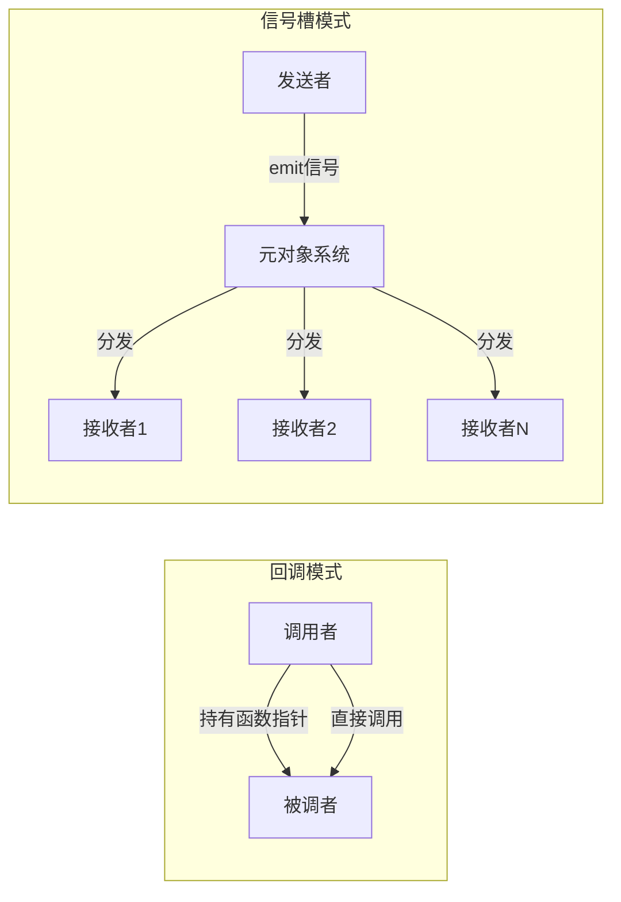
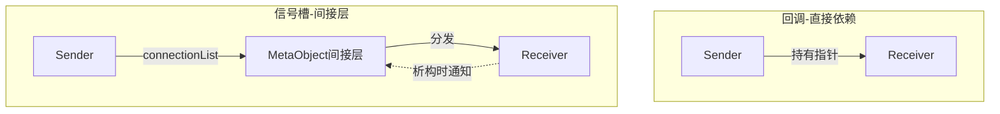

# 信号槽和回调函数有什么区别？

## 知识点速览

信号槽和回调函数都是实现"事件发生时通知相关方"的机制，但设计哲学完全不同。回调是C语言时代的产物，简单直接；信号槽是Qt在此基础上的抽象升级，为GUI框架量身打造。



**四维度对比：**

| 维度 | 回调函数 | 信号槽 |
|------|---------|--------|
| 耦合性 | 调用者必须知道回调函数签名，紧耦合 | 发送者完全不知道接收者，松耦合 |
| 一对多 | 需自己维护回调列表 | 天然支持一个信号连多个槽 |
| 线程安全 | 在调用者线程直接执行，跨线程需手动加锁 | Queued连接自动跨线程投递 |
| 生命周期 | 不感知对象销毁，可能悬空调用 | QObject析构自动断开连接 |
| 性能 | 接近直接函数调用 | Direct约10倍开销，Queued更高 |
| 类型检查 | 编译期（函数指针类型） | 新语法编译期，旧语法运行时 |

## 我的实战经历

**项目背景：** 我在两家公司经历了从回调到信号槽的演变。2020年在江西威力固做PCB喷墨机项目时用了大量C风格回调；2023年到南京华乘电气做T95带电检测终端，全面采用Qt信号槽架构。两段经历让我对二者的优劣有切身体会。

**威力固时期的回调困境：** PCB喷墨机需要控制多个运动轴，底层驱动是C接口，通过函数指针回调上报轴状态：

```cpp
// 威力固时期——回调方式
typedef void (*AxisCallback)(int axisId, AxisStatus status, void* userData);
void registerAxisCallback(int axisId, AxisCallback cb, void* userData);
```

问题逐渐暴露：
- UI层和控制层都要关心轴状态，但一个轴只能注册一个回调，于是搞了个手动分发列表
- 跨线程回调直接操作UI导致崩溃，得在回调里手动PostMessage到UI线程
- 有一次轴控制模块先析构了，回调还在触发，userData变成野指针，设备直接死机

**华乘T95时期的信号槽架构：** 到了T95项目，我做硬件抽象层时选择了信号槽。每个检测设备封装为QObject派生类，状态变化通过信号上报：

```cpp
class DetectionDevice : public QObject {
    Q_OBJECT
signals:
    void dataReady(const QByteArray& rawData);
    void statusChanged(DeviceStatus status);
    void errorOccurred(int code);
};
```

多个模块自由订阅同一个信号，互不影响。设备对象销毁时Qt自动断开所有连接，不会出现悬空回调。跨线程通信通过Queued连接自动处理。

**结果：** 信号槽架构下新增一个状态消费方只需一行connect，模块间完全不需要互相引入头文件。威力固项目后期有两次因回调顺序问题引发的诡异bug，在T95项目中从未出现过。

## 深入原理

### 回调函数的本质

回调函数本质上是把函数指针作为参数传递，让被调用方在合适时机"回调"调用方的逻辑。核心问题是**调用者必须持有回调对象的引用/指针**，形成强依赖关系。

### 信号槽的间接层

信号槽在发送者和接收者之间插入了`QMetaObject`间接层。connect时注册到sender的connectionList，emit时通过元对象系统遍历分发。这个间接层就是解耦的关键。



### 什么时候还是应该用回调？

1. **对性能极度敏感的热路径**：每秒调用百万次的排序比较函数
2. **非QObject的场景**：纯算法库、STL容器的谓词
3. **同步返回值**：回调可以直接返回结果
4. **C接口对接**：底层硬件驱动通常只提供C回调接口

### 性能对比数据

| 调用方式 | 单次开销 | 说明 |
|---------|---------|------|
| 直接调用 | ~1ns | 编译器可内联 |
| 函数指针回调 | ~2ns | 一次间接寻址 |
| std::function | ~3-5ns | 有类型擦除开销 |
| Direct信号槽 | ~15-25ns | 元对象遍历+间接调用 |
| Queued信号槽 | ~1-5μs | 参数序列化+事件投递 |

## 面试表达建议

**开头：** "信号槽和回调都是对象间通信机制，但我从两个项目的经历中深刻体会到它们的区别。我总结为四个维度：解耦、一对多、线程安全、生命周期。"

**重点展开：** 讲威力固PCB喷墨机用回调遇到的三个痛点（一对多难搞、跨线程崩溃、悬空指针死机），再说T95项目用信号槽后这些问题都自然消失了。

**收尾：** "当然回调也不是没有场景——性能敏感的热路径、非QObject的算法库、C接口对接这些情况我还是会用回调。但在Qt应用开发中，信号槽应该是默认选择。"