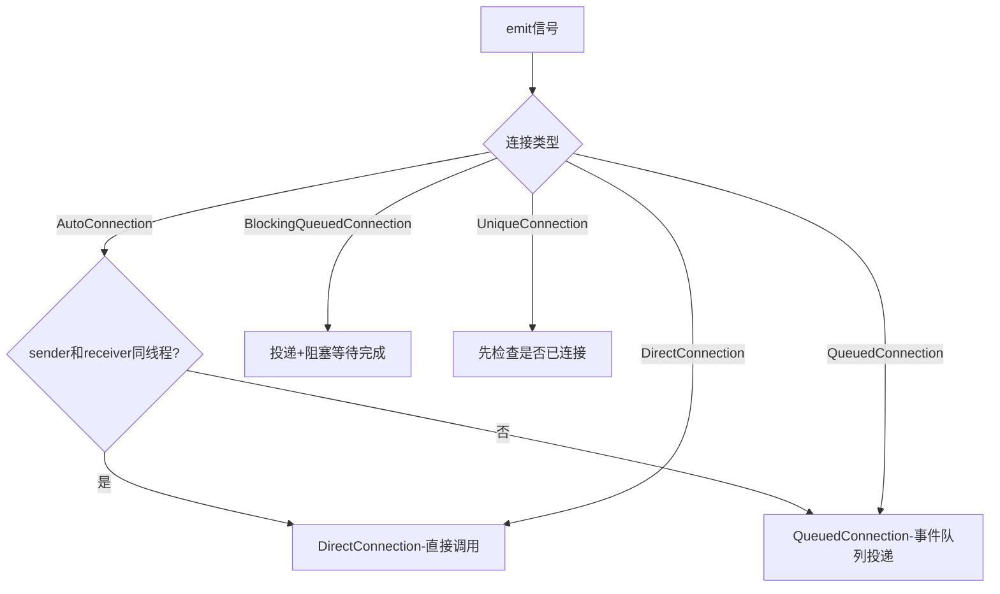
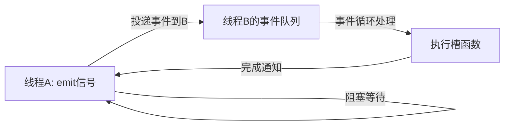

# 信号槽的连接类型有哪些？分别用在什么场景？

## 知识点速览

Qt提供五种连接类型，控制信号触发时槽函数在**哪个线程**、以**何种方式**被调用。理解连接类型是正确使用跨线程信号槽的关键。



**五种连接类型总结：**

| 类型 | 执行线程 | 同步/异步 | 典型场景 |
|------|---------|----------|---------|
| Auto（默认） | 自动判断 | 视情况 | 大多数场景，省心之选 |
| Direct | 发送者线程 | 同步 | 同线程、需要即时响应 |
| Queued | 接收者线程 | 异步 | 跨线程通信 |
| BlockingQueued | 接收者线程 | 同步阻塞 | 跨线程但需等待结果 |
| Unique | 同上 | 同上 | 防止重复连接 |

## 我的实战经历

**项目背景：** 在南京华乘电气T95带电检测手持终端项目中，架构上采用"采集线程+UI主线程"分离模式。TEV/UHF传感器的数据采集运行在独立的工作线程中，UI线程负责波形展示和用户交互。

**遇到的问题：** 项目初期，一位初级工程师在connect时显式指定了`DirectConnection`，想着"直接调用快一些"。结果采集线程发`dataReady`信号时，槽函数直接在采集线程执行，操作了UI控件——QLabel::setText在非UI线程调用，程序时不时崩溃，随机崩溃非常难复现。

**分析与解决：** 我排查后发现是连接类型用错了。采集线程和UI线程是不同线程，必须用Queued或Auto连接。我跟团队统一规范：

```cpp
// 采集线程→UI线程：用默认Auto即可
connect(tevWorker, &TEVWorker::dataReady,
        this, &MainWindow::updateWaveform);

// 同线程内的UI组件通信：Auto自动走Direct
connect(startButton, &QPushButton::clicked,
        this, &MainWindow::onStartClicked);
```

还有一个场景用到了`BlockingQueuedConnection`：采集线程需要从UI线程获取当前配置参数：

```cpp
connect(worker, &AcquisitionWorker::requestConfig,
        configDialog, &ConfigDialog::getCurrentConfig,
        Qt::BlockingQueuedConnection);
```

设备连接管理器里用到了`UniqueConnection`防止重复connect：

```cpp
connect(device, &DetectionDevice::statusChanged,
        statusBar, &StatusBar::updateDeviceStatus,
        Qt::UniqueConnection);
```

**结果：** 统一规范后团队再也没出现过"跨线程操作UI"的崩溃。我总结了一条原则：**绝大多数情况用默认Auto，不确定时就不要指定连接类型，Qt比你更清楚该用哪种。**

## 深入原理

### AutoConnection的判断逻辑

Auto连接在**每次emit时**动态判断（不是connect时），比较当前执行线程和receiver的`thread()`属性：

```cpp
// Qt内部简化逻辑
if (receiver->thread() == QThread::currentThread()) {
    slot(args);  // 同线程→Direct
} else {
    QCoreApplication::postEvent(receiver, new QMetaCallEvent(...));  // 跨线程→Queued
}
```

### QueuedConnection的参数传递

Queued连接需要拷贝参数，所以：
1. 参数类型必须可拷贝构造
2. 自定义类型需要`qRegisterMetaType<MyType>()`注册
3. 参数被序列化到`QMetaCallEvent`中

```cpp
qRegisterMetaType<DetectionData>("DetectionData");
// 否则Queued连接时运行时报错
```

### BlockingQueuedConnection的死锁风险



死锁场景：如果sender和receiver在同一线程，sender发信号后阻塞等待receiver的事件循环处理——但sender阻塞了事件循环，永远等不到。

### 常见陷阱

1. **Auto不是"一次判断"**：同一个connect，不同次emit可能走不同路径
2. **BlockingQueued + 同线程 = 死锁**：最常见的新手坑
3. **Queued连接中Lambda捕获局部变量**：lambda在不同线程异步执行时，局部变量可能已超出作用域
4. **忘记注册元类型**：自定义类型走Queued连接时不注册会运行时报错

## 面试表达建议

**开头：** "Qt有五种连接类型，核心区别在于槽函数在哪个线程、以同步还是异步方式执行。最常用的是Auto，Qt自动判断走Direct还是Queued。"

**重点展开：** 用T95项目举例——采集线程到UI线程用Auto自动走Queued，获取配置用BlockingQueued，设备重连用Unique防重复。特别强调误用Direct导致跨线程操作UI崩溃的排查经历。

**收尾：** "我的经验是，默认用Auto就对了，只有在明确需要同步阻塞返回值时才用BlockingQueued，而且一定要确认不在同线程。"