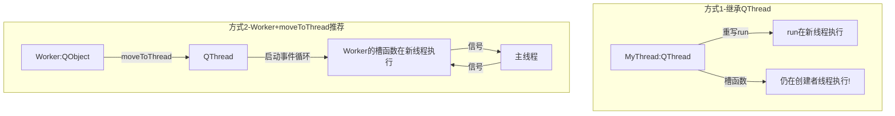
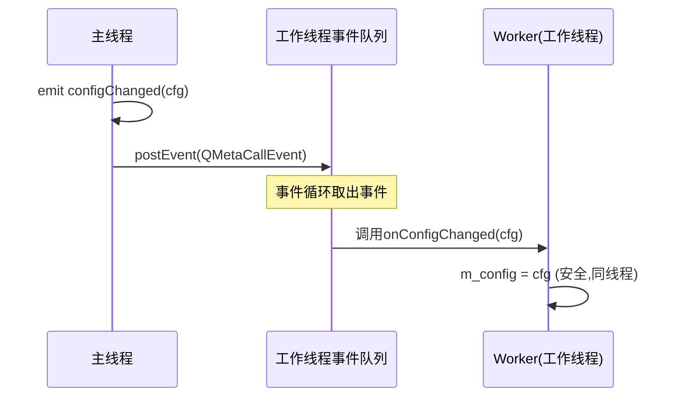

# QThread的正确用法是什么？继承vs moveToThread？

## 知识点速览

QThread的使用是Qt面试高频考点，也是实际开发中最容易踩坑的地方。核心分歧在于：**继承QThread重写run()** 还是 **Worker对象+moveToThread()**。



**两种方式对比：**

| 对比项 | 继承QThread | Worker+moveToThread |
|--------|-----------|-------------------|
| 线程中有事件循环 | 默认没有（除非手动exec） | 天然支持 |
| 槽函数执行线程 | 创建者线程（易混淆） | 新线程（符合直觉） |
| 多任务支持 | 只有一个run() | Worker可有多个槽响应不同信号 |
| 信号槽配合 | 别扭 | 天然配合 |
| 适用场景 | 简单的一次性任务 | 长期运行的服务 |

## 我的实战经历

**项目背景：** 在南京华乘电气T95带电检测手持终端中，TEV和UHF数据采集需要在独立线程中运行，避免阻塞UI。采集模块需要持续运行，通过串口/TCP读取传感器数据，对数据做初步处理后回传给UI线程显示。

**遇到的问题：** 项目初期有同事用继承QThread的方式实现TEV采集：

```cpp
// 初期的错误做法
class TEVThread : public QThread {
    Q_OBJECT
protected:
    void run() override {
        while (!isInterruptionRequested()) {
            QByteArray data = serialPort->readAll();  // 问题1：serialPort在主线程创建
            processData(data);
            emit dataReady(result);
        }
    }
public slots:
    void onConfigChanged(const Config& cfg) {
        m_config = cfg;  // 问题2：这个槽在主线程执行，和run()并发访问m_config
    }
};
```

两个严重问题：serialPort在主线程创建但在子线程使用（QIODevice不能跨线程）；槽函数onConfigChanged在创建者（主）线程执行，和run()并发访问m_config存在数据竞争。

**分析与解决：** 我把采集模块重构为Worker+moveToThread模式：

```cpp
class TEVWorker : public QObject {
    Q_OBJECT
public slots:
    void startAcquisition() {
        m_serial = new QSerialPort(this);  // 在工作线程创建
        m_serial->setPortName(m_portName);
        m_serial->open(QIODevice::ReadOnly);
        connect(m_serial, &QSerialPort::readyRead,
                this, &TEVWorker::onDataAvailable);
    }
    void stopAcquisition() {
        m_serial->close();
        m_serial->deleteLater();
    }
    void onConfigChanged(const Config& cfg) {
        m_config = cfg;  // 在工作线程执行，无需加锁
    }
private slots:
    void onDataAvailable() {
        QByteArray raw = m_serial->readAll();
        DetectionData result = processData(raw, m_config);
        emit dataReady(result);
    }
signals:
    void dataReady(const DetectionData& data);
};
```

主线程中的创建和连接：

```cpp
QThread* thread = new QThread;
TEVWorker* worker = new TEVWorker;  // 不能设置parent
worker->moveToThread(thread);

connect(thread, &QThread::started, worker, &TEVWorker::startAcquisition);
connect(worker, &TEVWorker::dataReady, this, &MainWindow::updateWaveform);
connect(configDialog, &ConfigDialog::configChanged, worker, &TEVWorker::onConfigChanged);
connect(thread, &QThread::finished, worker, &QObject::deleteLater);
connect(thread, &QThread::finished, thread, &QObject::deleteLater);
thread->start();
```

**结果：** 重构后串口跨线程问题消失，配置变更不需要加锁。我把这个模式做成团队标准模板，指导两位初级工程师用Worker模式开发后续的AE和红外采集模块，再没出现线程相关bug。

## 深入原理

### 为什么Worker的槽函数在新线程执行？

`moveToThread()`改变了Worker的**线程归属**(thread affinity)。当用Auto或Queued连接时，信号发出后Qt检查receiver的线程归属，把调用投递到该线程的事件循环。



### QThread本身属于哪个线程？

**QThread对象本身属于创建它的线程**，但`run()`在新线程执行。所以继承QThread时，它的槽函数默认在创建者线程执行，而不是run()所在的新线程。

### moveToThread的注意事项

1. **Worker不能有parent**：有parent的QObject不能moveToThread
2. **moveToThread后不能直接调方法**：必须通过信号触发
3. **在目标线程创建资源**：QIODevice（串口、Socket等）必须在使用它的线程创建
4. **线程退出时清理**：connect finished信号到deleteLater

### 常见陷阱

1. **继承QThread后在构造函数/析构函数中操作成员**：构造和析构在创建者线程执行
2. **忘记启动事件循环**：Worker模式依赖事件循环，QThread::start()默认调exec()

## 面试表达建议

**开头：** "QThread有两种用法，我推荐Worker+moveToThread模式。继承重写run()在简单场景可以用，但容易搞混槽函数的执行线程。"

**重点展开：** 说T95项目的故事——初期继承QThread导致串口跨线程使用和槽函数数据竞争两个bug，重构为Worker模式后问题都消除了。

**收尾：** "Worker模式的核心优势是：资源在正确的线程创建，槽函数自动在工作线程执行，天然支持事件循环。我把这个模式总结为团队模板，指导组员实现了其他采集模块。"