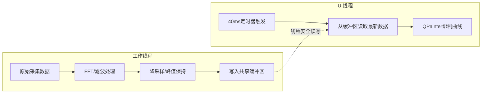

# Qt GUI实时曲线显示如何做性能优化？

## 知识点速览

实时曲线显示是嵌入式/工控类Qt应用的核心场景。优化的核心矛盾是：**数据产生速率远高于屏幕刷新需求**。



**三大优化原则：**

| 原则 | 做法 | 效果 |
|------|------|------|
| 计算与渲染分离 | FFT/滤波移到Worker线程 | UI线程不被计算阻塞 |
| 控制刷新频率 | 定时器统一触发，不逐帧刷新 | 避免过度重绘 |
| 减少内存分配 | 预分配缓冲区，复用对象 | 减少GC/碎片开销 |

## 我的实战经历

**项目背景：** T95带电检测手持终端的核心功能之一是实时显示TEV/UHF检测波形。传感器采样率高达1MHz（每秒100万个数据点），需要实时显示时域波形和频谱图。终端用的是ARM Cortex-A53处理器，性能有限。

**遇到的问题：** 初版实现非常直接——采集线程每收到一包数据(4096点)就发信号给UI线程，UI线程在槽函数中做FFT变换然后直接`update()`触发重绘。问题很快暴露：
1. **UI卡顿严重**：FFT在UI线程执行，每次约8ms，帧间隔超过50ms
2. **CPU占用高**：采集线程每秒发约250次信号，UI线程被疯狂调度
3. **内存抖动**：每次FFT都new一个QVector存结果，频繁分配释放导致碎片化

**分析与解决：** 我做了三阶段优化。

**第一阶段：计算分离。**

```cpp
class SignalProcessor : public QObject {
    Q_OBJECT
public slots:
    void processRawData(const QByteArray& raw) {
        applyBandpassFilter(raw, m_filteredData);
        computeFFT(m_filteredData, m_spectrumData);
        emit waveformReady(m_filteredData);
        emit spectrumReady(m_spectrumData);
    }
private:
    QVector<float> m_filteredData;   // 预分配，复用
    QVector<float> m_spectrumData;   // 预分配，复用
};
```

**第二阶段：控制刷新频率。** 40ms定时器(25fps)驱动刷新：

```cpp
class WaveformWidget : public QWidget {
    Q_OBJECT
public:
    WaveformWidget(QWidget* parent = nullptr) : QWidget(parent) {
        m_plotPoints.resize(DISPLAY_WIDTH);
        m_refreshTimer = new QTimer(this);
        m_refreshTimer->setInterval(40);
        connect(m_refreshTimer, &QTimer::timeout, this, [this]() {
            if (m_dirty) { update(); m_dirty = false; }
        });
        m_refreshTimer->start();
    }
public slots:
    void onWaveformData(const QVector<float>& data) {
        downsampleToDisplay(data, m_plotPoints);
        m_dirty = true;  // 标记脏，等定时器触发刷新
    }
protected:
    void paintEvent(QPaintEvent*) override {
        QPainter p(this);
        p.setRenderHint(QPainter::Antialiasing, false);
        p.setPen(m_curvePen);
        p.drawPolyline(m_plotPoints.data(), m_plotPoints.size());
    }
private:
    QVector<QPointF> m_plotPoints;
    QPen m_curvePen{Qt::green, 1};
    QTimer* m_refreshTimer;
    bool m_dirty = false;
};
```

**第三阶段：预分配缓冲区+峰值保持降采样。**

```cpp
void WaveformWidget::downsampleToDisplay(
    const QVector<float>& src, QVector<QPointF>& dst) {
    const int srcSize = src.size();
    const int dstSize = dst.size();
    const float step = float(srcSize) / dstSize;
    for (int i = 0; i < dstSize; ++i) {
        int start = int(i * step);
        int end = qMin(int((i + 1) * step), srcSize);
        float maxVal = src[start];
        for (int j = start + 1; j < end; ++j)
            maxVal = qMax(maxVal, src[j]);
        dst[i].setX(i);
        dst[i].setY(maxVal);
    }
}
```

**结果：**
- UI帧间隔从50ms+降到稳定40ms，操作完全流畅
- CPU占用从45%降到12%
- 内存分配从每秒数百次降到几乎为零

## 深入原理

### 降采样算法选择

| 算法 | 特点 | 适用场景 |
|------|------|---------|
| 等间隔采样 | 简单快速 | 平滑信号 |
| 峰值保持(MinMax) | 保留极值 | 脉冲/毛刺信号 |
| LTTB | 视觉保真度最高 | 数据展示 |
| 均值降采样 | 平滑效果好 | 噪声信号 |

### 常见陷阱

1. **paintEvent中创建临时对象**：QPen、QBrush、QFont等应预创建复用
2. **抗锯齿**：Antialiasing对实时曲线关掉可快2-3倍
3. **drawLine逐段画**：应收集为QPolygonF一次drawPolyline
4. **忽略设备像素比**：高DPI屏幕上缓冲区大小要乘devicePixelRatio

## 面试表达建议

**开头：** "实时曲线优化我总结为三原则：计算不在UI线程做、刷新频率要控制、内存分配要预做。"

**重点展开：** 讲T95的三阶段优化过程——FFT移线程、40ms定时器刷新、预分配buffer，CPU从45%降到12%。追问降采样就说峰值保持算法。

**收尾：** "核心思路就是让UI线程只做最终的绑制操作。定时器控制刷新频率是关键——25fps对人眼足够流畅，没必要追求更高帧率。"