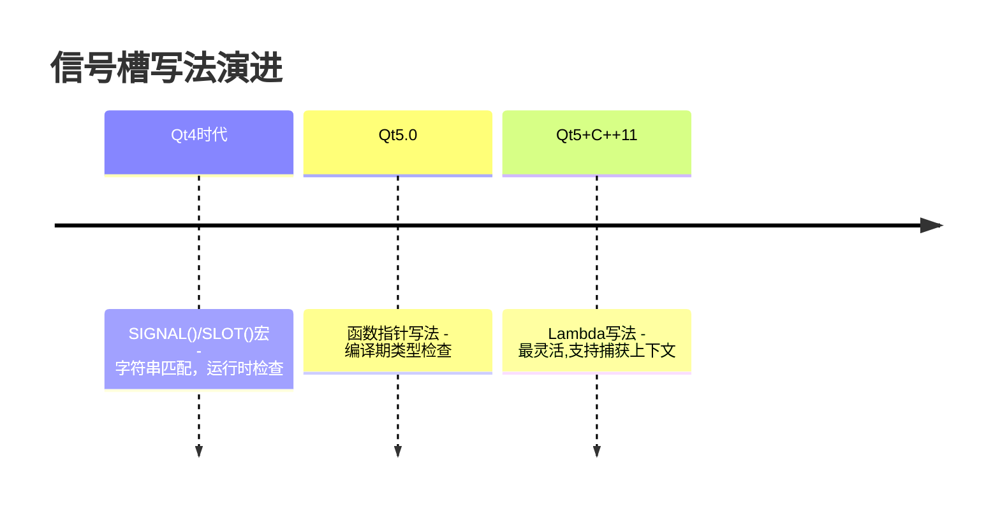
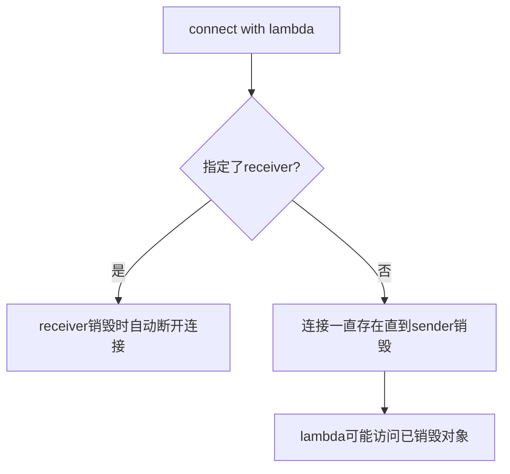

# 信号槽新旧写法有什么区别？推荐哪种？

## 知识点速览

Qt信号槽的connect写法经历了从"字符串匹配"到"编译期类型检查"的演进。



**三种写法对比：**

| 特性 | 旧宏写法 | 函数指针写法 | Lambda写法 |
|------|---------|------------|-----------|
| 检查时机 | 运行时 | 编译期 | 编译期 |
| 拼写错误 | 运行时warning | 编译报错 | 编译报错 |
| 支持Lambda | 不支持 | 不支持 | 就是Lambda |
| 重载函数 | 天然支持 | 需要qOverload | 天然支持 |
| 性能 | 略慢(字符串查找) | 更快 | 同函数指针 |

## 我的实战经历

**项目背景：** 南京华乘电气T95项目启动时，代码库里有一些模块用旧宏写法（从老项目迁移过来的）。我接手后推动团队统一迁移到新写法。

**遇到的问题：** 旧宏写法引发过好几次bug。一位同事connect时把槽函数名拼错了：

```cpp
// 旧宏写法——拼写错误只有运行时warning
connect(device, SIGNAL(statusChanged(int)),
        statusBar, SLOT(updateStatsu(int)));  // 拼错了updateStatus
// 编译通过！运行时输出:
// QObject::connect: No such slot StatusBar::updateStatsu(int)
```

编译完全通过，在嵌入式设备上跑控制台输出不方便查看，这个bug藏了两天才被发现。

另一个问题是参数类型不匹配：

```cpp
// 信号参数QString，槽参数int，旧宏写法编译通过
connect(editor, SIGNAL(textChanged(QString)),
        this, SLOT(onValueChanged(int)));
```

**分析与解决：** 我制定团队编码规范，要求所有新代码用函数指针写法或Lambda写法：

```cpp
// 推荐写法1：函数指针
connect(device, &DetectionDevice::statusChanged,
        statusBar, &StatusBar::updateStatus);
// 拼写错误直接编译失败！

// 推荐写法2：Lambda
connect(device, &DetectionDevice::statusChanged,
        this, [this](DeviceStatus status) {
    statusLabel->setText(statusToString(status));
    if (status == DeviceStatus::Error) showAlarmDialog();
});

// 重载信号用qOverload
connect(spinBox, qOverload<int>(&QSpinBox::valueChanged),
        this, &MainWindow::onThresholdChanged);
```

Lambda写法要注意指定receiver：

```cpp
// 不好：没有receiver
connect(timer, &QTimer::timeout, [this]() { doSomething(); });
// 好：指定receiver为this
connect(timer, &QTimer::timeout, this, [this]() { doSomething(); });
```

**结果：** 迁移后因信号槽拼写或类型错误导致的bug基本消失。编译器把这类错误从"运行时偶发"变成了"编译期必现"。

## 深入原理

### 旧宏写法的内部机制

```cpp
#define SIGNAL(a) "2"#a   // SIGNAL(clicked()) -> "2clicked()"
#define SLOT(a)   "1"#a   // SLOT(onClicked()) -> "1onClicked()"
```

connect内部用字符串在QMetaObject的元信息表中查找匹配。

### 函数指针写法的内部机制

编译器在编译期确定信号和槽的函数指针，Qt用模板推导参数类型列表并在编译期检查兼容性。运行时直接用函数指针注册，省去字符串查找。

### Lambda连接的生命周期陷阱



### 三种写法的性能差异

| 写法 | connect耗时 | emit耗时 |
|------|-----------|---------|
| 旧宏 | ~5us(字符串查找) | ~20ns |
| 函数指针 | ~1us(直接注册) | ~15ns |
| Lambda | ~1us(直接注册) | ~15ns |

### 常见陷阱

1. **Lambda中捕获this但没指定receiver**：对象销毁后崩溃
2. **qOverload需要C++14**：C++11用static_cast替代
3. **旧写法参数不能有名称**：`SIGNAL(clicked(bool checked))`是错的

## 面试表达建议

**开头：** "Qt信号槽有三种写法：旧宏、函数指针和Lambda。我推荐函数指针为主、Lambda为辅。"

**重点展开：** 说T95项目中同事拼错槽函数名编译通过但运行时不工作，藏了两天。函数指针写法直接编译报错。Lambda要注意指定receiver。

**收尾：** "我在T95推动了写法迁移，之后信号槽拼写和类型错误导致的bug基本消失了。编译期检查把问题从运行时提前到了编译期。"